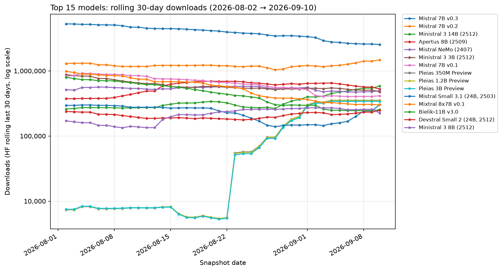
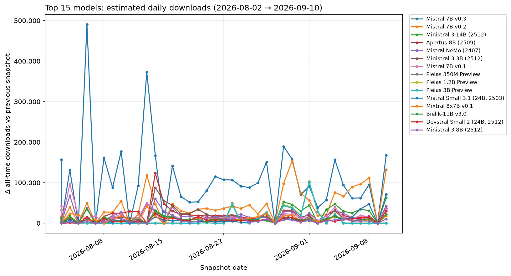
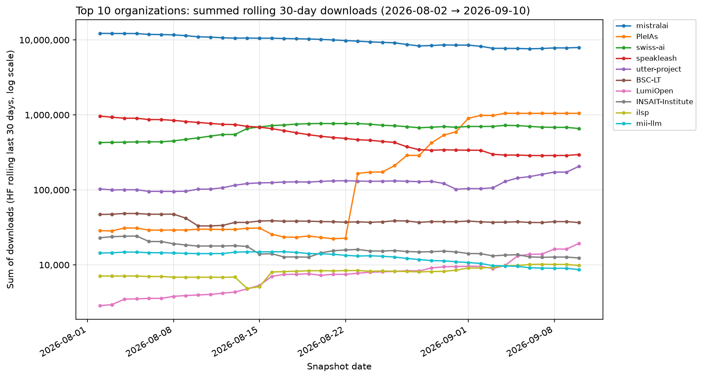
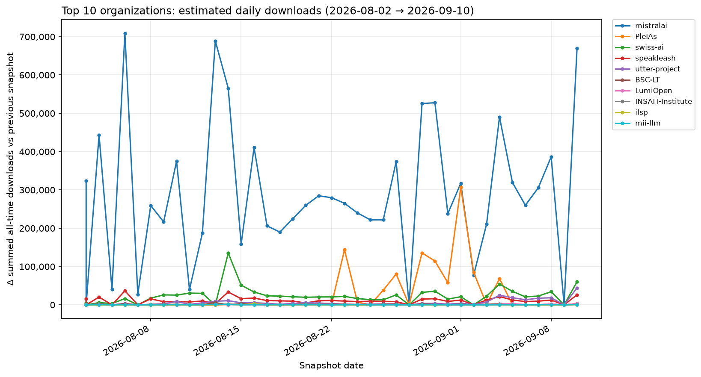

# European LLM Hugging Face download leaderboard

- **Snapshot date:** 2026-09-10
- **Generated at:** 2026-09-10T10:57:25Z
- **Ranking metric:** `total_downloads_30d` (last 30 days, summed across official format variants)
- **Rows:** 158

## Charts

### Trends over time

From daily snapshots in `data/metrics/timeseries.jsonl` (top 15 models / top 10 orgs by latest-day volume). Rolling-30d charts use a symlog y-axis (0 at zero, log compression above).

| Rank | Model | Country | Developer | Org | Downloads (30d) | Δ 30d | All-time | Momentum | Params | Repos |
| ---: | --- | :---: | --- | --- | ---: | ---: | ---: | ---: | ---: | ---: |
| 1 | Mistral 7B v0.3 | FR | Mistral AI | [mistralai](https://huggingface.co/mistralai) | 2,539,015 | -47,423 | 55,876,614 | 4.5% | 7.25B | 2 |
| 2 | Mistral 7B v0.2 | FR | Mistral AI | [mistralai](https://huggingface.co/mistralai) | 1,474,071 | +62,822 | 63,537,147 | 2.3% | 7.24B | 1 |
| 3 | Ministral 3 14B (2512) | FR | Mistral AI | [mistralai](https://huggingface.co/mistralai) | 584,406 | +41,312 | 3,435,837 | 16.5% | 13.95B | 6 |
| 4 | Apertus 8B (2509) | CH | swiss-ai | [swiss-ai](https://huggingface.co/swiss-ai) | 526,220 | -38,781 | 3,869,261 | 13.3% | 8.05B | 2 |
| 5 | Mistral NeMo (2407) | FR | Mistral AI | [mistralai](https://huggingface.co/mistralai) | 496,537 | +18,096 | 16,038,910 | 3.1% | 12.25B | 3 |
| 6 | Ministral 3 3B (2512) | FR | Mistral AI | [mistralai](https://huggingface.co/mistralai) | 477,520 | -27,865 | 5,422,358 | 8.6% | 4.25B | 7 |
| 7 | Mistral 7B v0.1 | FR | Mistral AI | [mistralai](https://huggingface.co/mistralai) | 414,760 | +9,158 | 45,264,306 | 0.9% | 7.24B | 2 |
| 8 | Pleias 350M Preview | FR | PleIAs | [PleIAs](https://huggingface.co/PleIAs) | 353,373 | +124 | 414,523 | 68.7% | 353.4M | 1 |
| 9 | Pleias 1.2B Preview | FR | PleIAs | [PleIAs](https://huggingface.co/PleIAs) | 350,835 | +136 | 410,870 | 68.7% | 1.20B | 1 |
| 10 | Pleias 3B Preview | FR | PleIAs | [PleIAs](https://huggingface.co/PleIAs) | 340,681 | +139 | 396,102 | 68.7% | 3.21B | 1 |
| 11 | Mistral Small 3.1 (24B, 2503) | FR | Mistral AI | [mistralai](https://huggingface.co/mistralai) | 304,105 | +62,026 | 4,416,398 | 6.7% | 24.01B | 2 |
| 12 | Mixtral 8x7B v0.1 | FR | Mistral AI | [mistralai](https://huggingface.co/mistralai) | 300,239 | -5,387 | 32,146,501 | 0.9% | 46.70B | 2 |
| 13 | Bielik-11B v3.0 | PL | SpeakLeash / ACK Cyfronet AGH | [speakleash](https://huggingface.co/speakleash) | 253,255 | +7,203 | 4,092,681 | 6.0% | 11.34B | 8 |
| 14 | Devstral Small 2 (24B, 2512) | FR | Mistral AI | [mistralai](https://huggingface.co/mistralai) | 247,647 | +15,463 | 2,613,806 | 9.1% | 24.01B | 1 |
| 15 | Ministral 3 8B (2512) | FR | Mistral AI | [mistralai](https://huggingface.co/mistralai) | 225,667 | -31,049 | 2,036,360 | 10.6% | 8.92B | 6 |
| 16 | Ministral 8B Instruct (2410) | FR | Mistral AI | [mistralai](https://huggingface.co/mistralai) | 205,827 | -5,585 | 8,397,053 | 2.4% | 8.02B | 1 |
| 17 | Mistral Medium 3.5 (128B) | FR | Mistral AI | [mistralai](https://huggingface.co/mistralai) | 139,261 | +15,141 | 1,021,752 | 12.4% | 127.70B | 2 |
| 18 | Mistral Small 3.2 (24B, 2506) | FR | Mistral AI | [mistralai](https://huggingface.co/mistralai) | 128,185 | +297 | 5,247,006 | 2.4% | 24.01B | 1 |
| 19 | EuroLLM-22B-Instruct (2512) | EU | utter-project | [utter-project](https://huggingface.co/utter-project) | 118,401 | +33,376 | 313,121 | 28.7% | 22.64B | 1 |
| 20 | Apertus 70B (2509) | CH | swiss-ai | [swiss-ai](https://huggingface.co/swiss-ai) | 96,067 | +13,495 | 510,213 | 15.7% | 70.60B | 2 |
| 21 | Magistral Small (2506) | FR | Mistral AI | [mistralai](https://huggingface.co/mistralai) | 76,935 | -271 | 676,338 | 9.9% | 23.57B | 2 |
| 22 | Devstral Small (2507) | FR | Mistral AI | [mistralai](https://huggingface.co/mistralai) | 68,313 | +2,464 | 618,028 | 9.5% | 23.57B | 2 |
| 23 | Mistral Small 24B (2501) | FR | Mistral AI | [mistralai](https://huggingface.co/mistralai) | 65,915 | +1,929 | 7,535,998 | 0.9% | 23.57B | 2 |
| 24 | Mistral Small 4 (119B, 2603) | FR | Mistral AI | [mistralai](https://huggingface.co/mistralai) | 58,002 | -19 | 626,818 | 8.0% | 119.40B | 3 |
| 25 | Mixtral 8x22B v0.1 | FR | Mistral AI | [mistralai](https://huggingface.co/mistralai) | 39,014 | +3,119 | 11,178,691 | 0.3% | 140.63B | 2 |
| 26 | EuroLLM-9B-Instruct (2512) | EU | utter-project | [utter-project](https://huggingface.co/utter-project) | 34,319 | +2,238 | 129,721 | 14.9% | 9.15B | 1 |
| 27 | Salamandra 7B Instruct | ES | BSC-LT | [BSC-LT](https://huggingface.co/BSC-LT) | 29,218 | +147 | 659,440 | 3.8% | 7.77B | 8 |
| 28 | EuroLLM-9B-Instruct | EU | utter-project | [utter-project](https://huggingface.co/utter-project) | 19,474 | +493 | 471,814 | 3.4% | 9.15B | 1 |
| 29 | Devstral 2 (123B, 2512) | FR | Mistral AI | [mistralai](https://huggingface.co/mistralai) | 18,168 | -474 | 344,298 | 4.1% | 125.03B | 1 |
| 30 | Magistral Small (2509) | FR | Mistral AI | [mistralai](https://huggingface.co/mistralai) | 16,444 | +946 | 320,906 | 3.9% | 24.01B | 2 |
| 31 | Bielik-11B v2.3 | PL | SpeakLeash / ACK Cyfronet AGH | [speakleash](https://huggingface.co/speakleash) | 15,715 | +244 | 767,658 | 1.8% | 11.25B | 10 |
| 32 | EuroLLM-1.7B-Instruct | EU | utter-project | [utter-project](https://huggingface.co/utter-project) | 15,005 | -1,893 | 693,940 | 1.9% | 1.66B | 1 |
| 33 | Apertus v1.5 8B | CH | swiss-ai | [swiss-ai](https://huggingface.co/swiss-ai) | 14,365 | +2,352 | 25,561 | 11.4% | 8.90B | 1 |
| 34 | Mathstral 7B v0.1 | FR | Mistral AI | [mistralai](https://huggingface.co/mistralai) | 13,875 | -7 | 5,299,309 | 0.3% | 7.25B | 1 |
| 35 | Apertus v1.5 70B | CH | swiss-ai | [swiss-ai](https://huggingface.co/swiss-ai) | 13,450 | +3,561 | 18,831 | 11.3% | 72.01B | 1 |
| 36 | Mistral Large 3 (675B, 2512) | FR | Mistral AI | [mistralai](https://huggingface.co/mistralai) | 12,199 | -64 | 63,356 | 7.5% | — | 5 |
| 37 | EuroLLM-1.7B (base) | EU | utter-project | [utter-project](https://huggingface.co/utter-project) | 10,355 | +318 | 201,263 | 3.4% | — | 1 |
| 38 | Bielik-7B v0.1 | PL | SpeakLeash | [speakleash](https://huggingface.co/speakleash) | 9,314 | +152 | 500,391 | 1.6% | 7.24B | 8 |
| 39 | Mistral Large Instruct (2411) | FR | Mistral AI | [mistralai](https://huggingface.co/mistralai) | 9,069 | -27 | 4,919,907 | 0.2% | 122.61B | 1 |
| 40 | Llama-Krikri 8B | GR | ILSP | [ilsp](https://huggingface.co/ilsp) | 9,009 | -309 | 104,785 | 4.4% | 8.42B | 5 |
| 41 | Codestral 22B v0.1 | FR | Mistral AI | [mistralai](https://huggingface.co/mistralai) | 5,899 | -4,193 | 5,141,143 | 0.1% | 22.25B | 1 |
| 42 | Salamandra 2B | ES | BSC-LT | [BSC-LT](https://huggingface.co/BSC-LT) | 5,306 | -1,076 | 140,523 | 2.2% | 2.25B | 7 |
| 43 | Viking 13B | FI | LumiOpen | [LumiOpen](https://huggingface.co/LumiOpen) | 5,117 | +590 | 30,785 | 3.9% | 14.03B | 1 |
| 44 | Mistral Large Instruct (2407) | FR | Mistral AI | [mistralai](https://huggingface.co/mistralai) | 4,929 | -1,818 | 5,029,924 | 0.1% | 122.61B | 1 |
| 45 | Bielik-11B v2.2 | PL | SpeakLeash / ACK Cyfronet AGH | [speakleash](https://huggingface.co/speakleash) | 4,736 | +208 | 161,103 | 1.8% | 11.17B | 16 |
| 46 | Llama-Poro 2 8B | FI | LumiOpen | [LumiOpen](https://huggingface.co/LumiOpen) | 4,701 | +350 | 44,722 | 3.2% | 8.03B | 7 |
| 47 | Viking 33B | FI | LumiOpen | [LumiOpen](https://huggingface.co/LumiOpen) | 4,434 | +1,582 | 28,476 | 3.5% | 33.12B | 1 |
| 48 | GaMS3 12B | SI | CJVT UL (Center za jezikovne vire in tehnologije, University of Ljubljana) | [cjvt](https://huggingface.co/cjvt) | 4,396 | -267 | 63,038 | 2.7% | 11.77B | 4 |
| 49 | Teuken 7B v0.6 | DE | openGPT-X | [openGPT-X](https://huggingface.co/openGPT-X) | 4,265 | +61 | 666,387 | 0.6% | 7.45B | 2 |
| 50 | Minerva Chat v0.1 | IT | mii-llm | [mii-llm](https://huggingface.co/mii-llm) | 3,925 | +203 | 89,292 | 2.1% | 2.89B | 1 |
| 51 | Mistral Small Instruct (2409) | FR | Mistral AI | [mistralai](https://huggingface.co/mistralai) | 3,917 | -240 | 5,374,002 | 0.1% | 22.25B | 1 |
| 52 | Devstral Small (2505) | FR | Mistral AI | [mistralai](https://huggingface.co/mistralai) | 3,645 | -655 | 901,399 | 0.4% | 23.57B | 2 |
| 53 | Bielik-1.5B v3.0 | PL | SpeakLeash | [speakleash](https://huggingface.co/speakleash) | 3,552 | -17 | 55,508 | 2.3% | 1.60B | 5 |
| 54 | Minerva 7B v1.0 | IT | SapienzaNLP | [sapienzanlp](https://huggingface.co/sapienzanlp) | 3,547 | -1,074 | 130,127 | 1.5% | 7.40B | 3 |
| 55 | Viking 7B | FI | LumiOpen | [LumiOpen](https://huggingface.co/LumiOpen) | 3,386 | +491 | 53,839 | 2.2% | 7.55B | 1 |
| 56 | Apertus v1.1 4B | CH | swiss-ai | [swiss-ai](https://huggingface.co/swiss-ai) | 3,313 | -4,674 | 13,623 | 2.9% | 3.83B | 5 |
| 57 | Bielik-4.5B v3.0 | PL | SpeakLeash | [speakleash](https://huggingface.co/speakleash) | 3,244 | +643 | 250,102 | 0.9% | 4.76B | 5 |
| 58 | Occiglot 7B (bilingual) | EU | occiglot | [occiglot](https://huggingface.co/occiglot) | 3,159 | -61 | 368,704 | 0.7% | 7.24B | 8 |
| 59 | Apertus v1.1 0.5B | CH | swiss-ai | [swiss-ai](https://huggingface.co/swiss-ai) | 3,113 | +27 | 10,953 | 2.8% | 572.6M | 5 |
| 60 | EuroLLM-22B (2512 base) | EU | utter-project | [utter-project](https://huggingface.co/utter-project) | 2,414 | -103 | 21,915 | 2.0% | 22.64B | 1 |
| 61 | Bielik-Minitron 7B v3.0 | PL | SpeakLeash / ACK Cyfronet AGH | [speakleash](https://huggingface.co/speakleash) | 2,354 | -30 | 124,177 | 1.1% | 7.48B | 5 |
| 62 | Maestrale Chat v0.4 | IT | mii-llm | [mii-llm](https://huggingface.co/mii-llm) | 2,340 | -169 | 145,452 | 1.0% | 7.24B | 4 |
| 63 | MamayLM Gemma 3 4B v1.0 | UA | INSAIT | [INSAIT-Institute](https://huggingface.co/INSAIT-Institute) | 2,283 | +35 | 19,106 | 1.9% | 4.30B | 2 |
| 64 | BgGPT 7B v0.2 | BG | INSAIT | [INSAIT-Institute](https://huggingface.co/INSAIT-Institute) | 2,178 | +102 | 107,032 | 1.1% | 7.29B | 2 |
| 65 | Baguettotron | FR | PleIAs | [PleIAs](https://huggingface.co/PleIAs) | 2,169 | +302 | 38,286 | 1.6% | 321.0M | 2 |
| 66 | PLLuM 4B (2512) | PL | CYFRAGOVPL / PLLuM consortium | [CYFRAGOVPL](https://huggingface.co/CYFRAGOVPL) | 1,865 | -21 | 6,793 | 1.7% | 4.30B | 3 |
| 67 | EuroMoE 2.6B-A0.6B (2512) | EU | utter-project | [utter-project](https://huggingface.co/utter-project) | 1,849 | +6 | 32,925 | 1.4% | 2.61B | 3 |
| 68 | Apertus v1.1 1.5B | CH | swiss-ai | [swiss-ai](https://huggingface.co/swiss-ai) | 1,844 | -16 | 6,580 | 1.7% | 1.51B | 6 |
| 69 | EuroLLM-9B (2512) | EU | utter-project | [utter-project](https://huggingface.co/utter-project) | 1,844 | -1,236 | 8,765 | 1.7% | 9.15B | 1 |
| 70 | MamayLM Gemma 3 12B v2.0 | UA | INSAIT | [INSAIT-Institute](https://huggingface.co/INSAIT-Institute) | 1,726 | +107 | 16,088 | 1.5% | 12.19B | 2 |
| 71 | PLLuM 12B (2512) | PL | CYFRAGOVPL / PLLuM consortium | [CYFRAGOVPL](https://huggingface.co/CYFRAGOVPL) | 1,708 | -150 | 18,743 | 1.4% | 12.25B | 3 |
| 72 | Teuken 7B v0.4 (research) | DE | openGPT-X | [openGPT-X](https://huggingface.co/openGPT-X) | 1,685 | +8 | 76,787 | 1.0% | 7.45B | 1 |
| 73 | Velvet 14B | IT | Almawave | [Almawave](https://huggingface.co/Almawave) | 1,607 | +59 | 63,059 | 1.0% | 14.08B | 1 |
| 74 | Bielik-11B v2.6 | PL | SpeakLeash / ACK Cyfronet AGH | [speakleash](https://huggingface.co/speakleash) | 1,461 | -99 | 172,387 | 0.5% | 11.51B | 7 |
| 75 | MamayLM Gemma 3 27B v2.0 | UA | INSAIT | [INSAIT-Institute](https://huggingface.co/INSAIT-Institute) | 1,391 | +90 | 7,252 | 1.3% | 28.84B | 3 |
| 76 | PLLuM 12B (2412) | PL | CYFRAGOVPL / PLLuM consortium | [CYFRAGOVPL](https://huggingface.co/CYFRAGOVPL) | 1,379 | -65 | 175,482 | 0.5% | 12.25B | 6 |
| 77 | TildeOpen 30B | LV | Tilde | [TildeAI](https://huggingface.co/TildeAI) | 1,252 | +29 | 98,336 | 0.6% | 30.68B | 1 |
| 78 | GaMS 9B | SI | CJVT UL (Center za jezikovne vire in tehnologije, University of Ljubljana) | [cjvt](https://huggingface.co/cjvt) | 1,216 | -3 | 47,463 | 0.8% | 9.24B | 4 |
| 79 | Bielik-11B v2.0 | PL | SpeakLeash / ACK Cyfronet AGH | [speakleash](https://huggingface.co/speakleash) | 1,202 | +29 | 21,259 | 1.0% | 11.17B | 5 |
| 80 | CroissantLLM Chat v0.1 | FR | croissantllm | [croissantllm](https://huggingface.co/croissantllm) | 1,190 | -24 | 95,099 | 0.6% | 1.35B | 8 |
| 81 | Teuken 7B v0.4 (commercial) | DE | openGPT-X | [openGPT-X](https://huggingface.co/openGPT-X) | 1,178 | +27 | 104,477 | 0.6% | 7.45B | 1 |
| 82 | Bielik-11B v2.1 | PL | SpeakLeash / ACK Cyfronet AGH | [speakleash](https://huggingface.co/speakleash) | 1,135 | +73 | 29,552 | 0.9% | 11.17B | 5 |
| 83 | MamayLM Gemma 3 12B v1.0 | UA | INSAIT | [INSAIT-Institute](https://huggingface.co/INSAIT-Institute) | 1,115 | +70 | 43,530 | 0.8% | 12.19B | 2 |
| 84 | EuroLLM-9B (base) | EU | utter-project | [utter-project](https://huggingface.co/utter-project) | 1,108 | +26 | 81,882 | 0.6% | 9.15B | 1 |
| 85 | EuroLLM-22B-Instruct (Preview) | EU | utter-project | [utter-project](https://huggingface.co/utter-project) | 1,107 | -5 | 30,930 | 0.8% | 22.64B | 1 |
| 86 | Salamandra 7B (base) | ES | BSC-LT | [BSC-LT](https://huggingface.co/BSC-LT) | 1,100 | -145 | 48,117 | 0.7% | 7.77B | 1 |
| 87 | TRURL 2 13B | PL | Voicelab | [Voicelab](https://huggingface.co/Voicelab) | 1,100 | +8 | 354,538 | 0.2% | — | 3 |
| 88 | BgGPT Gemma 3 27B | BG | INSAIT | [INSAIT-Institute](https://huggingface.co/INSAIT-Institute) | 1,062 | -529 | 7,743 | 1.0% | 27.43B | 3 |
| 89 | Qra 1B | PL | OPI-PG | [OPI-PG](https://huggingface.co/OPI-PG) | 1,037 | -10 | 156,389 | 0.4% | 1.10B | 1 |
| 90 | TRURL 2 7B | PL | Voicelab | [Voicelab](https://huggingface.co/Voicelab) | 1,033 | +5 | 299,948 | 0.3% | 6.74B | 2 |
| 91 | GaMS 27B | SI | CJVT UL (Center za jezikovne vire in tehnologije, University of Ljubljana) | [cjvt](https://huggingface.co/cjvt) | 1,010 | +23 | 37,261 | 0.7% | 27.23B | 3 |
| 92 | OCRonos | FR | PleIAs | [PleIAs](https://huggingface.co/PleIAs) | 1,005 | +12 | 80,851 | 0.6% | 8.03B | 3 |
| 93 | BgGPT Gemma 3 12B | BG | INSAIT | [INSAIT-Institute](https://huggingface.co/INSAIT-Institute) | 984 | -167 | 217,452 | 0.3% | 12.19B | 3 |
| 94 | TildeOpen 30B (64k) | LV | Tilde | [TildeAI](https://huggingface.co/TildeAI) | 975 | -21 | 2,716 | 0.9% | 30.68B | 1 |
| 95 | Monad | FR | PleIAs | [PleIAs](https://huggingface.co/PleIAs) | 974 | +19 | 31,718 | 0.7% | 56.7M | 1 |
| 96 | Qra 13B | PL | OPI-PG | [OPI-PG](https://huggingface.co/OPI-PG) | 956 | -1 | 144,140 | 0.4% | 13.02B | 1 |
| 97 | Qra 7B | PL | OPI-PG | [OPI-PG](https://huggingface.co/OPI-PG) | 955 | -7 | 183,346 | 0.3% | 6.74B | 1 |
| 98 | LeoLM HessianAI 7B | DE | LeoLM | [LeoLM](https://huggingface.co/LeoLM) | 948 | -61 | 799,575 | 0.1% | — | 3 |
| 99 | Llama-PLLuM 70B (2512) | PL | CYFRAGOVPL / PLLuM consortium | [CYFRAGOVPL](https://huggingface.co/CYFRAGOVPL) | 946 | +3 | 12,220 | 0.8% | 70.55B | 2 |
| 100 | Llama-Poro 2 70B | FI | LumiOpen | [LumiOpen](https://huggingface.co/LumiOpen) | 945 | +34 | 38,178 | 0.7% | 70.55B | 3 |
| 101 | Velvet 2B | IT | Almawave | [Almawave](https://huggingface.co/Almawave) | 937 | -143 | 83,288 | 0.5% | 2.22B | 1 |
| 102 | CroissantLLM Base | FR | croissantllm | [croissantllm](https://huggingface.co/croissantllm) | 912 | +4 | 56,431 | 0.6% | 1.35B | 3 |
| 103 | GaMS2 27B | SI | CJVT UL (Center za jezikovne vire in tehnologije, University of Ljubljana) | [cjvt](https://huggingface.co/cjvt) | 757 | +9 | 1,059 | 0.7% | 27.23B | 3 |
| 104 | Llama-PLLuM 8B (2412) | PL | CYFRAGOVPL / PLLuM consortium | [CYFRAGOVPL](https://huggingface.co/CYFRAGOVPL) | 748 | -15 | 70,030 | 0.4% | 8.03B | 3 |
| 105 | Poro 34B | FI | LumiOpen | [LumiOpen](https://huggingface.co/LumiOpen) | 739 | +24 | 227,105 | 0.2% | 35.13B | 4 |
| 106 | Domyn Small v1.0 | IT | Domyn | [domyn](https://huggingface.co/domyn) | 689 | +70 | 6,499 | 0.6% | 9.82B | 1 |
| 107 | BgGPT Gemma 3 4B | BG | INSAIT | [INSAIT-Institute](https://huggingface.co/INSAIT-Institute) | 635 | -39 | 13,488 | 0.6% | 4.33B | 3 |
| 108 | Occiglot 7B EU5 | EU | occiglot | [occiglot](https://huggingface.co/occiglot) | 606 | -31 | 321,636 | 0.1% | 7.24B | 2 |
| 109 | ALIA 40B (base) | ES | BSC-LT | [BSC-LT](https://huggingface.co/BSC-LT) | 586 | +3 | 450,801 | 0.1% | 40.43B | 1 |
| 110 | Llama-PLLuM 8B (2512) | PL | CYFRAGOVPL / PLLuM consortium | [CYFRAGOVPL](https://huggingface.co/CYFRAGOVPL) | 573 | -36 | 3,354 | 0.6% | 8.03B | 3 |
| 111 | Magistral Small (2507) | FR | Mistral AI | [mistralai](https://huggingface.co/mistralai) | 572 | +58 | 149,563 | 0.2% | 23.57B | 2 |
| 112 | Pleias RAG 1B | FR | PleIAs | [PleIAs](https://huggingface.co/PleIAs) | 527 | +3 | 17,896 | 0.4% | 1.20B | 2 |
| 113 | Maestrale Chat v0.3 | IT | mii-llm | [mii-llm](https://huggingface.co/mii-llm) | 504 | -103 | 51,616 | 0.3% | 7.24B | 5 |
| 114 | ALIA 40B Instruct (2601) | ES | BSC-LT | [BSC-LT](https://huggingface.co/BSC-LT) | 496 | -3 | 32,155 | 0.4% | 40.43B | 2 |
| 115 | Pleias RAG 350M | FR | PleIAs | [PleIAs](https://huggingface.co/PleIAs) | 486 | +2 | 13,529 | 0.4% | 353.4M | 2 |
| 116 | LeoLM Mistral HessianAI 7B | DE | LeoLM | [LeoLM](https://huggingface.co/LeoLM) | 473 | +44 | 232,264 | 0.1% | — | 2 |
| 117 | Soofi S Instruct Preview | DE | Soofi Project | [Soofi-Project](https://huggingface.co/Soofi-Project) | 472 | -337 | 7,018 | 0.4% | 31.59B | 6 |
| 118 | Soofi S Rhine Preview | DE | Soofi Project | [Soofi-Project](https://huggingface.co/Soofi-Project) | 459 | -37 | 1,981 | 0.5% | 31.59B | 6 |
| 119 | Maestrale Chat v0.2 | IT | mii-llm | [mii-llm](https://huggingface.co/mii-llm) | 446 | -104 | 50,543 | 0.3% | 7.24B | 1 |
| 120 | Meltemi 7B v1 | GR | ILSP | [ilsp](https://huggingface.co/ilsp) | 429 | +9 | 44,185 | 0.3% | 7.70B | 5 |
| 121 | Nesso 0.4B Agentic | IT | mii-llm | [mii-llm](https://huggingface.co/mii-llm) | 414 | +9 | 2,598 | 0.4% | 560.9M | 2 |
| 122 | GaMS 2B | SI | CJVT UL (Center za jezikovne vire in tehnologije, University of Ljubljana) | [cjvt](https://huggingface.co/cjvt) | 399 | +7 | 19,483 | 0.3% | 3.20B | 2 |
| 123 | LeoLM HessianAI 13B | DE | LeoLM | [LeoLM](https://huggingface.co/LeoLM) | 398 | +4 | 106,693 | 0.2% | — | 3 |
| 124 | Meltemi 7B v1.5 | GR | ILSP | [ilsp](https://huggingface.co/ilsp) | 391 | -13 | 38,782 | 0.3% | 7.48B | 2 |
| 125 | Nesso 4B | IT | mii-llm | [mii-llm](https://huggingface.co/mii-llm) | 370 | -23 | 2,315 | 0.4% | 4.02B | 2 |
| 126 | GaMS 1B | SI | CJVT UL (Center za jezikovne vire in tehnologije, University of Ljubljana) | [cjvt](https://huggingface.co/cjvt) | 336 | +31 | 15,477 | 0.3% | 1.54B | 4 |
| 127 | Pharia-1-LLM-7B-control | DE | Aleph Alpha | [Aleph-Alpha](https://huggingface.co/Aleph-Alpha) | 335 | -49 | 75,713 | 0.2% | 7.04B | 4 |
| 128 | Zagreus 0.4B (ITA) | IT | mii-llm | [mii-llm](https://huggingface.co/mii-llm) | 327 | -157 | 4,839 | 0.3% | 437.8M | 1 |
| 129 | Soofi S Base | DE | Soofi Project | [Soofi-Project](https://huggingface.co/Soofi-Project) | 322 | +16 | 1,048 | 0.3% | 31.58B | 2 |
| 130 | BgGPT Gemma 2 9B | BG | INSAIT | [INSAIT-Institute](https://huggingface.co/INSAIT-Institute) | 282 | -3 | 26,877 | 0.2% | 9.24B | 2 |
| 131 | Bielik-11B v2 (base) | PL | SpeakLeash / ACK Cyfronet AGH | [speakleash](https://huggingface.co/speakleash) | 269 | -2 | 41,420 | 0.2% | 11.17B | 1 |
| 132 | MamayLM Gemma 2 9B v0.1 | UA | INSAIT | [INSAIT-Institute](https://huggingface.co/INSAIT-Institute) | 234 | -15 | 21,230 | 0.2% | 9.24B | 2 |
| 133 | Soofi S Isar Preview | DE | Soofi Project | [Soofi-Project](https://huggingface.co/Soofi-Project) | 215 | -5,650 | 10,734 | 0.2% | 31.59B | 6 |
| 134 | Leanstral 1.5 (119B-A6B) | FR | Mistral AI | [mistralai](https://huggingface.co/mistralai) | 191 | -6 | 870 | 0.2% | — | 1 |
| 135 | OpenEuroLLM Prelude | EU | openeurollm | [openeurollm](https://huggingface.co/openeurollm) | 190 | +3 | 1,937 | 0.2% | — | 1 |
| 136 | Pleias Pico | FR | PleIAs | [PleIAs](https://huggingface.co/PleIAs) | 181 | +12 | 5,198 | 0.2% | 353.4M | 2 |
| 137 | BgGPT Gemma 2 2.6B | BG | INSAIT | [INSAIT-Institute](https://huggingface.co/INSAIT-Institute) | 172 | -14 | 21,384 | 0.1% | 2.61B | 2 |
| 138 | BgGPT 7B v0.1 | BG | INSAIT | [INSAIT-Institute](https://huggingface.co/INSAIT-Institute) | 155 | +14 | 16,227 | 0.1% | 7.29B | 2 |
| 139 | Bielik-11B v2.5 | PL | SpeakLeash / ACK Cyfronet AGH | [speakleash](https://huggingface.co/speakleash) | 153 | +2 | 5,030 | 0.1% | 11.51B | 5 |
| 140 | BgGPT Gemma 2 27B | BG | INSAIT | [INSAIT-Institute](https://huggingface.co/INSAIT-Institute) | 151 | +2 | 11,427 | 0.1% | 27.23B | 2 |
| 141 | LeoLM HessianAI 70B | DE | LeoLM | [LeoLM](https://huggingface.co/LeoLM) | 148 | +21 | 19,266 | 0.1% | 68.98B | 2 |
| 142 | Nesso 0.4B Instruct | IT | mii-llm | [mii-llm](https://huggingface.co/mii-llm) | 133 | +15 | 1,212 | 0.1% | 560.9M | 1 |
| 143 | Llama-PLLuM 70B (2412) | PL | CYFRAGOVPL / PLLuM consortium | [CYFRAGOVPL](https://huggingface.co/CYFRAGOVPL) | 128 | -15 | 38,470 | 0.1% | 70.55B | 3 |
| 144 | Pleias Nano | FR | PleIAs | [PleIAs](https://huggingface.co/PleIAs) | 119 | +14 | 7,065 | 0.1% | 1.20B | 2 |
| 145 | EuroLLM-22B (Preview base) | EU | utter-project | [utter-project](https://huggingface.co/utter-project) | 107 | -4 | 2,196 | 0.1% | — | 1 |
| 146 | PLLuM 8x7B (2412) | PL | CYFRAGOVPL / PLLuM consortium | [CYFRAGOVPL](https://huggingface.co/CYFRAGOVPL) | 92 | +3 | 28,136 | 0.1% | 46.70B | 6 |
| 147 | Zagreus 0.4B (SPA) | IT | mii-llm | [mii-llm](https://huggingface.co/mii-llm) | 91 | -6 | 167 | 0.1% | 437.8M | 1 |
| 148 | PLLuM 12B nc (2507) | PL | CYFRAGOVPL / PLLuM consortium | [CYFRAGOVPL](https://huggingface.co/CYFRAGOVPL) | 75 | -2 | 6,030 | 0.1% | 12.25B | 3 |
| 149 | Llama-PLLuM 70B (2508) | PL | CYFRAGOVPL / PLLuM consortium | [CYFRAGOVPL](https://huggingface.co/CYFRAGOVPL) | 67 | -3 | 4,716 | 0.1% | 70.55B | 3 |
| 150 | Leanstral (2603) | FR | Mistral AI | [mistralai](https://huggingface.co/mistralai) | 65 | -3 | 898 | 0.1% | — | 1 |
| 151 | Pleias SLM RAG | FR | PleIAs | [PleIAs](https://huggingface.co/PleIAs) | 62 | -57 | 314 | 0.1% | 321.0M | 1 |
| 152 | Zagreus 0.4B (POR) | IT | mii-llm | [mii-llm](https://huggingface.co/mii-llm) | 50 | -20 | 242 | 0.0% | 437.8M | 1 |
| 153 | Open Zagreus 0.4B | IT | mii-llm | [mii-llm](https://huggingface.co/mii-llm) | 30 | 0 | 344 | 0.0% | 437.8M | 1 |
| 154 | Zagreus 0.4B (FRA) | IT | mii-llm | [mii-llm](https://huggingface.co/mii-llm) | 17 | +6 | 127 | 0.0% | 437.8M | 1 |
| 155 | TildeOpen 8B WMT26 (cs-de) | LV | Tilde | [TildeAI](https://huggingface.co/TildeAI) | 13 | -2 | 145 | 0.0% | 8.16B | 3 |
| 156 | Maestrale Chat v0.1 | IT | mii-llm | [mii-llm](https://huggingface.co/mii-llm) | 10 | -3 | 100 | 0.0% | 7.24B | 1 |
| 157 | TildeOpen 15B WMT26 (cs-de) | LV | Tilde | [TildeAI](https://huggingface.co/TildeAI) | 9 | -2 | 196 | 0.0% | 15.17B | 3 |
| 158 | Emma 5 Boost | IT | mii-llm | [mii-llm](https://huggingface.co/mii-llm) | 0 | 0 | 8 | 0.0% | 1.39B | 1 |

## Organizations

Same downloads, aggregated across every model version an organization publishes.

| Rank | Organization | Developer | Country | Downloads (30d) | All-time | Models | Momentum |
| ---: | --- | --- | :---: | ---: | ---: | ---: | ---: |
| 1 | [mistralai](https://huggingface.co/mistralai) | Mistral AI | FR | 7,934,392 | 293,635,496 | 30 | 2.7% |
| 2 | [PleIAs](https://huggingface.co/PleIAs) | PleIAs | FR | 1,050,412 | 1,416,352 | 11 | 69.3% |
| 3 | [swiss-ai](https://huggingface.co/swiss-ai) | swiss-ai | CH | 658,372 | 4,455,022 | 7 | 14.5% |
| 4 | [speakleash](https://huggingface.co/speakleash) | SpeakLeash / ACK Cyfronet AGH | PL | 296,390 | 6,221,268 | 12 | 4.7% |
| 5 | [utter-project](https://huggingface.co/utter-project) | utter-project | EU | 205,983 | 1,988,472 | 11 | 9.9% |
| 6 | [BSC-LT](https://huggingface.co/BSC-LT) | BSC-LT | ES | 36,706 | 1,331,036 | 5 | 2.6% |
| 7 | [LumiOpen](https://huggingface.co/LumiOpen) | LumiOpen | FI | 19,322 | 423,105 | 6 | 3.7% |
| 8 | [INSAIT-Institute](https://huggingface.co/INSAIT-Institute) | INSAIT | UA | 12,368 | 528,836 | 13 | 2.0% |
| 9 | [ilsp](https://huggingface.co/ilsp) | ILSP | GR | 9,829 | 187,752 | 3 | 3.4% |
| 10 | [mii-llm](https://huggingface.co/mii-llm) | mii-llm | IT | 8,657 | 348,855 | 14 | 1.9% |
| 11 | [cjvt](https://huggingface.co/cjvt) | CJVT UL (Center za jezikovne vire in tehnologije, University of Ljubljana) | SI | 8,114 | 183,781 | 6 | 2.9% |
| 12 | [CYFRAGOVPL](https://huggingface.co/CYFRAGOVPL) | CYFRAGOVPL / PLLuM consortium | PL | 7,581 | 363,974 | 10 | 1.6% |
| 13 | [openGPT-X](https://huggingface.co/openGPT-X) | openGPT-X | DE | 7,128 | 847,651 | 3 | 0.8% |
| 14 | [occiglot](https://huggingface.co/occiglot) | occiglot | EU | 3,765 | 690,340 | 2 | 0.5% |
| 15 | [sapienzanlp](https://huggingface.co/sapienzanlp) | SapienzaNLP | IT | 3,547 | 130,127 | 1 | 1.5% |
| 16 | [OPI-PG](https://huggingface.co/OPI-PG) | OPI-PG | PL | 2,948 | 483,875 | 3 | 0.5% |
| 17 | [Almawave](https://huggingface.co/Almawave) | Almawave | IT | 2,544 | 146,347 | 2 | 1.0% |
| 18 | [TildeAI](https://huggingface.co/TildeAI) | Tilde | LV | 2,249 | 101,393 | 4 | 1.1% |
| 19 | [Voicelab](https://huggingface.co/Voicelab) | Voicelab | PL | 2,133 | 654,486 | 2 | 0.3% |
| 20 | [croissantllm](https://huggingface.co/croissantllm) | croissantllm | FR | 2,102 | 151,530 | 2 | 0.8% |
| 21 | [LeoLM](https://huggingface.co/LeoLM) | LeoLM | DE | 1,967 | 1,157,798 | 4 | 0.2% |
| 22 | [Soofi-Project](https://huggingface.co/Soofi-Project) | Soofi Project | DE | 1,468 | 20,781 | 4 | 1.2% |
| 23 | [domyn](https://huggingface.co/domyn) | Domyn | IT | 689 | 6,499 | 1 | 0.6% |
| 24 | [Aleph-Alpha](https://huggingface.co/Aleph-Alpha) | Aleph Alpha | DE | 335 | 75,713 | 1 | 0.2% |
| 25 | [openeurollm](https://huggingface.co/openeurollm) | openeurollm | EU | 190 | 1,937 | 1 | 0.2% |

### By best single model

Ranked by each organization's single highest-downloading model (no summing across versions) — who has the biggest individual hit.

| Rank | Organization | Best model | Downloads (30d) | All-time | Overall model rank |
| ---: | --- | --- | ---: | ---: | ---: |
| 1 | [mistralai](https://huggingface.co/mistralai) | Mistral 7B v0.3 | 2,539,015 | 55,876,614 | 1 |
| 2 | [swiss-ai](https://huggingface.co/swiss-ai) | Apertus 8B (2509) | 526,220 | 3,869,261 | 4 |
| 3 | [PleIAs](https://huggingface.co/PleIAs) | Pleias 350M Preview | 353,373 | 414,523 | 8 |
| 4 | [speakleash](https://huggingface.co/speakleash) | Bielik-11B v3.0 | 253,255 | 4,092,681 | 13 |
| 5 | [utter-project](https://huggingface.co/utter-project) | EuroLLM-22B-Instruct (2512) | 118,401 | 313,121 | 19 |
| 6 | [BSC-LT](https://huggingface.co/BSC-LT) | Salamandra 7B Instruct | 29,218 | 659,440 | 27 |
| 7 | [ilsp](https://huggingface.co/ilsp) | Llama-Krikri 8B | 9,009 | 104,785 | 40 |
| 8 | [LumiOpen](https://huggingface.co/LumiOpen) | Viking 13B | 5,117 | 30,785 | 43 |
| 9 | [cjvt](https://huggingface.co/cjvt) | GaMS3 12B | 4,396 | 63,038 | 48 |
| 10 | [openGPT-X](https://huggingface.co/openGPT-X) | Teuken 7B v0.6 | 4,265 | 666,387 | 49 |
| 11 | [mii-llm](https://huggingface.co/mii-llm) | Minerva Chat v0.1 | 3,925 | 89,292 | 50 |
| 12 | [sapienzanlp](https://huggingface.co/sapienzanlp) | Minerva 7B v1.0 | 3,547 | 130,127 | 54 |
| 13 | [occiglot](https://huggingface.co/occiglot) | Occiglot 7B (bilingual) | 3,159 | 368,704 | 58 |
| 14 | [INSAIT-Institute](https://huggingface.co/INSAIT-Institute) | MamayLM Gemma 3 4B v1.0 | 2,283 | 19,106 | 63 |
| 15 | [CYFRAGOVPL](https://huggingface.co/CYFRAGOVPL) | PLLuM 4B (2512) | 1,865 | 6,793 | 66 |
| 16 | [Almawave](https://huggingface.co/Almawave) | Velvet 14B | 1,607 | 63,059 | 73 |
| 17 | [TildeAI](https://huggingface.co/TildeAI) | TildeOpen 30B | 1,252 | 98,336 | 77 |
| 18 | [croissantllm](https://huggingface.co/croissantllm) | CroissantLLM Chat v0.1 | 1,190 | 95,099 | 80 |
| 19 | [Voicelab](https://huggingface.co/Voicelab) | TRURL 2 13B | 1,100 | 354,538 | 87 |
| 20 | [OPI-PG](https://huggingface.co/OPI-PG) | Qra 1B | 1,037 | 156,389 | 89 |
| 21 | [LeoLM](https://huggingface.co/LeoLM) | LeoLM HessianAI 7B | 948 | 799,575 | 98 |
| 22 | [domyn](https://huggingface.co/domyn) | Domyn Small v1.0 | 689 | 6,499 | 106 |
| 23 | [Soofi-Project](https://huggingface.co/Soofi-Project) | Soofi S Instruct Preview | 472 | 7,018 | 117 |
| 24 | [Aleph-Alpha](https://huggingface.co/Aleph-Alpha) | Pharia-1-LLM-7B-control | 335 | 75,713 | 127 |
| 25 | [openeurollm](https://huggingface.co/openeurollm) | OpenEuroLLM Prelude | 190 | 1,937 | 135 |

### By momentum

Sorted by momentum (highest first). Momentum highlights orgs whose recent downloads are large *relative to their lifetime total* — i.e. accelerating adoption, not legacy long-tail traffic from an old release.

| Momentum rank | Organization | Momentum | Downloads (30d) | All-time | Downloads rank |
| ---: | --- | ---: | ---: | ---: | ---: |
| 1 | [PleIAs](https://huggingface.co/PleIAs) | 69.3% | 1,050,412 | 1,416,352 | 2 |
| 2 | [swiss-ai](https://huggingface.co/swiss-ai) | 14.5% | 658,372 | 4,455,022 | 3 |
| 3 | [utter-project](https://huggingface.co/utter-project) | 9.9% | 205,983 | 1,988,472 | 5 |
| 4 | [speakleash](https://huggingface.co/speakleash) | 4.7% | 296,390 | 6,221,268 | 4 |
| 5 | [LumiOpen](https://huggingface.co/LumiOpen) | 3.7% | 19,322 | 423,105 | 7 |
| 6 | [ilsp](https://huggingface.co/ilsp) | 3.4% | 9,829 | 187,752 | 9 |
| 7 | [cjvt](https://huggingface.co/cjvt) | 2.9% | 8,114 | 183,781 | 11 |
| 8 | [mistralai](https://huggingface.co/mistralai) | 2.7% | 7,934,392 | 293,635,496 | 1 |
| 9 | [BSC-LT](https://huggingface.co/BSC-LT) | 2.6% | 36,706 | 1,331,036 | 6 |
| 10 | [INSAIT-Institute](https://huggingface.co/INSAIT-Institute) | 2.0% | 12,368 | 528,836 | 8 |
| 11 | [mii-llm](https://huggingface.co/mii-llm) | 1.9% | 8,657 | 348,855 | 10 |
| 12 | [CYFRAGOVPL](https://huggingface.co/CYFRAGOVPL) | 1.6% | 7,581 | 363,974 | 12 |
| 13 | [sapienzanlp](https://huggingface.co/sapienzanlp) | 1.5% | 3,547 | 130,127 | 15 |
| 14 | [Soofi-Project](https://huggingface.co/Soofi-Project) | 1.2% | 1,468 | 20,781 | 22 |
| 15 | [TildeAI](https://huggingface.co/TildeAI) | 1.1% | 2,249 | 101,393 | 18 |
| 16 | [Almawave](https://huggingface.co/Almawave) | 1.0% | 2,544 | 146,347 | 17 |
| 17 | [croissantllm](https://huggingface.co/croissantllm) | 0.8% | 2,102 | 151,530 | 20 |
| 18 | [openGPT-X](https://huggingface.co/openGPT-X) | 0.8% | 7,128 | 847,651 | 13 |
| 19 | [domyn](https://huggingface.co/domyn) | 0.6% | 689 | 6,499 | 23 |
| 20 | [OPI-PG](https://huggingface.co/OPI-PG) | 0.5% | 2,948 | 483,875 | 16 |
| 21 | [occiglot](https://huggingface.co/occiglot) | 0.5% | 3,765 | 690,340 | 14 |
| 22 | [Voicelab](https://huggingface.co/Voicelab) | 0.3% | 2,133 | 654,486 | 19 |
| 23 | [Aleph-Alpha](https://huggingface.co/Aleph-Alpha) | 0.2% | 335 | 75,713 | 24 |
| 24 | [openeurollm](https://huggingface.co/openeurollm) | 0.2% | 190 | 1,937 | 25 |
| 25 | [LeoLM](https://huggingface.co/LeoLM) | 0.2% | 1,967 | 1,157,798 | 21 |

## Notes

- Downloads are Hugging Face Hub **rolling last-30-day** counts, aggregated over official repos matched by config regexes (GGUF / MLX / FP8 / etc. when published by the same org).
- **Params** is the max reported parameter count among member repos (`safetensors.total`, else `gguf.total`).
- **Momentum** = `downloads_30d / (downloads_all_time + 100,000)` — a recency ratio damped by a smoothing constant so low-volume/brand-new rows can't look like they have outsized momentum from a handful of downloads. Higher = more of its lifetime downloads happened in the last 30 days.
- **Trend charts** use [`data/metrics/timeseries.jsonl`](data/metrics/timeseries.jsonl). Rolling-30d lines follow HF’s sliding window; daily Δ lines use day-over-day changes in `downloads_all_time` (approximate new downloads, not unique users).
- Machine-readable data: [`output/leaderboard.json`](output/leaderboard.json), [`output/leaderboard.csv`](output/leaderboard.csv), [`output/leaderboard_orgs.json`](output/leaderboard_orgs.json), [`output/leaderboard_orgs.csv`](output/leaderboard_orgs.csv).
- How this is built / how to add models: [`DEVELOPMENT.md`](DEVELOPMENT.md).
- This file is regenerated by CI (`fetch` workflow) via `scripts/render_leaderboard_md.py`.
