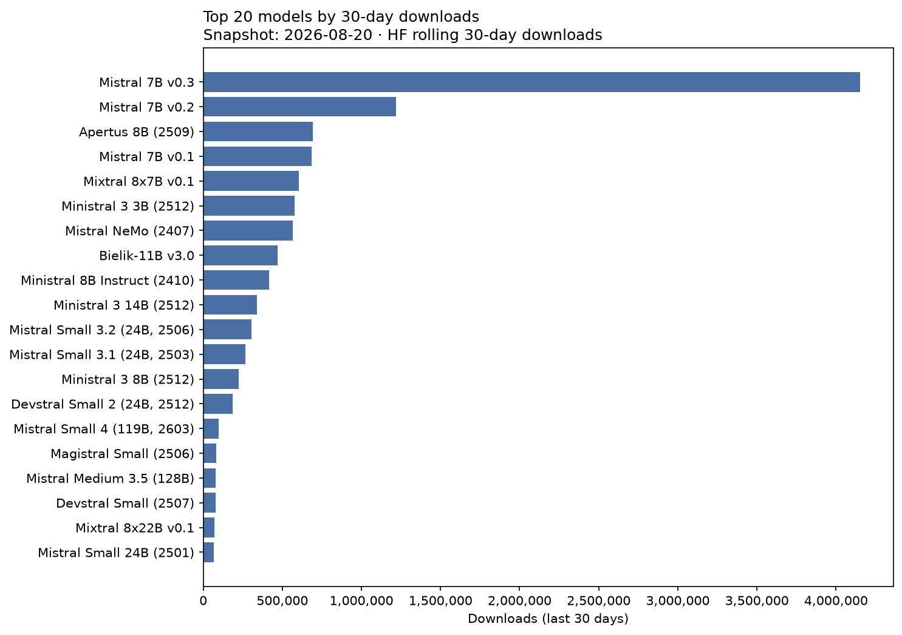
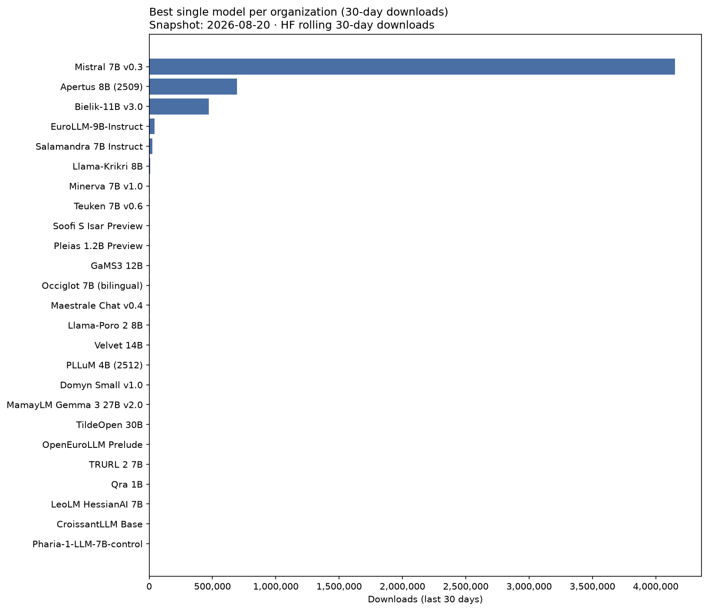
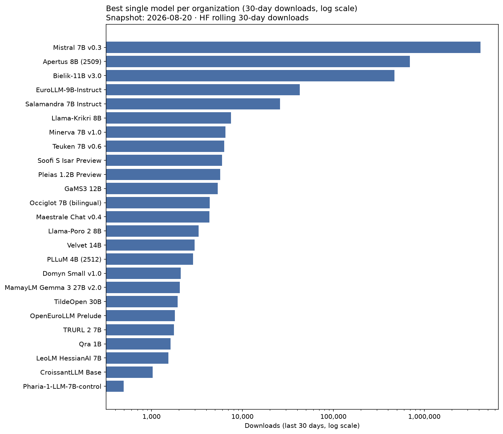

# European LLM Hugging Face download leaderboard

- **Snapshot date:** 2026-08-20
- **Generated at:** 2026-08-20T06:52:51Z
- **Ranking metric:** `total_downloads_30d` (last 30 days, summed across official format variants)
- **Rows:** 158

## Charts

| Rank | Model | Country | Developer | Org | Downloads (30d) | Δ 30d | All-time | Momentum | Params | Repos |
| ---: | --- | :---: | --- | --- | ---: | ---: | ---: | ---: | ---: | ---: |
| 1 | Mistral 7B v0.3 | FR | Mistral AI | [mistralai](https://huggingface.co/mistralai) | 4,153,806 | -71,741 | 53,874,790 | 7.7% | 7.25B | 2 |
| 2 | Mistral 7B v0.2 | FR | Mistral AI | [mistralai](https://huggingface.co/mistralai) | 1,220,252 | -3,746 | 62,279,274 | 2.0% | 7.24B | 1 |
| 3 | Apertus 8B (2509) | CH | swiss-ai | [swiss-ai](https://huggingface.co/swiss-ai) | 694,645 | +4,613 | 3,496,294 | 19.3% | 8.05B | 2 |
| 4 | Mistral 7B v0.1 | FR | Mistral AI | [mistralai](https://huggingface.co/mistralai) | 684,707 | -27,838 | 44,933,190 | 1.5% | 7.24B | 2 |
| 5 | Mixtral 8x7B v0.1 | FR | Mistral AI | [mistralai](https://huggingface.co/mistralai) | 603,757 | -44,290 | 31,921,250 | 1.9% | 46.70B | 2 |
| 6 | Ministral 3 3B (2512) | FR | Mistral AI | [mistralai](https://huggingface.co/mistralai) | 578,222 | +1,977 | 5,148,354 | 11.0% | 4.25B | 7 |
| 7 | Mistral NeMo (2407) | FR | Mistral AI | [mistralai](https://huggingface.co/mistralai) | 564,690 | +8,735 | 15,680,245 | 3.6% | 12.25B | 3 |
| 8 | Bielik-11B v3.0 | PL | SpeakLeash / ACK Cyfronet AGH | [speakleash](https://huggingface.co/speakleash) | 471,038 | -24,691 | 3,900,970 | 11.8% | 11.34B | 8 |
| 9 | Ministral 8B Instruct (2410) | FR | Mistral AI | [mistralai](https://huggingface.co/mistralai) | 417,780 | +548 | 8,261,266 | 5.0% | 8.02B | 1 |
| 10 | Ministral 3 14B (2512) | FR | Mistral AI | [mistralai](https://huggingface.co/mistralai) | 338,357 | +6,768 | 2,924,654 | 11.2% | 13.95B | 6 |
| 11 | Mistral Small 3.2 (24B, 2506) | FR | Mistral AI | [mistralai](https://huggingface.co/mistralai) | 303,509 | +1,567 | 5,147,681 | 5.8% | 24.01B | 1 |
| 12 | Mistral Small 3.1 (24B, 2503) | FR | Mistral AI | [mistralai](https://huggingface.co/mistralai) | 266,270 | -3,603 | 4,145,200 | 6.3% | 24.01B | 2 |
| 13 | Ministral 3 8B (2512) | FR | Mistral AI | [mistralai](https://huggingface.co/mistralai) | 222,837 | +11,022 | 1,888,979 | 11.2% | 8.92B | 6 |
| 14 | Devstral Small 2 (24B, 2512) | FR | Mistral AI | [mistralai](https://huggingface.co/mistralai) | 186,529 | -3,301 | 2,429,898 | 7.4% | 24.01B | 1 |
| 15 | Mistral Small 4 (119B, 2603) | FR | Mistral AI | [mistralai](https://huggingface.co/mistralai) | 98,264 | -6,922 | 581,629 | 14.4% | 119.40B | 3 |
| 16 | Magistral Small (2506) | FR | Mistral AI | [mistralai](https://huggingface.co/mistralai) | 83,583 | +2,286 | 619,659 | 11.6% | 23.57B | 2 |
| 17 | Mistral Medium 3.5 (128B) | FR | Mistral AI | [mistralai](https://huggingface.co/mistralai) | 77,593 | +253 | 917,809 | 7.6% | 127.70B | 2 |
| 18 | Devstral Small (2507) | FR | Mistral AI | [mistralai](https://huggingface.co/mistralai) | 76,688 | -5,837 | 551,492 | 11.8% | 23.57B | 2 |
| 19 | Mixtral 8x22B v0.1 | FR | Mistral AI | [mistralai](https://huggingface.co/mistralai) | 69,651 | -1,485 | 11,149,146 | 0.6% | 140.63B | 2 |
| 20 | Mistral Small 24B (2501) | FR | Mistral AI | [mistralai](https://huggingface.co/mistralai) | 66,970 | -102 | 7,485,776 | 0.9% | 23.57B | 2 |
| 21 | Codestral 22B v0.1 | FR | Mistral AI | [mistralai](https://huggingface.co/mistralai) | 42,997 | -425 | 5,137,181 | 0.8% | 22.25B | 1 |
| 22 | EuroLLM-9B-Instruct | EU | utter-project | [utter-project](https://huggingface.co/utter-project) | 42,837 | -125 | 455,083 | 7.7% | 9.15B | 1 |
| 23 | Apertus 70B (2509) | CH | swiss-ai | [swiss-ai](https://huggingface.co/swiss-ai) | 39,863 | -612 | 424,877 | 7.6% | 70.60B | 2 |
| 24 | EuroLLM-9B-Instruct (2512) | EU | utter-project | [utter-project](https://huggingface.co/utter-project) | 28,608 | +2,946 | 109,157 | 13.7% | 9.15B | 1 |
| 25 | Devstral 2 (123B, 2512) | FR | Mistral AI | [mistralai](https://huggingface.co/mistralai) | 28,371 | -379 | 330,865 | 6.6% | 125.03B | 1 |
| 26 | Salamandra 7B Instruct | ES | BSC-LT | [BSC-LT](https://huggingface.co/BSC-LT) | 25,972 | -386 | 635,161 | 3.5% | 7.77B | 8 |
| 27 | EuroLLM-1.7B-Instruct | EU | utter-project | [utter-project](https://huggingface.co/utter-project) | 25,632 | -332 | 682,180 | 3.3% | 1.66B | 1 |
| 28 | Mathstral 7B v0.1 | FR | Mistral AI | [mistralai](https://huggingface.co/mistralai) | 22,763 | -18 | 5,285,805 | 0.4% | 7.25B | 1 |
| 29 | Bielik-11B v2.3 | PL | SpeakLeash / ACK Cyfronet AGH | [speakleash](https://huggingface.co/speakleash) | 16,713 | -252 | 755,421 | 2.0% | 11.25B | 10 |
| 30 | Mistral Large 3 (675B, 2512) | FR | Mistral AI | [mistralai](https://huggingface.co/mistralai) | 13,396 | -82 | 53,873 | 8.7% | — | 5 |
| 31 | Mistral Large Instruct (2411) | FR | Mistral AI | [mistralai](https://huggingface.co/mistralai) | 13,321 | -20 | 4,914,636 | 0.3% | 122.61B | 1 |
| 32 | Apertus v1.5 8B | CH | swiss-ai | [swiss-ai](https://huggingface.co/swiss-ai) | 12,813 | +646 | 12,813 | 11.4% | 8.90B | 1 |
| 33 | EuroLLM-1.7B (base) | EU | utter-project | [utter-project](https://huggingface.co/utter-project) | 12,251 | +22 | 194,610 | 4.2% | — | 1 |
| 34 | Bielik-7B v0.1 | PL | SpeakLeash | [speakleash](https://huggingface.co/speakleash) | 10,365 | -49 | 493,622 | 1.7% | 7.24B | 8 |
| 35 | Mistral Large Instruct (2407) | FR | Mistral AI | [mistralai](https://huggingface.co/mistralai) | 8,798 | -44 | 5,028,409 | 0.2% | 122.61B | 1 |
| 36 | Apertus v1.1 4B | CH | swiss-ai | [swiss-ai](https://huggingface.co/swiss-ai) | 8,678 | -73 | 12,063 | 7.7% | 3.83B | 5 |
| 37 | Salamandra 2B | ES | BSC-LT | [BSC-LT](https://huggingface.co/BSC-LT) | 8,576 | -24 | 137,506 | 3.6% | 2.25B | 7 |
| 38 | EuroLLM-22B-Instruct (2512) | EU | utter-project | [utter-project](https://huggingface.co/utter-project) | 7,973 | +124 | 196,013 | 2.7% | 22.64B | 1 |
| 39 | Magistral Small (2509) | FR | Mistral AI | [mistralai](https://huggingface.co/mistralai) | 7,739 | +122 | 307,415 | 1.9% | 24.01B | 2 |
| 40 | Llama-Krikri 8B | GR | ILSP | [ilsp](https://huggingface.co/ilsp) | 7,473 | +30 | 99,753 | 3.7% | 8.42B | 5 |
| 41 | Minerva 7B v1.0 | IT | SapienzaNLP | [sapienzanlp](https://huggingface.co/sapienzanlp) | 6,495 | +95 | 127,863 | 2.9% | 7.40B | 3 |
| 42 | Apertus v1.5 70B | CH | swiss-ai | [swiss-ai](https://huggingface.co/swiss-ai) | 6,400 | +50 | 6,400 | 6.0% | 72.01B | 1 |
| 43 | Teuken 7B v0.6 | DE | openGPT-X | [openGPT-X](https://huggingface.co/openGPT-X) | 6,286 | 0 | 663,223 | 0.8% | 7.45B | 2 |
| 44 | Mistral Small Instruct (2409) | FR | Mistral AI | [mistralai](https://huggingface.co/mistralai) | 6,047 | +130 | 5,371,737 | 0.1% | 22.25B | 1 |
| 45 | Soofi S Isar Preview | DE | Soofi Project | [Soofi-Project](https://huggingface.co/Soofi-Project) | 5,983 | 0 | 10,610 | 5.4% | 31.59B | 6 |
| 46 | Pleias 1.2B Preview | FR | PleIAs | [PleIAs](https://huggingface.co/PleIAs) | 5,675 | -309 | 61,908 | 3.5% | 1.20B | 1 |
| 47 | Pleias 350M Preview | FR | PleIAs | [PleIAs](https://huggingface.co/PleIAs) | 5,652 | -324 | 63,009 | 3.5% | 353.4M | 1 |
| 48 | Pleias 3B Preview | FR | PleIAs | [PleIAs](https://huggingface.co/PleIAs) | 5,543 | -326 | 57,255 | 3.5% | 3.21B | 1 |
| 49 | GaMS3 12B | SI | CJVT UL (Center za jezikovne vire in tehnologije, University of Ljubljana) | [cjvt](https://huggingface.co/cjvt) | 5,363 | -168 | 59,286 | 3.4% | 11.77B | 4 |
| 50 | Bielik-1.5B v3.0 | PL | SpeakLeash | [speakleash](https://huggingface.co/speakleash) | 5,345 | +80 | 52,842 | 3.5% | 1.60B | 5 |
| 51 | Devstral Small (2505) | FR | Mistral AI | [mistralai](https://huggingface.co/mistralai) | 5,245 | -5 | 898,553 | 0.5% | 23.57B | 2 |
| 52 | Bielik-Minitron 7B v3.0 | PL | SpeakLeash / ACK Cyfronet AGH | [speakleash](https://huggingface.co/speakleash) | 4,948 | -1,121 | 122,379 | 2.2% | 7.48B | 5 |
| 53 | Occiglot 7B (bilingual) | EU | occiglot | [occiglot](https://huggingface.co/occiglot) | 4,377 | +38 | 366,459 | 0.9% | 7.24B | 8 |
| 54 | Maestrale Chat v0.4 | IT | mii-llm | [mii-llm](https://huggingface.co/mii-llm) | 4,335 | +9 | 144,137 | 1.8% | 7.24B | 4 |
| 55 | Apertus v1.1 0.5B | CH | swiss-ai | [swiss-ai](https://huggingface.co/swiss-ai) | 4,284 | +253 | 8,805 | 3.9% | 572.6M | 5 |
| 56 | Bielik-11B v2.2 | PL | SpeakLeash / ACK Cyfronet AGH | [speakleash](https://huggingface.co/speakleash) | 3,500 | -27 | 157,139 | 1.4% | 11.17B | 16 |
| 57 | EuroLLM-22B (2512 base) | EU | utter-project | [utter-project](https://huggingface.co/utter-project) | 3,492 | -19 | 20,822 | 2.9% | 22.64B | 1 |
| 58 | Llama-Poro 2 8B | FI | LumiOpen | [LumiOpen](https://huggingface.co/LumiOpen) | 3,286 | -461 | 40,956 | 2.3% | 8.03B | 7 |
| 59 | Minerva Chat v0.1 | IT | mii-llm | [mii-llm](https://huggingface.co/mii-llm) | 3,021 | +9 | 86,085 | 1.6% | 2.89B | 1 |
| 60 | Velvet 14B | IT | Almawave | [Almawave](https://huggingface.co/Almawave) | 2,970 | -2 | 62,089 | 1.8% | 14.08B | 1 |
| 61 | Baguettotron | FR | PleIAs | [PleIAs](https://huggingface.co/PleIAs) | 2,897 | +81 | 36,409 | 2.1% | 321.0M | 2 |
| 62 | PLLuM 4B (2512) | PL | CYFRAGOVPL / PLLuM consortium | [CYFRAGOVPL](https://huggingface.co/CYFRAGOVPL) | 2,865 | +146 | 5,751 | 2.7% | 4.30B | 3 |
| 63 | Llama-PLLuM 70B (2512) | PL | CYFRAGOVPL / PLLuM consortium | [CYFRAGOVPL](https://huggingface.co/CYFRAGOVPL) | 2,810 | +28 | 11,405 | 2.5% | 70.55B | 2 |
| 64 | EuroLLM-9B (base) | EU | utter-project | [utter-project](https://huggingface.co/utter-project) | 2,789 | -9 | 81,290 | 1.5% | 9.15B | 1 |
| 65 | Velvet 2B | IT | Almawave | [Almawave](https://huggingface.co/Almawave) | 2,676 | -5 | 82,982 | 1.5% | 2.22B | 1 |
| 66 | EuroMoE 2.6B-A0.6B (2512) | EU | utter-project | [utter-project](https://huggingface.co/utter-project) | 2,616 | -33 | 31,646 | 2.0% | 2.61B | 3 |
| 67 | Bielik-4.5B v3.0 | PL | SpeakLeash | [speakleash](https://huggingface.co/speakleash) | 2,389 | -109 | 247,305 | 0.7% | 4.76B | 5 |
| 68 | PLLuM 12B (2412) | PL | CYFRAGOVPL / PLLuM consortium | [CYFRAGOVPL](https://huggingface.co/CYFRAGOVPL) | 2,345 | -4 | 174,478 | 0.9% | 12.25B | 6 |
| 69 | Teuken 7B v0.4 (research) | DE | openGPT-X | [openGPT-X](https://huggingface.co/openGPT-X) | 2,250 | -17 | 75,744 | 1.3% | 7.45B | 1 |
| 70 | Apertus v1.1 1.5B | CH | swiss-ai | [swiss-ai](https://huggingface.co/swiss-ai) | 2,186 | -83 | 5,282 | 2.1% | 1.51B | 6 |
| 71 | Viking 13B | FI | LumiOpen | [LumiOpen](https://huggingface.co/LumiOpen) | 2,149 | +198 | 27,629 | 1.7% | 14.03B | 1 |
| 72 | Monad | FR | PleIAs | [PleIAs](https://huggingface.co/PleIAs) | 2,105 | -203 | 30,867 | 1.6% | 56.7M | 1 |
| 73 | PLLuM 12B (2512) | PL | CYFRAGOVPL / PLLuM consortium | [CYFRAGOVPL](https://huggingface.co/CYFRAGOVPL) | 2,102 | +72 | 17,700 | 1.8% | 12.25B | 3 |
| 74 | Domyn Small v1.0 | IT | Domyn | [domyn](https://huggingface.co/domyn) | 2,093 | -27 | 6,131 | 2.0% | 9.82B | 1 |
| 75 | Bielik-11B v2.6 | PL | SpeakLeash / ACK Cyfronet AGH | [speakleash](https://huggingface.co/speakleash) | 2,066 | -176 | 171,250 | 0.8% | 11.51B | 7 |
| 76 | MamayLM Gemma 3 27B v2.0 | UA | INSAIT | [INSAIT-Institute](https://huggingface.co/INSAIT-Institute) | 2,054 | +292 | 6,276 | 1.9% | 28.84B | 3 |
| 77 | Zagreus 0.4B (ITA) | IT | mii-llm | [mii-llm](https://huggingface.co/mii-llm) | 2,043 | -58 | 4,606 | 2.0% | 437.8M | 1 |
| 78 | EuroLLM-9B (2512) | EU | utter-project | [utter-project](https://huggingface.co/utter-project) | 1,969 | +20 | 7,236 | 1.8% | 9.15B | 1 |
| 79 | TildeOpen 30B | LV | Tilde | [TildeAI](https://huggingface.co/TildeAI) | 1,946 | -152 | 97,512 | 1.0% | 30.68B | 1 |
| 80 | BgGPT 7B v0.2 | BG | INSAIT | [INSAIT-Institute](https://huggingface.co/INSAIT-Institute) | 1,916 | +26 | 105,385 | 0.9% | 7.29B | 2 |
| 81 | GaMS 9B | SI | CJVT UL (Center za jezikovne vire in tehnologije, University of Ljubljana) | [cjvt](https://huggingface.co/cjvt) | 1,895 | -5 | 46,658 | 1.3% | 9.24B | 4 |
| 82 | MamayLM Gemma 3 4B v1.0 | UA | INSAIT | [INSAIT-Institute](https://huggingface.co/INSAIT-Institute) | 1,824 | +456 | 17,693 | 1.5% | 4.30B | 2 |
| 83 | OpenEuroLLM Prelude | EU | openeurollm | [openeurollm](https://huggingface.co/openeurollm) | 1,802 | -1 | 1,805 | 1.8% | — | 1 |
| 84 | TRURL 2 7B | PL | Voicelab | [Voicelab](https://huggingface.co/Voicelab) | 1,768 | -7 | 299,287 | 0.4% | 6.74B | 2 |
| 85 | Teuken 7B v0.4 (commercial) | DE | openGPT-X | [openGPT-X](https://huggingface.co/openGPT-X) | 1,753 | -7 | 103,690 | 0.9% | 7.45B | 1 |
| 86 | BgGPT Gemma 3 27B | BG | INSAIT | [INSAIT-Institute](https://huggingface.co/INSAIT-Institute) | 1,727 | +132 | 7,134 | 1.6% | 27.43B | 3 |
| 87 | EuroLLM-22B-Instruct (Preview) | EU | utter-project | [utter-project](https://huggingface.co/utter-project) | 1,669 | +18 | 30,221 | 1.3% | 22.64B | 1 |
| 88 | Salamandra 7B (base) | ES | BSC-LT | [BSC-LT](https://huggingface.co/BSC-LT) | 1,654 | +17 | 47,372 | 1.1% | 7.77B | 1 |
| 89 | MamayLM Gemma 3 12B v1.0 | UA | INSAIT | [INSAIT-Institute](https://huggingface.co/INSAIT-Institute) | 1,635 | +383 | 42,886 | 1.1% | 12.19B | 2 |
| 90 | TRURL 2 13B | PL | Voicelab | [Voicelab](https://huggingface.co/Voicelab) | 1,630 | +1 | 353,816 | 0.4% | — | 3 |
| 91 | Qra 1B | PL | OPI-PG | [OPI-PG](https://huggingface.co/OPI-PG) | 1,619 | -5 | 155,726 | 0.6% | 1.10B | 1 |
| 92 | Qra 7B | PL | OPI-PG | [OPI-PG](https://huggingface.co/OPI-PG) | 1,548 | 0 | 182,750 | 0.5% | 6.74B | 1 |
| 93 | LeoLM HessianAI 7B | DE | LeoLM | [LeoLM](https://huggingface.co/LeoLM) | 1,538 | -405 | 798,853 | 0.2% | — | 3 |
| 94 | Qra 13B | PL | OPI-PG | [OPI-PG](https://huggingface.co/OPI-PG) | 1,531 | -1 | 143,541 | 0.6% | 13.02B | 1 |
| 95 | Maestrale Chat v0.3 | IT | mii-llm | [mii-llm](https://huggingface.co/mii-llm) | 1,507 | +9 | 51,463 | 1.0% | 7.24B | 5 |
| 96 | MamayLM Gemma 3 12B v2.0 | UA | INSAIT | [INSAIT-Institute](https://huggingface.co/INSAIT-Institute) | 1,491 | +525 | 15,015 | 1.3% | 12.19B | 2 |
| 97 | Maestrale Chat v0.2 | IT | mii-llm | [mii-llm](https://huggingface.co/mii-llm) | 1,446 | +8 | 50,431 | 1.0% | 7.24B | 1 |
| 98 | Soofi S Instruct Preview | DE | Soofi Project | [Soofi-Project](https://huggingface.co/Soofi-Project) | 1,426 | -470 | 6,656 | 1.3% | 31.59B | 6 |
| 99 | BgGPT Gemma 3 12B | BG | INSAIT | [INSAIT-Institute](https://huggingface.co/INSAIT-Institute) | 1,421 | +11 | 216,636 | 0.4% | 12.19B | 3 |
| 100 | BgGPT Gemma 3 4B | BG | INSAIT | [INSAIT-Institute](https://huggingface.co/INSAIT-Institute) | 1,313 | -25 | 12,940 | 1.2% | 4.33B | 3 |
| 101 | Magistral Small (2507) | FR | Mistral AI | [mistralai](https://huggingface.co/mistralai) | 1,248 | -3 | 149,086 | 0.5% | 23.57B | 2 |
| 102 | Occiglot 7B EU5 | EU | occiglot | [occiglot](https://huggingface.co/occiglot) | 1,239 | -16 | 321,248 | 0.3% | 7.24B | 2 |
| 103 | Llama-PLLuM 8B (2512) | PL | CYFRAGOVPL / PLLuM consortium | [CYFRAGOVPL](https://huggingface.co/CYFRAGOVPL) | 1,210 | +14 | 2,920 | 1.2% | 8.03B | 3 |
| 104 | ALIA 40B Instruct (2601) | ES | BSC-LT | [BSC-LT](https://huggingface.co/BSC-LT) | 1,184 | -30 | 31,748 | 0.9% | 40.43B | 2 |
| 105 | CroissantLLM Base | FR | croissantllm | [croissantllm](https://huggingface.co/croissantllm) | 1,028 | +15 | 55,660 | 0.7% | 1.35B | 3 |
| 106 | CroissantLLM Chat v0.1 | FR | croissantllm | [croissantllm](https://huggingface.co/croissantllm) | 955 | +15 | 94,170 | 0.5% | 1.35B | 8 |
| 107 | Bielik-11B v2.0 | PL | SpeakLeash / ACK Cyfronet AGH | [speakleash](https://huggingface.co/speakleash) | 911 | +5 | 20,308 | 0.8% | 11.17B | 5 |
| 108 | Bielik-11B v2.1 | PL | SpeakLeash / ACK Cyfronet AGH | [speakleash](https://huggingface.co/speakleash) | 788 | +10 | 28,616 | 0.6% | 11.17B | 5 |
| 109 | Soofi S Rhine Preview | DE | Soofi Project | [Soofi-Project](https://huggingface.co/Soofi-Project) | 753 | -32 | 1,610 | 0.7% | 31.59B | 6 |
| 110 | TildeOpen 30B (64k) | LV | Tilde | [TildeAI](https://huggingface.co/TildeAI) | 698 | -4 | 2,202 | 0.7% | 30.68B | 1 |
| 111 | Soofi S Base | DE | Soofi Project | [Soofi-Project](https://huggingface.co/Soofi-Project) | 666 | 0 | 761 | 0.7% | 31.58B | 1 |
| 112 | Llama-Poro 2 70B | FI | LumiOpen | [LumiOpen](https://huggingface.co/LumiOpen) | 658 | -112 | 37,375 | 0.5% | 70.55B | 3 |
| 113 | Nesso 0.4B Agentic | IT | mii-llm | [mii-llm](https://huggingface.co/mii-llm) | 654 | -22 | 2,313 | 0.6% | 560.9M | 2 |
| 114 | Nesso 4B | IT | mii-llm | [mii-llm](https://huggingface.co/mii-llm) | 608 | -41 | 2,018 | 0.6% | 4.02B | 2 |
| 115 | Llama-PLLuM 8B (2412) | PL | CYFRAGOVPL / PLLuM consortium | [CYFRAGOVPL](https://huggingface.co/CYFRAGOVPL) | 556 | +38 | 69,390 | 0.3% | 8.03B | 3 |
| 116 | Poro 34B | FI | LumiOpen | [LumiOpen](https://huggingface.co/LumiOpen) | 523 | +9 | 226,474 | 0.2% | 35.13B | 4 |
| 117 | Pharia-1-LLM-7B-control | DE | Aleph Alpha | [Aleph-Alpha](https://huggingface.co/Aleph-Alpha) | 496 | +9 | 75,468 | 0.3% | 7.04B | 4 |
| 118 | ALIA 40B (base) | ES | BSC-LT | [BSC-LT](https://huggingface.co/BSC-LT) | 476 | +15 | 450,362 | 0.1% | 40.43B | 1 |
| 119 | Meltemi 7B v1.5 | GR | ILSP | [ilsp](https://huggingface.co/ilsp) | 462 | -9 | 38,510 | 0.3% | 7.48B | 2 |
| 120 | Meltemi 7B v1 | GR | ILSP | [ilsp](https://huggingface.co/ilsp) | 437 | 0 | 43,853 | 0.3% | 7.70B | 5 |
| 121 | Viking 7B | FI | LumiOpen | [LumiOpen](https://huggingface.co/LumiOpen) | 339 | -3 | 50,554 | 0.2% | 7.55B | 1 |
| 122 | GaMS 27B | SI | CJVT UL (Center za jezikovne vire in tehnologije, University of Ljubljana) | [cjvt](https://huggingface.co/cjvt) | 325 | +105 | 36,489 | 0.2% | 27.23B | 3 |
| 123 | MamayLM Gemma 2 9B v0.1 | UA | INSAIT | [INSAIT-Institute](https://huggingface.co/INSAIT-Institute) | 321 | -16 | 21,073 | 0.3% | 9.24B | 2 |
| 124 | Bielik-11B v2 (base) | PL | SpeakLeash / ACK Cyfronet AGH | [speakleash](https://huggingface.co/speakleash) | 308 | +15 | 41,226 | 0.2% | 11.17B | 1 |
| 125 | Viking 33B | FI | LumiOpen | [LumiOpen](https://huggingface.co/LumiOpen) | 298 | +3 | 24,238 | 0.2% | 33.12B | 1 |
| 126 | LeoLM HessianAI 13B | DE | LeoLM | [LeoLM](https://huggingface.co/LeoLM) | 290 | +17 | 106,370 | 0.1% | — | 3 |
| 127 | Pleias RAG 350M | FR | PleIAs | [PleIAs](https://huggingface.co/PleIAs) | 288 | +7 | 13,112 | 0.3% | 353.4M | 2 |
| 128 | OCRonos | FR | PleIAs | [PleIAs](https://huggingface.co/PleIAs) | 283 | +17 | 79,938 | 0.2% | 8.03B | 3 |
| 129 | Pleias RAG 1B | FR | PleIAs | [PleIAs](https://huggingface.co/PleIAs) | 281 | +4 | 17,416 | 0.2% | 1.20B | 2 |
| 130 | Pleias Pico | FR | PleIAs | [PleIAs](https://huggingface.co/PleIAs) | 275 | -3 | 5,061 | 0.3% | 353.4M | 2 |
| 131 | BgGPT Gemma 2 9B | BG | INSAIT | [INSAIT-Institute](https://huggingface.co/INSAIT-Institute) | 272 | -5 | 26,664 | 0.2% | 9.24B | 2 |
| 132 | PLLuM 12B nc (2507) | PL | CYFRAGOVPL / PLLuM consortium | [CYFRAGOVPL](https://huggingface.co/CYFRAGOVPL) | 270 | -37 | 5,955 | 0.3% | 12.25B | 3 |
| 133 | Leanstral 1.5 (119B-A6B) | FR | Mistral AI | [mistralai](https://huggingface.co/mistralai) | 262 | -5 | 737 | 0.3% | — | 1 |
| 134 | Nesso 0.4B Instruct | IT | mii-llm | [mii-llm](https://huggingface.co/mii-llm) | 233 | -11 | 1,113 | 0.2% | 560.9M | 1 |
| 135 | Llama-PLLuM 70B (2412) | PL | CYFRAGOVPL / PLLuM consortium | [CYFRAGOVPL](https://huggingface.co/CYFRAGOVPL) | 222 | +1 | 38,370 | 0.2% | 70.55B | 3 |
| 136 | BgGPT Gemma 2 2.6B | BG | INSAIT | [INSAIT-Institute](https://huggingface.co/INSAIT-Institute) | 215 | -4 | 21,253 | 0.2% | 2.61B | 2 |
| 137 | PLLuM 8x7B (2412) | PL | CYFRAGOVPL / PLLuM consortium | [CYFRAGOVPL](https://huggingface.co/CYFRAGOVPL) | 212 | 0 | 28,067 | 0.2% | 46.70B | 6 |
| 138 | Pleias SLM RAG | FR | PleIAs | [PleIAs](https://huggingface.co/PleIAs) | 203 | +4 | 287 | 0.2% | 321.0M | 1 |
| 139 | LeoLM Mistral HessianAI 7B | DE | LeoLM | [LeoLM](https://huggingface.co/LeoLM) | 175 | +2 | 231,883 | 0.1% | — | 2 |
| 140 | BgGPT 7B v0.1 | BG | INSAIT | [INSAIT-Institute](https://huggingface.co/INSAIT-Institute) | 152 | +15 | 16,108 | 0.1% | 7.29B | 2 |
| 141 | GaMS 2B | SI | CJVT UL (Center za jezikovne vire in tehnologije, University of Ljubljana) | [cjvt](https://huggingface.co/cjvt) | 139 | +10 | 19,135 | 0.1% | 3.20B | 2 |
| 142 | LeoLM HessianAI 70B | DE | LeoLM | [LeoLM](https://huggingface.co/LeoLM) | 131 | -9 | 19,137 | 0.1% | 68.98B | 2 |
| 143 | BgGPT Gemma 2 27B | BG | INSAIT | [INSAIT-Institute](https://huggingface.co/INSAIT-Institute) | 127 | -1 | 11,294 | 0.1% | 27.23B | 2 |
| 144 | Bielik-11B v2.5 | PL | SpeakLeash / ACK Cyfronet AGH | [speakleash](https://huggingface.co/speakleash) | 115 | -1 | 4,912 | 0.1% | 11.51B | 5 |
| 145 | Zagreus 0.4B (POR) | IT | mii-llm | [mii-llm](https://huggingface.co/mii-llm) | 109 | 0 | 204 | 0.1% | 437.8M | 1 |
| 146 | GaMS2 27B | SI | CJVT UL (Center za jezikovne vire in tehnologije, University of Ljubljana) | [cjvt](https://huggingface.co/cjvt) | 104 | +1 | 305 | 0.1% | 27.23B | 3 |
| 147 | Llama-PLLuM 70B (2508) | PL | CYFRAGOVPL / PLLuM consortium | [CYFRAGOVPL](https://huggingface.co/CYFRAGOVPL) | 81 | 0 | 4,657 | 0.1% | 70.55B | 3 |
| 148 | Leanstral (2603) | FR | Mistral AI | [mistralai](https://huggingface.co/mistralai) | 75 | +1 | 850 | 0.1% | — | 1 |
| 149 | EuroLLM-22B (Preview base) | EU | utter-project | [utter-project](https://huggingface.co/utter-project) | 64 | +2 | 2,105 | 0.1% | — | 1 |
| 150 | GaMS 1B | SI | CJVT UL (Center za jezikovne vire in tehnologije, University of Ljubljana) | [cjvt](https://huggingface.co/cjvt) | 61 | +8 | 15,155 | 0.1% | 1.54B | 4 |
| 151 | Pleias Nano | FR | PleIAs | [PleIAs](https://huggingface.co/PleIAs) | 45 | +3 | 6,962 | 0.0% | 1.20B | 2 |
| 152 | Zagreus 0.4B (SPA) | IT | mii-llm | [mii-llm](https://huggingface.co/mii-llm) | 42 | 0 | 94 | 0.0% | 437.8M | 1 |
| 153 | Open Zagreus 0.4B | IT | mii-llm | [mii-llm](https://huggingface.co/mii-llm) | 35 | 0 | 330 | 0.0% | 437.8M | 1 |
| 154 | TildeOpen 8B WMT26 (cs-de) | LV | Tilde | [TildeAI](https://huggingface.co/TildeAI) | 23 | +2 | 136 | 0.0% | 8.16B | 3 |
| 155 | TildeOpen 15B WMT26 (cs-de) | LV | Tilde | [TildeAI](https://huggingface.co/TildeAI) | 18 | -5 | 188 | 0.0% | 15.17B | 3 |
| 156 | Zagreus 0.4B (FRA) | IT | mii-llm | [mii-llm](https://huggingface.co/mii-llm) | 14 | 0 | 112 | 0.0% | 437.8M | 1 |
| 157 | Maestrale Chat v0.1 | IT | mii-llm | [mii-llm](https://huggingface.co/mii-llm) | 13 | 0 | 91 | 0.0% | 7.24B | 1 |
| 158 | Emma 5 Boost | IT | mii-llm | [mii-llm](https://huggingface.co/mii-llm) | 0 | 0 | 8 | 0.0% | 1.39B | 1 |

## Organizations

Same downloads, aggregated across every model version an organization publishes.

| Rank | Organization | Developer | Country | Downloads (30d) | All-time | Models | Momentum |
| ---: | --- | --- | :---: | ---: | ---: | ---: | ---: |
| 1 | [mistralai](https://huggingface.co/mistralai) | Mistral AI | FR | 10,163,727 | 287,419,439 | 30 | 3.5% |
| 2 | [swiss-ai](https://huggingface.co/swiss-ai) | swiss-ai | CH | 768,869 | 3,966,534 | 7 | 18.9% |
| 3 | [speakleash](https://huggingface.co/speakleash) | SpeakLeash / ACK Cyfronet AGH | PL | 518,486 | 5,995,990 | 12 | 8.5% |
| 4 | [utter-project](https://huggingface.co/utter-project) | utter-project | EU | 129,900 | 1,810,363 | 11 | 6.8% |
| 5 | [BSC-LT](https://huggingface.co/BSC-LT) | BSC-LT | ES | 37,862 | 1,302,149 | 5 | 2.7% |
| 6 | [PleIAs](https://huggingface.co/PleIAs) | PleIAs | FR | 23,247 | 372,224 | 11 | 4.9% |
| 7 | [INSAIT-Institute](https://huggingface.co/INSAIT-Institute) | INSAIT | UA | 14,468 | 520,357 | 13 | 2.3% |
| 8 | [mii-llm](https://huggingface.co/mii-llm) | mii-llm | IT | 14,060 | 343,005 | 14 | 3.2% |
| 9 | [CYFRAGOVPL](https://huggingface.co/CYFRAGOVPL) | CYFRAGOVPL / PLLuM consortium | PL | 12,673 | 358,693 | 10 | 2.8% |
| 10 | [openGPT-X](https://huggingface.co/openGPT-X) | openGPT-X | DE | 10,289 | 842,657 | 3 | 1.1% |
| 11 | [Soofi-Project](https://huggingface.co/Soofi-Project) | Soofi Project | DE | 8,828 | 19,637 | 4 | 7.4% |
| 12 | [ilsp](https://huggingface.co/ilsp) | ILSP | GR | 8,372 | 182,116 | 3 | 3.0% |
| 13 | [cjvt](https://huggingface.co/cjvt) | CJVT UL (Center za jezikovne vire in tehnologije, University of Ljubljana) | SI | 7,887 | 177,028 | 6 | 2.8% |
| 14 | [LumiOpen](https://huggingface.co/LumiOpen) | LumiOpen | FI | 7,253 | 407,226 | 6 | 1.4% |
| 15 | [sapienzanlp](https://huggingface.co/sapienzanlp) | SapienzaNLP | IT | 6,495 | 127,863 | 1 | 2.9% |
| 16 | [Almawave](https://huggingface.co/Almawave) | Almawave | IT | 5,646 | 145,071 | 2 | 2.3% |
| 17 | [occiglot](https://huggingface.co/occiglot) | occiglot | EU | 5,616 | 687,707 | 2 | 0.7% |
| 18 | [OPI-PG](https://huggingface.co/OPI-PG) | OPI-PG | PL | 4,698 | 482,017 | 3 | 0.8% |
| 19 | [Voicelab](https://huggingface.co/Voicelab) | Voicelab | PL | 3,398 | 653,103 | 2 | 0.5% |
| 20 | [TildeAI](https://huggingface.co/TildeAI) | Tilde | LV | 2,685 | 100,038 | 4 | 1.3% |
| 21 | [LeoLM](https://huggingface.co/LeoLM) | LeoLM | DE | 2,134 | 1,156,243 | 4 | 0.2% |
| 22 | [domyn](https://huggingface.co/domyn) | Domyn | IT | 2,093 | 6,131 | 1 | 2.0% |
| 23 | [croissantllm](https://huggingface.co/croissantllm) | croissantllm | FR | 1,983 | 149,830 | 2 | 0.8% |
| 24 | [openeurollm](https://huggingface.co/openeurollm) | openeurollm | EU | 1,802 | 1,805 | 1 | 1.8% |
| 25 | [Aleph-Alpha](https://huggingface.co/Aleph-Alpha) | Aleph Alpha | DE | 496 | 75,468 | 1 | 0.3% |

### By best single model

Ranked by each organization's single highest-downloading model (no summing across versions) — who has the biggest individual hit.

| Rank | Organization | Best model | Downloads (30d) | All-time | Overall model rank |
| ---: | --- | --- | ---: | ---: | ---: |
| 1 | [mistralai](https://huggingface.co/mistralai) | Mistral 7B v0.3 | 4,153,806 | 53,874,790 | 1 |
| 2 | [swiss-ai](https://huggingface.co/swiss-ai) | Apertus 8B (2509) | 694,645 | 3,496,294 | 3 |
| 3 | [speakleash](https://huggingface.co/speakleash) | Bielik-11B v3.0 | 471,038 | 3,900,970 | 8 |
| 4 | [utter-project](https://huggingface.co/utter-project) | EuroLLM-9B-Instruct | 42,837 | 455,083 | 22 |
| 5 | [BSC-LT](https://huggingface.co/BSC-LT) | Salamandra 7B Instruct | 25,972 | 635,161 | 26 |
| 6 | [ilsp](https://huggingface.co/ilsp) | Llama-Krikri 8B | 7,473 | 99,753 | 40 |
| 7 | [sapienzanlp](https://huggingface.co/sapienzanlp) | Minerva 7B v1.0 | 6,495 | 127,863 | 41 |
| 8 | [openGPT-X](https://huggingface.co/openGPT-X) | Teuken 7B v0.6 | 6,286 | 663,223 | 43 |
| 9 | [Soofi-Project](https://huggingface.co/Soofi-Project) | Soofi S Isar Preview | 5,983 | 10,610 | 45 |
| 10 | [PleIAs](https://huggingface.co/PleIAs) | Pleias 1.2B Preview | 5,675 | 61,908 | 46 |
| 11 | [cjvt](https://huggingface.co/cjvt) | GaMS3 12B | 5,363 | 59,286 | 49 |
| 12 | [occiglot](https://huggingface.co/occiglot) | Occiglot 7B (bilingual) | 4,377 | 366,459 | 53 |
| 13 | [mii-llm](https://huggingface.co/mii-llm) | Maestrale Chat v0.4 | 4,335 | 144,137 | 54 |
| 14 | [LumiOpen](https://huggingface.co/LumiOpen) | Llama-Poro 2 8B | 3,286 | 40,956 | 58 |
| 15 | [Almawave](https://huggingface.co/Almawave) | Velvet 14B | 2,970 | 62,089 | 60 |
| 16 | [CYFRAGOVPL](https://huggingface.co/CYFRAGOVPL) | PLLuM 4B (2512) | 2,865 | 5,751 | 62 |
| 17 | [domyn](https://huggingface.co/domyn) | Domyn Small v1.0 | 2,093 | 6,131 | 74 |
| 18 | [INSAIT-Institute](https://huggingface.co/INSAIT-Institute) | MamayLM Gemma 3 27B v2.0 | 2,054 | 6,276 | 76 |
| 19 | [TildeAI](https://huggingface.co/TildeAI) | TildeOpen 30B | 1,946 | 97,512 | 79 |
| 20 | [openeurollm](https://huggingface.co/openeurollm) | OpenEuroLLM Prelude | 1,802 | 1,805 | 83 |
| 21 | [Voicelab](https://huggingface.co/Voicelab) | TRURL 2 7B | 1,768 | 299,287 | 84 |
| 22 | [OPI-PG](https://huggingface.co/OPI-PG) | Qra 1B | 1,619 | 155,726 | 91 |
| 23 | [LeoLM](https://huggingface.co/LeoLM) | LeoLM HessianAI 7B | 1,538 | 798,853 | 93 |
| 24 | [croissantllm](https://huggingface.co/croissantllm) | CroissantLLM Base | 1,028 | 55,660 | 105 |
| 25 | [Aleph-Alpha](https://huggingface.co/Aleph-Alpha) | Pharia-1-LLM-7B-control | 496 | 75,468 | 117 |

### By momentum

Sorted by momentum (highest first). Momentum highlights orgs whose recent downloads are large *relative to their lifetime total* — i.e. accelerating adoption, not legacy long-tail traffic from an old release.

| Momentum rank | Organization | Momentum | Downloads (30d) | All-time | Downloads rank |
| ---: | --- | ---: | ---: | ---: | ---: |
| 1 | [swiss-ai](https://huggingface.co/swiss-ai) | 18.9% | 768,869 | 3,966,534 | 2 |
| 2 | [speakleash](https://huggingface.co/speakleash) | 8.5% | 518,486 | 5,995,990 | 3 |
| 3 | [Soofi-Project](https://huggingface.co/Soofi-Project) | 7.4% | 8,828 | 19,637 | 11 |
| 4 | [utter-project](https://huggingface.co/utter-project) | 6.8% | 129,900 | 1,810,363 | 4 |
| 5 | [PleIAs](https://huggingface.co/PleIAs) | 4.9% | 23,247 | 372,224 | 6 |
| 6 | [mistralai](https://huggingface.co/mistralai) | 3.5% | 10,163,727 | 287,419,439 | 1 |
| 7 | [mii-llm](https://huggingface.co/mii-llm) | 3.2% | 14,060 | 343,005 | 8 |
| 8 | [ilsp](https://huggingface.co/ilsp) | 3.0% | 8,372 | 182,116 | 12 |
| 9 | [sapienzanlp](https://huggingface.co/sapienzanlp) | 2.9% | 6,495 | 127,863 | 15 |
| 10 | [cjvt](https://huggingface.co/cjvt) | 2.8% | 7,887 | 177,028 | 13 |
| 11 | [CYFRAGOVPL](https://huggingface.co/CYFRAGOVPL) | 2.8% | 12,673 | 358,693 | 9 |
| 12 | [BSC-LT](https://huggingface.co/BSC-LT) | 2.7% | 37,862 | 1,302,149 | 5 |
| 13 | [INSAIT-Institute](https://huggingface.co/INSAIT-Institute) | 2.3% | 14,468 | 520,357 | 7 |
| 14 | [Almawave](https://huggingface.co/Almawave) | 2.3% | 5,646 | 145,071 | 16 |
| 15 | [domyn](https://huggingface.co/domyn) | 2.0% | 2,093 | 6,131 | 22 |
| 16 | [openeurollm](https://huggingface.co/openeurollm) | 1.8% | 1,802 | 1,805 | 24 |
| 17 | [LumiOpen](https://huggingface.co/LumiOpen) | 1.4% | 7,253 | 407,226 | 14 |
| 18 | [TildeAI](https://huggingface.co/TildeAI) | 1.3% | 2,685 | 100,038 | 20 |
| 19 | [openGPT-X](https://huggingface.co/openGPT-X) | 1.1% | 10,289 | 842,657 | 10 |
| 20 | [OPI-PG](https://huggingface.co/OPI-PG) | 0.8% | 4,698 | 482,017 | 18 |
| 21 | [croissantllm](https://huggingface.co/croissantllm) | 0.8% | 1,983 | 149,830 | 23 |
| 22 | [occiglot](https://huggingface.co/occiglot) | 0.7% | 5,616 | 687,707 | 17 |
| 23 | [Voicelab](https://huggingface.co/Voicelab) | 0.5% | 3,398 | 653,103 | 19 |
| 24 | [Aleph-Alpha](https://huggingface.co/Aleph-Alpha) | 0.3% | 496 | 75,468 | 25 |
| 25 | [LeoLM](https://huggingface.co/LeoLM) | 0.2% | 2,134 | 1,156,243 | 21 |

## Notes

- Downloads are Hugging Face Hub **rolling last-30-day** counts, aggregated over official repos matched by config regexes (GGUF / MLX / FP8 / etc. when published by the same org).
- **Params** is the max reported parameter count among member repos (`safetensors.total`, else `gguf.total`).
- **Momentum** = `downloads_30d / (downloads_all_time + 100,000)` — a recency ratio damped by a smoothing constant so low-volume/brand-new rows can't look like they have outsized momentum from a handful of downloads. Higher = more of its lifetime downloads happened in the last 30 days.
- Machine-readable data: [`output/leaderboard.json`](output/leaderboard.json), [`output/leaderboard.csv`](output/leaderboard.csv), [`output/leaderboard_orgs.json`](output/leaderboard_orgs.json), [`output/leaderboard_orgs.csv`](output/leaderboard_orgs.csv).
- How this is built / how to add models: [`DEVELOPMENT.md`](DEVELOPMENT.md).
- This file is regenerated by CI (`fetch` workflow) via `scripts/render_leaderboard_md.py`.
