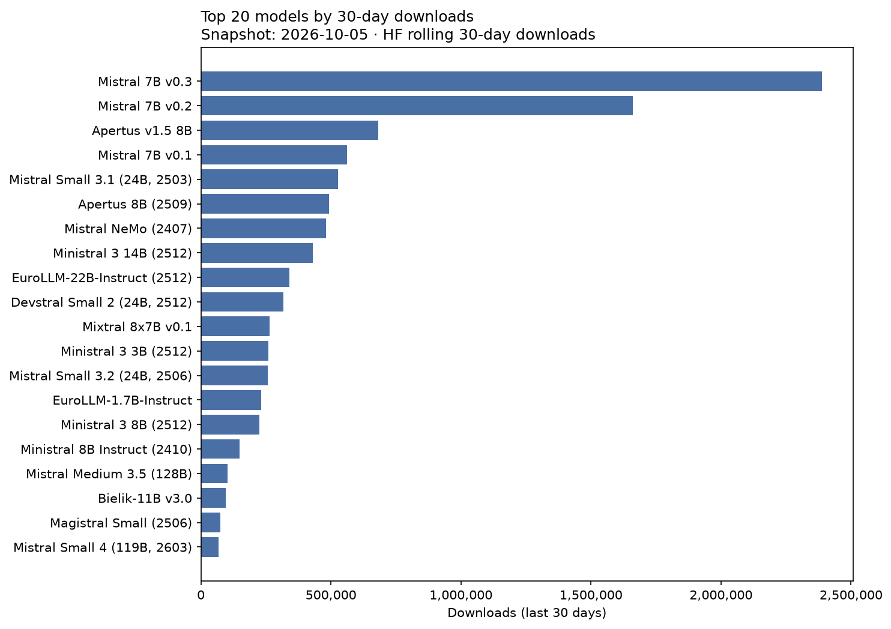
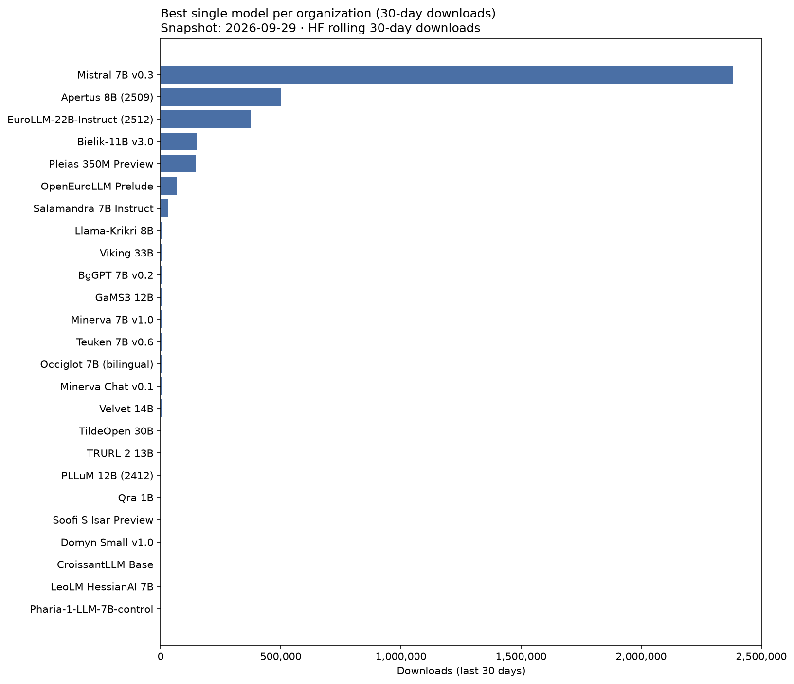
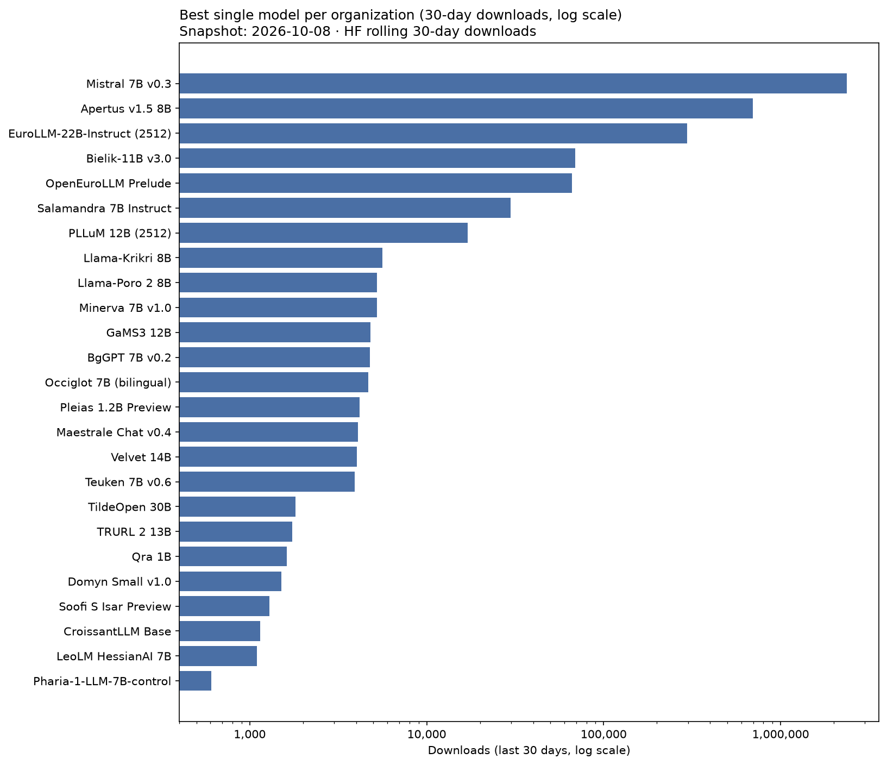
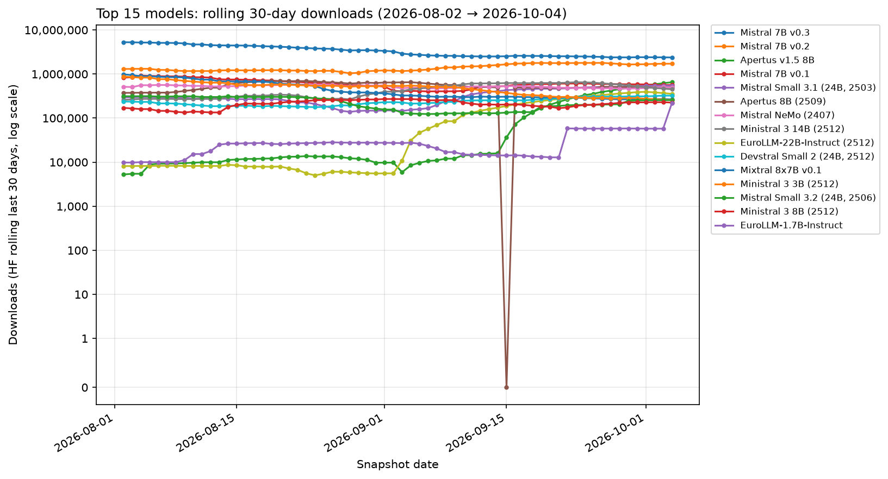
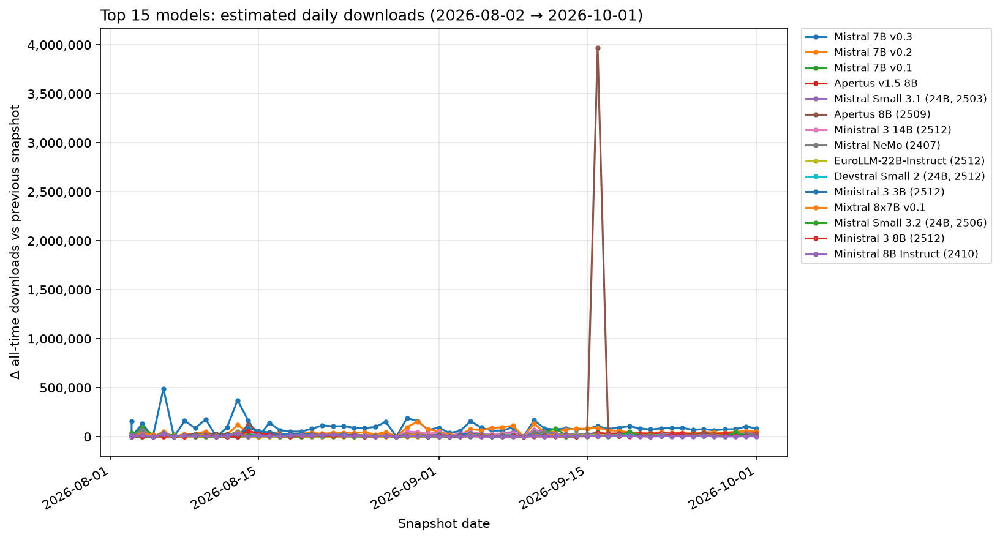
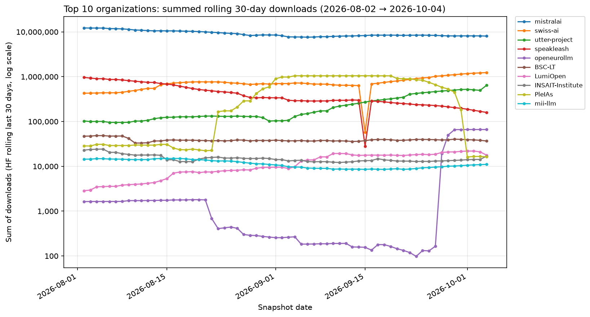
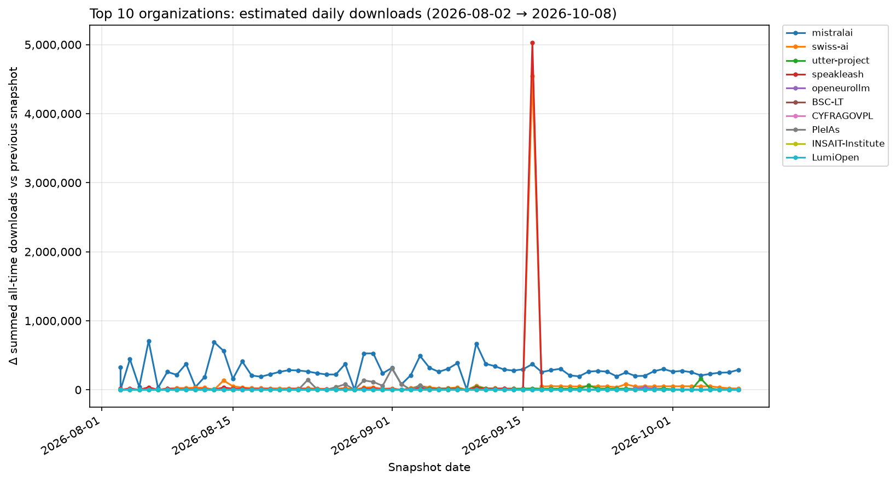

# European LLM Hugging Face download leaderboard

- **Snapshot date:** 2026-10-01
- **Generated at:** 2026-10-01T12:47:17Z
- **Ranking metric:** `total_downloads_30d` (last 30 days, summed across official format variants)
- **Rows:** 158

## Charts

### Trends over time

From daily snapshots in `data/metrics/timeseries.jsonl` (top 15 models / top 10 orgs by latest-day volume). Rolling-30d charts use a symlog y-axis (0 at zero, log compression above).

| Rank | Model | Country | Developer | Org | Downloads (30d) | Δ 30d | All-time | Momentum | Params | Repos |
| ---: | --- | :---: | --- | --- | ---: | ---: | ---: | ---: | ---: | ---: |
| 1 | Mistral 7B v0.3 | FR | Mistral AI | [mistralai](https://huggingface.co/mistralai) | 2,406,416 | -2,050 | 57,633,252 | 4.2% | 7.25B | 2 |
| 2 | Mistral 7B v0.2 | FR | Mistral AI | [mistralai](https://huggingface.co/mistralai) | 1,670,224 | +11,421 | 64,634,591 | 2.6% | 7.24B | 1 |
| 3 | Mistral 7B v0.1 | FR | Mistral AI | [mistralai](https://huggingface.co/mistralai) | 580,752 | -3,501 | 45,702,795 | 1.3% | 7.24B | 2 |
| 4 | Apertus v1.5 8B | CH | swiss-ai | [swiss-ai](https://huggingface.co/swiss-ai) | 554,756 | +33,345 | 569,959 | 82.8% | 8.90B | 1 |
| 5 | Mistral Small 3.1 (24B, 2503) | FR | Mistral AI | [mistralai](https://huggingface.co/mistralai) | 540,933 | +9,985 | 4,761,597 | 11.1% | 24.01B | 2 |
| 6 | Apertus 8B (2509) | CH | swiss-ai | [swiss-ai](https://huggingface.co/swiss-ai) | 498,730 | -2,055 | 4,232,624 | 11.5% | 8.05B | 2 |
| 7 | Ministral 3 14B (2512) | FR | Mistral AI | [mistralai](https://huggingface.co/mistralai) | 498,256 | -22,044 | 3,699,520 | 13.1% | 13.95B | 6 |
| 8 | Mistral NeMo (2407) | FR | Mistral AI | [mistralai](https://huggingface.co/mistralai) | 479,240 | +5,386 | 16,381,593 | 2.9% | 12.25B | 3 |
| 9 | EuroLLM-22B-Instruct (2512) | EU | utter-project | [utter-project](https://huggingface.co/utter-project) | 394,607 | +6,669 | 593,300 | 56.9% | 22.64B | 1 |
| 10 | Devstral Small 2 (24B, 2512) | FR | Mistral AI | [mistralai](https://huggingface.co/mistralai) | 312,218 | +494 | 2,843,369 | 10.6% | 24.01B | 1 |
| 11 | Ministral 3 3B (2512) | FR | Mistral AI | [mistralai](https://huggingface.co/mistralai) | 274,068 | -9,787 | 5,601,983 | 4.8% | 4.25B | 7 |
| 12 | Mixtral 8x7B v0.1 | FR | Mistral AI | [mistralai](https://huggingface.co/mistralai) | 269,990 | +2,270 | 32,349,131 | 0.8% | 46.70B | 2 |
| 13 | Mistral Small 3.2 (24B, 2506) | FR | Mistral AI | [mistralai](https://huggingface.co/mistralai) | 253,960 | +1,611 | 5,461,169 | 4.6% | 24.01B | 1 |
| 14 | Ministral 3 8B (2512) | FR | Mistral AI | [mistralai](https://huggingface.co/mistralai) | 228,215 | +411 | 2,218,229 | 9.8% | 8.92B | 6 |
| 15 | Ministral 8B Instruct (2410) | FR | Mistral AI | [mistralai](https://huggingface.co/mistralai) | 151,535 | -1,298 | 8,518,575 | 1.8% | 8.02B | 1 |
| 16 | Mistral Medium 3.5 (128B) | FR | Mistral AI | [mistralai](https://huggingface.co/mistralai) | 134,362 | -302 | 1,087,765 | 11.3% | 127.70B | 2 |
| 17 | Bielik-11B v3.0 | PL | SpeakLeash / ACK Cyfronet AGH | [speakleash](https://huggingface.co/speakleash) | 133,430 | -8,759 | 4,146,377 | 3.1% | 11.34B | 8 |
| 18 | Apertus 70B (2509) | CH | swiss-ai | [swiss-ai](https://huggingface.co/swiss-ai) | 94,438 | -1,111 | 531,806 | 14.9% | 70.60B | 2 |
| 19 | Magistral Small (2506) | FR | Mistral AI | [mistralai](https://huggingface.co/mistralai) | 72,548 | +19 | 728,811 | 8.8% | 23.57B | 2 |
| 20 | OpenEuroLLM Prelude | EU | openeurollm | [openeurollm](https://huggingface.co/openeurollm) | 66,266 | +316 | 68,164 | 39.4% | — | 1 |
| 21 | Mistral Small 24B (2501) | FR | Mistral AI | [mistralai](https://huggingface.co/mistralai) | 60,652 | +1,502 | 7,580,973 | 0.8% | 23.57B | 2 |
| 22 | EuroLLM-1.7B-Instruct | EU | utter-project | [utter-project](https://huggingface.co/utter-project) | 57,589 | -259 | 746,632 | 6.8% | 1.66B | 1 |
| 23 | Mistral Small 4 (119B, 2603) | FR | Mistral AI | [mistralai](https://huggingface.co/mistralai) | 54,213 | +684 | 666,788 | 7.1% | 119.40B | 3 |
| 24 | Mixtral 8x22B v0.1 | FR | Mistral AI | [mistralai](https://huggingface.co/mistralai) | 45,534 | -756 | 11,209,424 | 0.4% | 140.63B | 2 |
| 25 | Devstral Small (2507) | FR | Mistral AI | [mistralai](https://huggingface.co/mistralai) | 34,458 | -157 | 631,843 | 4.7% | 23.57B | 2 |
| 26 | Salamandra 7B Instruct | ES | BSC-LT | [BSC-LT](https://huggingface.co/BSC-LT) | 30,753 | -577 | 679,836 | 3.9% | 7.77B | 8 |
| 27 | EuroLLM-9B-Instruct (2512) | EU | utter-project | [utter-project](https://huggingface.co/utter-project) | 27,753 | -442 | 145,788 | 11.3% | 9.15B | 1 |
| 28 | Codestral 22B v0.1 | FR | Mistral AI | [mistralai](https://huggingface.co/mistralai) | 19,385 | -137 | 5,159,253 | 0.4% | 22.25B | 1 |
| 29 | Apertus v1.5 70B | CH | swiss-ai | [swiss-ai](https://huggingface.co/swiss-ai) | 17,930 | +59 | 25,271 | 14.3% | 72.01B | 1 |
| 30 | EuroLLM-9B-Instruct | EU | utter-project | [utter-project](https://huggingface.co/utter-project) | 16,134 | -884 | 481,946 | 2.8% | 9.15B | 1 |
| 31 | Bielik-11B v2.3 | PL | SpeakLeash / ACK Cyfronet AGH | [speakleash](https://huggingface.co/speakleash) | 15,414 | -236 | 778,248 | 1.8% | 11.25B | 10 |
| 32 | EuroLLM-1.7B (base) | EU | utter-project | [utter-project](https://huggingface.co/utter-project) | 15,163 | +15 | 212,979 | 4.8% | — | 1 |
| 33 | Mistral Large 3 (675B, 2512) | FR | Mistral AI | [mistralai](https://huggingface.co/mistralai) | 14,027 | -42 | 73,907 | 8.1% | — | 5 |
| 34 | Bielik-7B v0.1 | PL | SpeakLeash | [speakleash](https://huggingface.co/speakleash) | 12,221 | +81 | 508,423 | 2.0% | 7.24B | 8 |
| 35 | Bielik-Minitron 7B v3.0 | PL | SpeakLeash / ACK Cyfronet AGH | [speakleash](https://huggingface.co/speakleash) | 10,198 | +389 | 133,722 | 4.4% | 7.48B | 5 |
| 36 | Devstral 2 (123B, 2512) | FR | Mistral AI | [mistralai](https://huggingface.co/mistralai) | 9,378 | -1,170 | 349,499 | 2.1% | 125.03B | 1 |
| 37 | Magistral Small (2509) | FR | Mistral AI | [mistralai](https://huggingface.co/mistralai) | 8,712 | +197 | 326,706 | 2.0% | 24.01B | 2 |
| 38 | Mistral Large Instruct (2411) | FR | Mistral AI | [mistralai](https://huggingface.co/mistralai) | 8,066 | +281 | 4,925,941 | 0.2% | 122.61B | 1 |
| 39 | Llama-Krikri 8B | GR | ILSP | [ilsp](https://huggingface.co/ilsp) | 6,431 | -60 | 109,165 | 3.1% | 8.42B | 7 |
| 40 | Llama-Poro 2 8B | FI | LumiOpen | [LumiOpen](https://huggingface.co/LumiOpen) | 6,161 | +159 | 49,236 | 4.1% | 8.03B | 7 |
| 41 | Viking 33B | FI | LumiOpen | [LumiOpen](https://huggingface.co/LumiOpen) | 5,730 | +15 | 30,139 | 4.4% | 33.12B | 1 |
| 42 | Bielik-11B v2.2 | PL | SpeakLeash / ACK Cyfronet AGH | [speakleash](https://huggingface.co/speakleash) | 5,193 | -83 | 164,553 | 2.0% | 11.17B | 16 |
| 43 | Mistral Small Instruct (2409) | FR | Mistral AI | [mistralai](https://huggingface.co/mistralai) | 5,100 | +244 | 5,378,019 | 0.1% | 22.25B | 1 |
| 44 | BgGPT 7B v0.2 | BG | INSAIT | [INSAIT-Institute](https://huggingface.co/INSAIT-Institute) | 4,967 | -47 | 111,327 | 2.4% | 7.29B | 2 |
| 45 | Magistral Small (2507) | FR | Mistral AI | [mistralai](https://huggingface.co/mistralai) | 4,866 | +1,339 | 154,234 | 1.9% | 23.57B | 2 |
| 46 | Salamandra 2B | ES | BSC-LT | [BSC-LT](https://huggingface.co/BSC-LT) | 4,711 | +18 | 144,277 | 1.9% | 2.25B | 7 |
| 47 | GaMS3 12B | SI | CJVT UL (Center za jezikovne vire in tehnologije, University of Ljubljana) | [cjvt](https://huggingface.co/cjvt) | 4,630 | -24 | 66,894 | 2.8% | 12.77B | 5 |
| 48 | Minerva 7B v1.0 | IT | SapienzaNLP | [sapienzanlp](https://huggingface.co/sapienzanlp) | 4,593 | +163 | 133,934 | 2.0% | 7.40B | 3 |
| 49 | Viking 7B | FI | LumiOpen | [LumiOpen](https://huggingface.co/LumiOpen) | 4,369 | +130 | 55,279 | 2.8% | 7.55B | 1 |
| 50 | Teuken 7B v0.6 | DE | openGPT-X | [openGPT-X](https://huggingface.co/openGPT-X) | 4,252 | -53 | 669,614 | 0.6% | 7.45B | 2 |
| 51 | Devstral Small (2505) | FR | Mistral AI | [mistralai](https://huggingface.co/mistralai) | 4,244 | +32 | 904,794 | 0.4% | 23.57B | 2 |
| 52 | Occiglot 7B (bilingual) | EU | occiglot | [occiglot](https://huggingface.co/occiglot) | 4,239 | +61 | 372,094 | 0.9% | 7.24B | 8 |
| 53 | Bielik-4.5B v3.0 | PL | SpeakLeash | [speakleash](https://huggingface.co/speakleash) | 4,145 | -11 | 252,797 | 1.2% | 4.76B | 5 |
| 54 | Apertus v1.1 0.5B | CH | swiss-ai | [swiss-ai](https://huggingface.co/swiss-ai) | 3,961 | +182 | 14,292 | 3.5% | 572.6M | 5 |
| 55 | Minerva Chat v0.1 | IT | mii-llm | [mii-llm](https://huggingface.co/mii-llm) | 3,911 | +55 | 91,786 | 2.0% | 2.89B | 1 |
| 56 | Mistral Large Instruct (2407) | FR | Mistral AI | [mistralai](https://huggingface.co/mistralai) | 3,748 | +53 | 5,033,218 | 0.1% | 122.61B | 1 |
| 57 | Viking 13B | FI | LumiOpen | [LumiOpen](https://huggingface.co/LumiOpen) | 3,639 | +7 | 31,659 | 2.8% | 14.03B | 1 |
| 58 | Velvet 14B | IT | Almawave | [Almawave](https://huggingface.co/Almawave) | 3,608 | +95 | 66,294 | 2.2% | 14.08B | 1 |
| 59 | Maestrale Chat v0.4 | IT | mii-llm | [mii-llm](https://huggingface.co/mii-llm) | 3,437 | +91 | 148,416 | 1.4% | 7.24B | 4 |
| 60 | EuroMoE 2.6B-A0.6B (2512) | EU | utter-project | [utter-project](https://huggingface.co/utter-project) | 3,240 | +65 | 35,461 | 2.4% | 2.61B | 3 |
| 61 | Pleias 1.2B Preview | FR | PleIAs | [PleIAs](https://huggingface.co/PleIAs) | 3,207 | -57,047 | 413,643 | 0.6% | 1.20B | 1 |
| 62 | Pleias 350M Preview | FR | PleIAs | [PleIAs](https://huggingface.co/PleIAs) | 3,073 | -57,294 | 417,162 | 0.6% | 353.4M | 1 |
| 63 | Pleias 3B Preview | FR | PleIAs | [PleIAs](https://huggingface.co/PleIAs) | 3,031 | -55,479 | 398,708 | 0.6% | 3.21B | 1 |
| 64 | Bielik-1.5B v3.0 | PL | SpeakLeash | [speakleash](https://huggingface.co/speakleash) | 2,868 | +39 | 57,801 | 1.8% | 1.60B | 5 |
| 65 | EuroLLM-9B (base) | EU | utter-project | [utter-project](https://huggingface.co/utter-project) | 2,493 | -1 | 84,239 | 1.4% | 9.15B | 1 |
| 66 | Baguettotron | FR | PleIAs | [PleIAs](https://huggingface.co/PleIAs) | 2,429 | +34 | 39,901 | 1.7% | 321.0M | 2 |
| 67 | GaMS 9B | SI | CJVT UL (Center za jezikovne vire in tehnologije, University of Ljubljana) | [cjvt](https://huggingface.co/cjvt) | 2,213 | +6 | 49,081 | 1.5% | 9.24B | 4 |
| 68 | MamayLM Gemma 3 12B v2.0 | UA | INSAIT | [INSAIT-Institute](https://huggingface.co/INSAIT-Institute) | 2,210 | +229 | 17,932 | 1.9% | 12.19B | 2 |
| 69 | EuroLLM-22B-Instruct (Preview) | EU | utter-project | [utter-project](https://huggingface.co/utter-project) | 2,152 | +24 | 32,602 | 1.6% | 22.64B | 1 |
| 70 | Teuken 7B v0.4 (research) | DE | openGPT-X | [openGPT-X](https://huggingface.co/openGPT-X) | 2,034 | +31 | 78,131 | 1.1% | 7.45B | 1 |
| 71 | Velvet 2B | IT | Almawave | [Almawave](https://huggingface.co/Almawave) | 2,000 | +95 | 85,221 | 1.1% | 2.22B | 1 |
| 72 | EuroLLM-22B (2512 base) | EU | utter-project | [utter-project](https://huggingface.co/utter-project) | 1,995 | +31 | 23,389 | 1.6% | 22.64B | 1 |
| 73 | Apertus v1.1 1.5B | CH | swiss-ai | [swiss-ai](https://huggingface.co/swiss-ai) | 1,959 | -58 | 8,104 | 1.8% | 1.51B | 6 |
| 74 | Mathstral 7B v0.1 | FR | Mistral AI | [mistralai](https://huggingface.co/mistralai) | 1,896 | +39 | 5,300,604 | 0.0% | 7.25B | 1 |
| 75 | Apertus v1.1 4B | CH | swiss-ai | [swiss-ai](https://huggingface.co/swiss-ai) | 1,839 | -39 | 14,889 | 1.6% | 3.83B | 5 |
| 76 | Teuken 7B v0.4 (commercial) | DE | openGPT-X | [openGPT-X](https://huggingface.co/openGPT-X) | 1,835 | +28 | 105,791 | 0.9% | 7.45B | 1 |
| 77 | TildeOpen 30B | LV | Tilde | [TildeAI](https://huggingface.co/TildeAI) | 1,797 | +63 | 99,621 | 0.9% | 30.68B | 1 |
| 78 | ALIA 40B (base) | ES | BSC-LT | [BSC-LT](https://huggingface.co/BSC-LT) | 1,794 | +3 | 452,393 | 0.3% | 40.43B | 1 |
| 79 | TRURL 2 13B | PL | Voicelab | [Voicelab](https://huggingface.co/Voicelab) | 1,701 | +14 | 355,771 | 0.4% | — | 3 |
| 80 | PLLuM 12B (2412) | PL | CYFRAGOVPL / PLLuM consortium | [CYFRAGOVPL](https://huggingface.co/CYFRAGOVPL) | 1,665 | +4 | 176,663 | 0.6% | 12.25B | 6 |
| 81 | Salamandra 7B (base) | ES | BSC-LT | [BSC-LT](https://huggingface.co/BSC-LT) | 1,639 | +13 | 49,500 | 1.1% | 7.77B | 1 |
| 82 | Qra 1B | PL | OPI-PG | [OPI-PG](https://huggingface.co/OPI-PG) | 1,588 | +23 | 157,556 | 0.6% | 1.10B | 1 |
| 83 | TRURL 2 7B | PL | Voicelab | [Voicelab](https://huggingface.co/Voicelab) | 1,549 | +18 | 301,059 | 0.4% | 6.74B | 2 |
| 84 | Bielik-11B v2.0 | PL | SpeakLeash / ACK Cyfronet AGH | [speakleash](https://huggingface.co/speakleash) | 1,520 | +35 | 22,434 | 1.2% | 11.17B | 5 |
| 85 | Qra 13B | PL | OPI-PG | [OPI-PG](https://huggingface.co/OPI-PG) | 1,490 | +20 | 145,211 | 0.6% | 13.02B | 1 |
| 86 | Qra 7B | PL | OPI-PG | [OPI-PG](https://huggingface.co/OPI-PG) | 1,483 | +19 | 184,412 | 0.5% | 6.74B | 1 |
| 87 | Bielik-11B v2.6 | PL | SpeakLeash / ACK Cyfronet AGH | [speakleash](https://huggingface.co/speakleash) | 1,411 | -18 | 173,325 | 0.5% | 11.51B | 7 |
| 88 | Domyn Small v1.0 | IT | Domyn | [domyn](https://huggingface.co/domyn) | 1,403 | +12 | 7,696 | 1.3% | 9.82B | 1 |
| 89 | Monad | FR | PleIAs | [PleIAs](https://huggingface.co/PleIAs) | 1,395 | +45 | 32,685 | 1.1% | 56.7M | 1 |
| 90 | Soofi S Isar Preview | DE | Soofi Project | [Soofi-Project](https://huggingface.co/Soofi-Project) | 1,363 | -18 | 12,009 | 1.2% | 31.59B | 6 |
| 91 | Bielik-11B v2.1 | PL | SpeakLeash / ACK Cyfronet AGH | [speakleash](https://huggingface.co/speakleash) | 1,342 | +11 | 30,505 | 1.0% | 11.17B | 5 |
| 92 | MamayLM Gemma 3 4B v1.0 | UA | INSAIT | [INSAIT-Institute](https://huggingface.co/INSAIT-Institute) | 1,286 | -39 | 19,998 | 1.1% | 4.30B | 2 |
| 93 | CroissantLLM Base | FR | croissantllm | [croissantllm](https://huggingface.co/croissantllm) | 1,280 | +12 | 57,269 | 0.8% | 1.35B | 3 |
| 94 | PLLuM 12B (2512) | PL | CYFRAGOVPL / PLLuM consortium | [CYFRAGOVPL](https://huggingface.co/CYFRAGOVPL) | 1,164 | +35 | 19,674 | 1.0% | 12.25B | 3 |
| 95 | BgGPT Gemma 3 27B | BG | INSAIT | [INSAIT-Institute](https://huggingface.co/INSAIT-Institute) | 1,148 | +178 | 8,589 | 1.1% | 27.43B | 3 |
| 96 | Poro 34B | FI | LumiOpen | [LumiOpen](https://huggingface.co/LumiOpen) | 1,095 | +30 | 227,901 | 0.3% | 35.13B | 4 |
| 97 | EuroLLM-9B (2512) | EU | utter-project | [utter-project](https://huggingface.co/utter-project) | 1,093 | -194 | 9,410 | 1.0% | 9.15B | 1 |
| 98 | Maestrale Chat v0.3 | IT | mii-llm | [mii-llm](https://huggingface.co/mii-llm) | 1,068 | +44 | 52,629 | 0.7% | 7.24B | 5 |
| 99 | PLLuM 4B (2512) | PL | CYFRAGOVPL / PLLuM consortium | [CYFRAGOVPL](https://huggingface.co/CYFRAGOVPL) | 1,063 | +38 | 7,411 | 1.0% | 4.30B | 3 |
| 100 | CroissantLLM Chat v0.1 | FR | croissantllm | [croissantllm](https://huggingface.co/croissantllm) | 1,058 | -1 | 95,657 | 0.5% | 1.35B | 8 |
| 101 | LeoLM HessianAI 7B | DE | LeoLM | [LeoLM](https://huggingface.co/LeoLM) | 1,044 | +10 | 800,387 | 0.1% | — | 3 |
| 102 | MamayLM Gemma 3 27B v2.0 | UA | INSAIT | [INSAIT-Institute](https://huggingface.co/INSAIT-Institute) | 1,026 | -9 | 8,039 | 0.9% | 28.84B | 3 |
| 103 | Pleias RAG 1B | FR | PleIAs | [PleIAs](https://huggingface.co/PleIAs) | 1,000 | +11 | 18,732 | 0.8% | 1.20B | 2 |
| 104 | Maestrale Chat v0.2 | IT | mii-llm | [mii-llm](https://huggingface.co/mii-llm) | 978 | +46 | 51,487 | 0.6% | 7.24B | 1 |
| 105 | GaMS 27B | SI | CJVT UL (Center za jezikovne vire in tehnologije, University of Ljubljana) | [cjvt](https://huggingface.co/cjvt) | 943 | +24 | 37,518 | 0.7% | 27.23B | 3 |
| 106 | Llama-Poro 2 70B | FI | LumiOpen | [LumiOpen](https://huggingface.co/LumiOpen) | 912 | +15 | 38,806 | 0.7% | 70.55B | 3 |
| 107 | Pleias RAG 350M | FR | PleIAs | [PleIAs](https://huggingface.co/PleIAs) | 879 | +6 | 14,226 | 0.8% | 353.4M | 2 |
| 108 | Soofi S Rhine Preview | DE | Soofi Project | [Soofi-Project](https://huggingface.co/Soofi-Project) | 869 | 0 | 2,828 | 0.8% | 31.59B | 6 |
| 109 | GaMS 1B | SI | CJVT UL (Center za jezikovne vire in tehnologije, University of Ljubljana) | [cjvt](https://huggingface.co/cjvt) | 798 | +21 | 16,135 | 0.7% | 1.54B | 4 |
| 110 | OCRonos | FR | PleIAs | [PleIAs](https://huggingface.co/PleIAs) | 775 | -24 | 81,312 | 0.4% | 8.03B | 3 |
| 111 | GaMS 2B | SI | CJVT UL (Center za jezikovne vire in tehnologije, University of Ljubljana) | [cjvt](https://huggingface.co/cjvt) | 773 | +4 | 20,034 | 0.6% | 3.20B | 2 |
| 112 | MamayLM Gemma 3 12B v1.0 | UA | INSAIT | [INSAIT-Institute](https://huggingface.co/INSAIT-Institute) | 652 | -17 | 44,005 | 0.5% | 12.19B | 2 |
| 113 | Llama-PLLuM 8B (2412) | PL | CYFRAGOVPL / PLLuM consortium | [CYFRAGOVPL](https://huggingface.co/CYFRAGOVPL) | 595 | -34 | 70,272 | 0.3% | 8.03B | 3 |
| 114 | BgGPT Gemma 3 12B | BG | INSAIT | [INSAIT-Institute](https://huggingface.co/INSAIT-Institute) | 581 | -3 | 217,843 | 0.2% | 12.19B | 3 |
| 115 | Soofi S Base | DE | Soofi Project | [Soofi-Project](https://huggingface.co/Soofi-Project) | 571 | -52 | 1,497 | 0.6% | 31.58B | 2 |
| 116 | LeoLM Mistral HessianAI 7B | DE | LeoLM | [LeoLM](https://huggingface.co/LeoLM) | 538 | +4 | 232,632 | 0.2% | — | 2 |
| 117 | Llama-PLLuM 8B (2512) | PL | CYFRAGOVPL / PLLuM consortium | [CYFRAGOVPL](https://huggingface.co/CYFRAGOVPL) | 531 | +10 | 3,794 | 0.5% | 8.03B | 3 |
| 118 | Nesso 0.4B Agentic | IT | mii-llm | [mii-llm](https://huggingface.co/mii-llm) | 530 | -2 | 2,979 | 0.5% | 560.9M | 2 |
| 119 | Llama-PLLuM 70B (2512) | PL | CYFRAGOVPL / PLLuM consortium | [CYFRAGOVPL](https://huggingface.co/CYFRAGOVPL) | 495 | -4 | 12,485 | 0.4% | 70.55B | 2 |
| 120 | ALIA 40B Instruct (2601) | ES | BSC-LT | [BSC-LT](https://huggingface.co/BSC-LT) | 487 | +3 | 32,484 | 0.4% | 40.43B | 2 |
| 121 | Pharia-1-LLM-7B-control | DE | Aleph Alpha | [Aleph-Alpha](https://huggingface.co/Aleph-Alpha) | 486 | +9 | 76,123 | 0.3% | 7.04B | 4 |
| 122 | BgGPT Gemma 3 4B | BG | INSAIT | [INSAIT-Institute](https://huggingface.co/INSAIT-Institute) | 450 | +1 | 13,816 | 0.4% | 4.33B | 3 |
| 123 | BgGPT Gemma 2 9B | BG | INSAIT | [INSAIT-Institute](https://huggingface.co/INSAIT-Institute) | 448 | +2 | 27,239 | 0.4% | 9.24B | 2 |
| 124 | Meltemi 7B v1.5 | GR | ILSP | [ilsp](https://huggingface.co/ilsp) | 443 | -3 | 39,087 | 0.3% | 7.48B | 2 |
| 125 | TildeOpen 30B (64k) | LV | Tilde | [TildeAI](https://huggingface.co/TildeAI) | 421 | -31 | 2,987 | 0.4% | 30.68B | 1 |
| 126 | Occiglot 7B EU5 | EU | occiglot | [occiglot](https://huggingface.co/occiglot) | 418 | +10 | 321,939 | 0.1% | 7.24B | 2 |
| 127 | BgGPT Gemma 2 2.6B | BG | INSAIT | [INSAIT-Institute](https://huggingface.co/INSAIT-Institute) | 407 | +4 | 21,741 | 0.3% | 2.61B | 2 |
| 128 | Soofi S Instruct Preview | DE | Soofi Project | [Soofi-Project](https://huggingface.co/Soofi-Project) | 407 | +1 | 7,303 | 0.4% | 31.59B | 6 |
| 129 | BgGPT Gemma 2 27B | BG | INSAIT | [INSAIT-Institute](https://huggingface.co/INSAIT-Institute) | 376 | +2 | 11,736 | 0.3% | 27.23B | 2 |
| 130 | Meltemi 7B v1 | GR | ILSP | [ilsp](https://huggingface.co/ilsp) | 360 | -11 | 44,414 | 0.2% | 7.70B | 5 |
| 131 | Bielik-11B v2 (base) | PL | SpeakLeash / ACK Cyfronet AGH | [speakleash](https://huggingface.co/speakleash) | 345 | 0 | 41,652 | 0.2% | 11.17B | 1 |
| 132 | Leanstral 1.5 (119B-A6B) | FR | Mistral AI | [mistralai](https://huggingface.co/mistralai) | 310 | +6 | 1,134 | 0.3% | — | 1 |
| 133 | Nesso 4B | IT | mii-llm | [mii-llm](https://huggingface.co/mii-llm) | 289 | +2 | 2,448 | 0.3% | 4.02B | 2 |
| 134 | LeoLM HessianAI 13B | DE | LeoLM | [LeoLM](https://huggingface.co/LeoLM) | 279 | -2 | 106,901 | 0.1% | — | 3 |
| 135 | MamayLM Gemma 2 9B v0.1 | UA | INSAIT | [INSAIT-Institute](https://huggingface.co/INSAIT-Institute) | 269 | +5 | 21,445 | 0.2% | 9.24B | 2 |
| 136 | BgGPT 7B v0.1 | BG | INSAIT | [INSAIT-Institute](https://huggingface.co/INSAIT-Institute) | 256 | +3 | 16,411 | 0.2% | 7.29B | 2 |
| 137 | LeoLM HessianAI 70B | DE | LeoLM | [LeoLM](https://huggingface.co/LeoLM) | 251 | +11 | 19,438 | 0.2% | 68.98B | 2 |
| 138 | GaMS2 27B | SI | CJVT UL (Center za jezikovne vire in tehnologije, University of Ljubljana) | [cjvt](https://huggingface.co/cjvt) | 233 | -10 | 1,234 | 0.2% | 27.23B | 3 |
| 139 | Llama-PLLuM 70B (2412) | PL | CYFRAGOVPL / PLLuM consortium | [CYFRAGOVPL](https://huggingface.co/CYFRAGOVPL) | 207 | +5 | 38,616 | 0.1% | 70.55B | 3 |
| 140 | Bielik-11B v2.5 | PL | SpeakLeash / ACK Cyfronet AGH | [speakleash](https://huggingface.co/speakleash) | 201 | +2 | 5,180 | 0.2% | 11.51B | 5 |
| 141 | Pleias Pico | FR | PleIAs | [PleIAs](https://huggingface.co/PleIAs) | 199 | +1 | 5,321 | 0.2% | 353.4M | 2 |
| 142 | EuroLLM-22B (Preview base) | EU | utter-project | [utter-project](https://huggingface.co/utter-project) | 198 | +4 | 2,349 | 0.2% | — | 1 |
| 143 | Pleias Nano | FR | PleIAs | [PleIAs](https://huggingface.co/PleIAs) | 146 | 0 | 7,149 | 0.1% | 1.20B | 2 |
| 144 | PLLuM 8x7B (2412) | PL | CYFRAGOVPL / PLLuM consortium | [CYFRAGOVPL](https://huggingface.co/CYFRAGOVPL) | 141 | 0 | 28,244 | 0.1% | 46.70B | 6 |
| 145 | Zagreus 0.4B (ITA) | IT | mii-llm | [mii-llm](https://huggingface.co/mii-llm) | 138 | -8 | 4,880 | 0.1% | 437.8M | 1 |
| 146 | Llama-PLLuM 70B (2508) | PL | CYFRAGOVPL / PLLuM consortium | [CYFRAGOVPL](https://huggingface.co/CYFRAGOVPL) | 135 | -5 | 4,836 | 0.1% | 70.55B | 3 |
| 147 | Leanstral (2603) | FR | Mistral AI | [mistralai](https://huggingface.co/mistralai) | 127 | +2 | 1,009 | 0.1% | — | 1 |
| 148 | Nesso 0.4B Instruct | IT | mii-llm | [mii-llm](https://huggingface.co/mii-llm) | 93 | -4 | 1,235 | 0.1% | 560.9M | 1 |
| 149 | Zagreus 0.4B (SPA) | IT | mii-llm | [mii-llm](https://huggingface.co/mii-llm) | 55 | +1 | 189 | 0.1% | 437.8M | 1 |
| 150 | Pleias SLM RAG | FR | PleIAs | [PleIAs](https://huggingface.co/PleIAs) | 49 | +1 | 352 | 0.0% | 321.0M | 1 |
| 151 | Zagreus 0.4B (POR) | IT | mii-llm | [mii-llm](https://huggingface.co/mii-llm) | 34 | -3 | 258 | 0.0% | 437.8M | 1 |
| 152 | TildeOpen 15B WMT26 (cs-de) | LV | Tilde | [TildeAI](https://huggingface.co/TildeAI) | 28 | +8 | 223 | 0.0% | 15.17B | 3 |
| 153 | Zagreus 0.4B (FRA) | IT | mii-llm | [mii-llm](https://huggingface.co/mii-llm) | 28 | 0 | 143 | 0.0% | 437.8M | 1 |
| 154 | TildeOpen 8B WMT26 (cs-de) | LV | Tilde | [TildeAI](https://huggingface.co/TildeAI) | 24 | +6 | 165 | 0.0% | 8.16B | 3 |
| 155 | Open Zagreus 0.4B | IT | mii-llm | [mii-llm](https://huggingface.co/mii-llm) | 17 | -1 | 354 | 0.0% | 437.8M | 1 |
| 156 | Maestrale Chat v0.1 | IT | mii-llm | [mii-llm](https://huggingface.co/mii-llm) | 14 | -1 | 111 | 0.0% | 7.24B | 1 |
| 157 | PLLuM 12B nc (2507) | PL | CYFRAGOVPL / PLLuM consortium | [CYFRAGOVPL](https://huggingface.co/CYFRAGOVPL) | 5 | -4 | 6,035 | 0.0% | 12.25B | 3 |
| 158 | Emma 5 Boost | IT | mii-llm | [mii-llm](https://huggingface.co/mii-llm) | 0 | 0 | 8 | 0.0% | 1.39B | 1 |

## Organizations

Same downloads, aggregated across every model version an organization publishes.

| Rank | Organization | Developer | Country | Downloads (30d) | All-time | Models | Momentum |
| ---: | --- | --- | :---: | ---: | ---: | ---: | ---: |
| 1 | [mistralai](https://huggingface.co/mistralai) | Mistral AI | FR | 8,147,433 | 299,319,726 | 30 | 2.7% |
| 2 | [swiss-ai](https://huggingface.co/swiss-ai) | swiss-ai | CH | 1,173,613 | 5,396,945 | 7 | 21.4% |
| 3 | [utter-project](https://huggingface.co/utter-project) | utter-project | EU | 522,417 | 2,368,095 | 11 | 21.2% |
| 4 | [speakleash](https://huggingface.co/speakleash) | SpeakLeash / ACK Cyfronet AGH | PL | 188,288 | 6,315,017 | 12 | 2.9% |
| 5 | [openeurollm](https://huggingface.co/openeurollm) | openeurollm | EU | 66,266 | 68,164 | 1 | 39.4% |
| 6 | [BSC-LT](https://huggingface.co/BSC-LT) | BSC-LT | ES | 39,384 | 1,358,490 | 5 | 2.7% |
| 7 | [LumiOpen](https://huggingface.co/LumiOpen) | LumiOpen | FI | 21,906 | 433,020 | 6 | 4.1% |
| 8 | [PleIAs](https://huggingface.co/PleIAs) | PleIAs | FR | 16,183 | 1,429,191 | 11 | 1.1% |
| 9 | [INSAIT-Institute](https://huggingface.co/INSAIT-Institute) | INSAIT | BG | 14,076 | 540,121 | 13 | 2.2% |
| 10 | [mii-llm](https://huggingface.co/mii-llm) | mii-llm | IT | 10,592 | 356,923 | 14 | 2.3% |
| 11 | [cjvt](https://huggingface.co/cjvt) | CJVT UL (Center za jezikovne vire in tehnologije, University of Ljubljana) | SI | 9,590 | 190,896 | 6 | 3.3% |
| 12 | [openGPT-X](https://huggingface.co/openGPT-X) | openGPT-X | DE | 8,121 | 853,536 | 3 | 0.9% |
| 13 | [ilsp](https://huggingface.co/ilsp) | ILSP | GR | 7,234 | 192,666 | 3 | 2.5% |
| 14 | [CYFRAGOVPL](https://huggingface.co/CYFRAGOVPL) | CYFRAGOVPL / PLLuM consortium | PL | 6,001 | 368,030 | 10 | 1.3% |
| 15 | [Almawave](https://huggingface.co/Almawave) | Almawave | IT | 5,608 | 151,515 | 2 | 2.2% |
| 16 | [occiglot](https://huggingface.co/occiglot) | occiglot | EU | 4,657 | 694,033 | 2 | 0.6% |
| 17 | [sapienzanlp](https://huggingface.co/sapienzanlp) | SapienzaNLP | IT | 4,593 | 133,934 | 1 | 2.0% |
| 18 | [OPI-PG](https://huggingface.co/OPI-PG) | OPI-PG | PL | 4,561 | 487,179 | 3 | 0.8% |
| 19 | [Voicelab](https://huggingface.co/Voicelab) | Voicelab | PL | 3,250 | 656,830 | 2 | 0.4% |
| 20 | [Soofi-Project](https://huggingface.co/Soofi-Project) | Soofi Project | DE | 3,210 | 23,637 | 4 | 2.6% |
| 21 | [croissantllm](https://huggingface.co/croissantllm) | croissantllm | FR | 2,338 | 152,926 | 2 | 0.9% |
| 22 | [TildeAI](https://huggingface.co/TildeAI) | Tilde | LV | 2,270 | 102,996 | 4 | 1.1% |
| 23 | [LeoLM](https://huggingface.co/LeoLM) | LeoLM | DE | 2,112 | 1,159,358 | 4 | 0.2% |
| 24 | [domyn](https://huggingface.co/domyn) | Domyn | IT | 1,403 | 7,696 | 1 | 1.3% |
| 25 | [Aleph-Alpha](https://huggingface.co/Aleph-Alpha) | Aleph Alpha | DE | 486 | 76,123 | 1 | 0.3% |

### By best single model

Ranked by each organization's single highest-downloading model (no summing across versions) — who has the biggest individual hit.

| Rank | Organization | Best model | Downloads (30d) | All-time | Overall model rank |
| ---: | --- | --- | ---: | ---: | ---: |
| 1 | [mistralai](https://huggingface.co/mistralai) | Mistral 7B v0.3 | 2,406,416 | 57,633,252 | 1 |
| 2 | [swiss-ai](https://huggingface.co/swiss-ai) | Apertus v1.5 8B | 554,756 | 569,959 | 4 |
| 3 | [utter-project](https://huggingface.co/utter-project) | EuroLLM-22B-Instruct (2512) | 394,607 | 593,300 | 9 |
| 4 | [speakleash](https://huggingface.co/speakleash) | Bielik-11B v3.0 | 133,430 | 4,146,377 | 17 |
| 5 | [openeurollm](https://huggingface.co/openeurollm) | OpenEuroLLM Prelude | 66,266 | 68,164 | 20 |
| 6 | [BSC-LT](https://huggingface.co/BSC-LT) | Salamandra 7B Instruct | 30,753 | 679,836 | 26 |
| 7 | [ilsp](https://huggingface.co/ilsp) | Llama-Krikri 8B | 6,431 | 109,165 | 39 |
| 8 | [LumiOpen](https://huggingface.co/LumiOpen) | Llama-Poro 2 8B | 6,161 | 49,236 | 40 |
| 9 | [INSAIT-Institute](https://huggingface.co/INSAIT-Institute) | BgGPT 7B v0.2 | 4,967 | 111,327 | 44 |
| 10 | [cjvt](https://huggingface.co/cjvt) | GaMS3 12B | 4,630 | 66,894 | 47 |
| 11 | [sapienzanlp](https://huggingface.co/sapienzanlp) | Minerva 7B v1.0 | 4,593 | 133,934 | 48 |
| 12 | [openGPT-X](https://huggingface.co/openGPT-X) | Teuken 7B v0.6 | 4,252 | 669,614 | 50 |
| 13 | [occiglot](https://huggingface.co/occiglot) | Occiglot 7B (bilingual) | 4,239 | 372,094 | 52 |
| 14 | [mii-llm](https://huggingface.co/mii-llm) | Minerva Chat v0.1 | 3,911 | 91,786 | 55 |
| 15 | [Almawave](https://huggingface.co/Almawave) | Velvet 14B | 3,608 | 66,294 | 58 |
| 16 | [PleIAs](https://huggingface.co/PleIAs) | Pleias 1.2B Preview | 3,207 | 413,643 | 61 |
| 17 | [TildeAI](https://huggingface.co/TildeAI) | TildeOpen 30B | 1,797 | 99,621 | 77 |
| 18 | [Voicelab](https://huggingface.co/Voicelab) | TRURL 2 13B | 1,701 | 355,771 | 79 |
| 19 | [CYFRAGOVPL](https://huggingface.co/CYFRAGOVPL) | PLLuM 12B (2412) | 1,665 | 176,663 | 80 |
| 20 | [OPI-PG](https://huggingface.co/OPI-PG) | Qra 1B | 1,588 | 157,556 | 82 |
| 21 | [domyn](https://huggingface.co/domyn) | Domyn Small v1.0 | 1,403 | 7,696 | 88 |
| 22 | [Soofi-Project](https://huggingface.co/Soofi-Project) | Soofi S Isar Preview | 1,363 | 12,009 | 90 |
| 23 | [croissantllm](https://huggingface.co/croissantllm) | CroissantLLM Base | 1,280 | 57,269 | 93 |
| 24 | [LeoLM](https://huggingface.co/LeoLM) | LeoLM HessianAI 7B | 1,044 | 800,387 | 101 |
| 25 | [Aleph-Alpha](https://huggingface.co/Aleph-Alpha) | Pharia-1-LLM-7B-control | 486 | 76,123 | 121 |

### By momentum

Sorted by momentum (highest first). Momentum highlights orgs whose recent downloads are large *relative to their lifetime total* — i.e. accelerating adoption, not legacy long-tail traffic from an old release.

| Momentum rank | Organization | Momentum | Downloads (30d) | All-time | Downloads rank |
| ---: | --- | ---: | ---: | ---: | ---: |
| 1 | [openeurollm](https://huggingface.co/openeurollm) | 39.4% | 66,266 | 68,164 | 5 |
| 2 | [swiss-ai](https://huggingface.co/swiss-ai) | 21.4% | 1,173,613 | 5,396,945 | 2 |
| 3 | [utter-project](https://huggingface.co/utter-project) | 21.2% | 522,417 | 2,368,095 | 3 |
| 4 | [LumiOpen](https://huggingface.co/LumiOpen) | 4.1% | 21,906 | 433,020 | 7 |
| 5 | [cjvt](https://huggingface.co/cjvt) | 3.3% | 9,590 | 190,896 | 11 |
| 6 | [speakleash](https://huggingface.co/speakleash) | 2.9% | 188,288 | 6,315,017 | 4 |
| 7 | [mistralai](https://huggingface.co/mistralai) | 2.7% | 8,147,433 | 299,319,726 | 1 |
| 8 | [BSC-LT](https://huggingface.co/BSC-LT) | 2.7% | 39,384 | 1,358,490 | 6 |
| 9 | [Soofi-Project](https://huggingface.co/Soofi-Project) | 2.6% | 3,210 | 23,637 | 20 |
| 10 | [ilsp](https://huggingface.co/ilsp) | 2.5% | 7,234 | 192,666 | 13 |
| 11 | [mii-llm](https://huggingface.co/mii-llm) | 2.3% | 10,592 | 356,923 | 10 |
| 12 | [Almawave](https://huggingface.co/Almawave) | 2.2% | 5,608 | 151,515 | 15 |
| 13 | [INSAIT-Institute](https://huggingface.co/INSAIT-Institute) | 2.2% | 14,076 | 540,121 | 9 |
| 14 | [sapienzanlp](https://huggingface.co/sapienzanlp) | 2.0% | 4,593 | 133,934 | 17 |
| 15 | [domyn](https://huggingface.co/domyn) | 1.3% | 1,403 | 7,696 | 24 |
| 16 | [CYFRAGOVPL](https://huggingface.co/CYFRAGOVPL) | 1.3% | 6,001 | 368,030 | 14 |
| 17 | [TildeAI](https://huggingface.co/TildeAI) | 1.1% | 2,270 | 102,996 | 22 |
| 18 | [PleIAs](https://huggingface.co/PleIAs) | 1.1% | 16,183 | 1,429,191 | 8 |
| 19 | [croissantllm](https://huggingface.co/croissantllm) | 0.9% | 2,338 | 152,926 | 21 |
| 20 | [openGPT-X](https://huggingface.co/openGPT-X) | 0.9% | 8,121 | 853,536 | 12 |
| 21 | [OPI-PG](https://huggingface.co/OPI-PG) | 0.8% | 4,561 | 487,179 | 18 |
| 22 | [occiglot](https://huggingface.co/occiglot) | 0.6% | 4,657 | 694,033 | 16 |
| 23 | [Voicelab](https://huggingface.co/Voicelab) | 0.4% | 3,250 | 656,830 | 19 |
| 24 | [Aleph-Alpha](https://huggingface.co/Aleph-Alpha) | 0.3% | 486 | 76,123 | 25 |
| 25 | [LeoLM](https://huggingface.co/LeoLM) | 0.2% | 2,112 | 1,159,358 | 23 |

## Notes

- Downloads are Hugging Face Hub **rolling last-30-day** counts, aggregated over official repos matched by config regexes (GGUF / MLX / FP8 / etc. when published by the same org).
- **Params** is the max reported parameter count among member repos (`safetensors.total`, else `gguf.total`).
- **Momentum** = `downloads_30d / (downloads_all_time + 100,000)` — a recency ratio damped by a smoothing constant so low-volume/brand-new rows can't look like they have outsized momentum from a handful of downloads. Higher = more of its lifetime downloads happened in the last 30 days.
- **Trend charts** use [`data/metrics/timeseries.jsonl`](data/metrics/timeseries.jsonl). Rolling-30d lines follow HF’s sliding window; daily Δ lines use day-over-day changes in `downloads_all_time` (approximate new downloads, not unique users).
- Machine-readable data: [`output/leaderboard.json`](output/leaderboard.json), [`output/leaderboard.csv`](output/leaderboard.csv), [`output/leaderboard_orgs.json`](output/leaderboard_orgs.json), [`output/leaderboard_orgs.csv`](output/leaderboard_orgs.csv).
- How this is built / how to add models: [`DEVELOPMENT.md`](DEVELOPMENT.md).
- This file is regenerated by CI (`fetch` workflow) via `scripts/render_leaderboard_md.py`.
