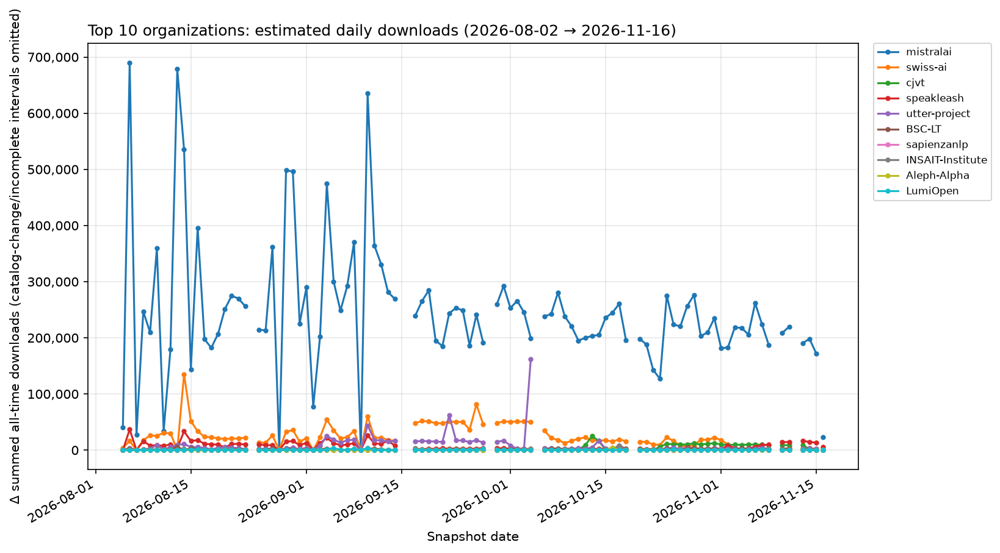

# European LLM Hugging Face download leaderboard

- **Snapshot date:** 2026-11-16
- **Generated at:** 2026-11-16T15:21:07Z
- **Ranking metric:** `total_downloads_30d` (last 30 days, summed across official format variants)
- **Rows:** 197

General-purpose generative LLMs, including general-purpose multimodal models. Task-specific OCR, translation, RAG, coding, math/proof, decision and function-calling specialists are excluded, alongside auxiliary models.

Historical snapshots retain their original scope; changes across the scope correction on 2026-11-16 also reflect the removed repositories.

## Charts

### Trends over time

From daily snapshots in `data/metrics/timeseries.jsonl` (top 15 models / top 10 orgs by latest-day volume). Rolling-30d charts use a symlog y-axis (0 at zero, log compression above).

Rolling-30-day charts omit incomplete model observations; organization totals have a gap if any member model is incomplete. Complete zero observations remain zero.

Daily estimates omit intervals where the catalog changed, its identity is unknown, or a fetch was incomplete; they resume after two complete observations of the same catalog. This avoids counting newly added models’ lifetime downloads as daily growth.

| Rank | Model | Country | Developer | Org | Downloads (30d) | Δ 30d | All-time | Momentum | Params | Repos |
| ---: | --- | :---: | --- | --- | ---: | ---: | ---: | ---: | ---: | ---: |
| 1 | Mistral 7B v0.3 | FR | Mistral AI | [mistralai](https://huggingface.co/mistralai) | 2,021,775 | +9,748 | 60,805,659 | 3.3% | 7.25B | 2 |
| 2 | Mistral 7B v0.2 | FR | Mistral AI | [mistralai](https://huggingface.co/mistralai) | 1,159,669 | -34,791 | 66,958,424 | 1.7% | 7.24B | 1 |
| 3 | Ministral 3 14B (2512) | FR | Mistral AI | [mistralai](https://huggingface.co/mistralai) | 654,849 | -12,991 | 4,569,506 | 14.0% | 13.95B | 6 |
| 4 | Mistral 7B v0.1 | FR | Mistral AI | [mistralai](https://huggingface.co/mistralai) | 551,470 | -899 | 46,553,497 | 1.2% | 7.24B | 2 |
| 5 | Mixtral 8x7B v0.1 | FR | Mistral AI | [mistralai](https://huggingface.co/mistralai) | 359,851 | -1,309 | 32,856,363 | 1.1% | 46.70B | 2 |
| 6 | Ministral 3 8B (2512) | FR | Mistral AI | [mistralai](https://huggingface.co/mistralai) | 264,046 | -327 | 2,583,684 | 9.8% | 8.92B | 6 |
| 7 | GaMS3 12B | SI | CJVT UL (Center za jezikovne vire in tehnologije, University of Ljubljana) | [cjvt](https://huggingface.co/cjvt) | 213,127 | +7 | 331,919 | 49.3% | 12.77B | 4 |
| 8 | Ministral 3 3B (2512) | FR | Mistral AI | [mistralai](https://huggingface.co/mistralai) | 208,988 | -1,968 | 5,932,937 | 3.5% | 3.85B | 7 |
| 9 | Apertus 8B (2509) | CH | swiss-ai | [swiss-ai](https://huggingface.co/swiss-ai) | 201,563 | -13,510 | 4,696,677 | 4.2% | 8.05B | 2 |
| 10 | Mistral NeMo (2407) | FR | Mistral AI | [mistralai](https://huggingface.co/mistralai) | 145,331 | -1,224 | 16,687,585 | 0.9% | 12.25B | 3 |
| 11 | Mistral Small 3.1 (24B, 2503) | FR | Mistral AI | [mistralai](https://huggingface.co/mistralai) | 140,087 | -4,001 | 5,041,492 | 2.7% | 24.01B | 2 |
| 12 | Bielik-11B v3.0 | PL | SpeakLeash / ACK Cyfronet AGH | [speakleash](https://huggingface.co/speakleash) | 126,548 | +3,873 | 4,292,487 | 2.9% | 11.34B | 10 |
| 13 | Mistral Small 3.2 (24B, 2506) | FR | Mistral AI | [mistralai](https://huggingface.co/mistralai) | 105,616 | +4,598 | 5,656,809 | 1.8% | 24.01B | 1 |
| 14 | Mistral Small 24B (2501) | FR | Mistral AI | [mistralai](https://huggingface.co/mistralai) | 101,326 | -780 | 7,732,991 | 1.3% | 23.57B | 2 |
| 15 | Voxtral Mini 3B (2507) | FR | Mistral AI | [mistralai](https://huggingface.co/mistralai) | 86,069 | — | 6,580,241 | 1.3% | 4.68B | 1 |
| 16 | Ministral 8B Instruct (2410) | FR | Mistral AI | [mistralai](https://huggingface.co/mistralai) | 62,418 | +202 | 8,612,489 | 0.7% | 8.02B | 1 |
| 17 | Mixtral 8x22B v0.1 | FR | Mistral AI | [mistralai](https://huggingface.co/mistralai) | 43,827 | +41 | 11,297,423 | 0.4% | 140.63B | 2 |
| 18 | Magistral Small (2506) | FR | Mistral AI | [mistralai](https://huggingface.co/mistralai) | 38,252 | -2,243 | 807,720 | 4.2% | 23.57B | 2 |
| 19 | Salamandra 7B Instruct | ES | BSC-LT | [BSC-LT](https://huggingface.co/BSC-LT) | 35,506 | -3,167 | 735,619 | 4.2% | 7.77B | 5 |
| 20 | Mistral Small 4 (119B, 2603) | FR | Mistral AI | [mistralai](https://huggingface.co/mistralai) | 35,113 | -49 | 751,961 | 4.1% | 119.40B | 3 |
| 21 | Magistral Small (2509) | FR | Mistral AI | [mistralai](https://huggingface.co/mistralai) | 21,355 | +628 | 370,737 | 4.5% | 24.01B | 2 |
| 22 | EuroLLM-1.7B-Instruct | EU | utter-project | [utter-project](https://huggingface.co/utter-project) | 19,733 | -155 | 948,064 | 1.9% | 1.66B | 1 |
| 23 | Bielik-11B v2.3 | PL | SpeakLeash / ACK Cyfronet AGH | [speakleash](https://huggingface.co/speakleash) | 17,522 | +637 | 803,455 | 1.9% | 11.25B | 10 |
| 24 | Mistral Large 4 (1T-A52B) | FR | Mistral AI | [mistralai](https://huggingface.co/mistralai) | 16,999 | +373 | 17,059 | 14.5% | — | 2 |
| 25 | Apertus v1.5 8B | CH | swiss-ai | [swiss-ai](https://huggingface.co/swiss-ai) | 15,268 | -185 | 749,669 | 1.8% | 8.90B | 5 |
| 26 | Mistral Medium 3.5 (128B) | FR | Mistral AI | [mistralai](https://huggingface.co/mistralai) | 14,942 | -142 | 1,123,364 | 1.2% | 127.70B | 2 |
| 27 | Mistral Large Instruct (2411) | FR | Mistral AI | [mistralai](https://huggingface.co/mistralai) | 14,703 | -17 | 4,946,542 | 0.3% | 122.61B | 1 |
| 28 | Kolibri-1 | DE | Aleph Alpha | [Aleph-Alpha](https://huggingface.co/Aleph-Alpha) | 13,457 | -167 | 35,658 | 9.9% | 78.10B | 2 |
| 29 | Mistral Large Instruct (2407) | FR | Mistral AI | [mistralai](https://huggingface.co/mistralai) | 12,815 | -20 | 5,047,833 | 0.2% | 122.61B | 1 |
| 30 | EuroLLM-1.7B (base) | EU | utter-project | [utter-project](https://huggingface.co/utter-project) | 12,462 | +1,199 | 249,586 | 3.6% | — | 1 |
| 31 | EuroLLM-9B-Instruct | EU | utter-project | [utter-project](https://huggingface.co/utter-project) | 10,967 | -101 | 499,402 | 1.8% | 9.15B | 1 |
| 32 | Bielik-7B v0.1 | PL | SpeakLeash | [speakleash](https://huggingface.co/speakleash) | 10,571 | -66 | 525,863 | 1.7% | 7.24B | 8 |
| 33 | Mistral Small Instruct (2409) | FR | Mistral AI | [mistralai](https://huggingface.co/mistralai) | 9,374 | +122 | 5,392,215 | 0.2% | 22.25B | 1 |
| 34 | Apertus v1.5 70B | CH | swiss-ai | [swiss-ai](https://huggingface.co/swiss-ai) | 8,358 | -114 | 36,692 | 6.1% | 72.01B | 4 |
| 35 | Apertus v1.1 4B | CH | swiss-ai | [swiss-ai](https://huggingface.co/swiss-ai) | 7,740 | +132 | 23,778 | 6.3% | 3.83B | 5 |
| 36 | Mistral Large 3 (675B, 2512) | FR | Mistral AI | [mistralai](https://huggingface.co/mistralai) | 7,686 | -121 | 88,713 | 4.1% | — | 5 |
| 37 | Bielik-4.5B v3.0 | PL | SpeakLeash | [speakleash](https://huggingface.co/speakleash) | 7,485 | +210 | 262,428 | 2.1% | 4.76B | 8 |
| 38 | Apertus 70B (2509) | CH | swiss-ai | [swiss-ai](https://huggingface.co/swiss-ai) | 7,475 | -578 | 552,230 | 1.1% | 70.60B | 2 |
| 39 | Apertus v1.1 1.5B | CH | swiss-ai | [swiss-ai](https://huggingface.co/swiss-ai) | 7,363 | -89 | 17,438 | 6.3% | 1.51B | 6 |
| 40 | Llama-Krikri 8B | GR | ILSP | [ilsp](https://huggingface.co/ilsp) | 7,327 | -1,211 | 120,554 | 3.3% | 8.42B | 7 |
| 41 | Pixtral 12B (2409) | FR | Mistral AI | [mistralai](https://huggingface.co/mistralai) | 7,063 | — | 143,291 | 2.9% | — | 2 |
| 42 | Voxtral Small 24B (2507) | FR | Mistral AI | [mistralai](https://huggingface.co/mistralai) | 6,691 | — | 998,363 | 0.6% | 24.26B | 1 |
| 43 | EuroLLM-22B-Instruct (2512) | EU | utter-project | [utter-project](https://huggingface.co/utter-project) | 6,629 | -75 | 605,555 | 0.9% | 22.64B | 1 |
| 44 | EuroLLM-9B-Instruct (2512) | EU | utter-project | [utter-project](https://huggingface.co/utter-project) | 6,504 | +106 | 161,843 | 2.5% | 9.15B | 1 |
| 45 | Apertus v1.1 0.5B | CH | swiss-ai | [swiss-ai](https://huggingface.co/swiss-ai) | 6,429 | +152 | 24,400 | 5.2% | 572.6M | 5 |
| 46 | Bielik-11B v3.1 | PL | SpeakLeash / ACK Cyfronet AGH | [speakleash](https://huggingface.co/speakleash) | 6,159 | +13 | 6,159 | 5.8% | 11.17B | 8 |
| 47 | Llama-Poro 2 8B | FI | LumiOpen | [LumiOpen](https://huggingface.co/LumiOpen) | 5,935 | -52 | 57,153 | 3.8% | 8.03B | 7 |
| 48 | Minerva 3B v1.0 | IT | SapienzaNLP | [sapienzanlp](https://huggingface.co/sapienzanlp) | 5,847 | -1 | 138,604 | 2.5% | 2.89B | 1 |
| 49 | Salamandra 2B | ES | BSC-LT | [BSC-LT](https://huggingface.co/BSC-LT) | 5,648 | -40 | 153,627 | 2.2% | 2.25B | 7 |
| 50 | Minerva 350M v1.0 | IT | SapienzaNLP | [sapienzanlp](https://huggingface.co/sapienzanlp) | 5,601 | +2 | 159,558 | 2.2% | 351.6M | 1 |
| 51 | Bielik-1.5B v3.0 | PL | SpeakLeash | [speakleash](https://huggingface.co/speakleash) | 5,360 | +173 | 65,382 | 3.2% | 1.60B | 9 |
| 52 | Monad | FR | PleIAs | [PleIAs](https://huggingface.co/PleIAs) | 4,712 | +17 | 39,315 | 3.4% | 56.7M | 1 |
| 53 | Maestrale Chat v0.4 | IT | mii-llm | [mii-llm](https://huggingface.co/mii-llm) | 4,444 | -43 | 155,495 | 1.7% | 7.24B | 4 |
| 54 | Modello Italia 9B | IT | SapienzaNLP | [sapienzanlp](https://huggingface.co/sapienzanlp) | 4,236 | -6 | 125,260 | 1.9% | 8.54B | 2 |
| 55 | Minerva 7B v1.0 | IT | SapienzaNLP | [sapienzanlp](https://huggingface.co/sapienzanlp) | 4,226 | -37 | 141,189 | 1.8% | 7.40B | 3 |
| 56 | EuroLLM-22B (2512 base) | EU | utter-project | [utter-project](https://huggingface.co/utter-project) | 4,116 | +34 | 29,233 | 3.2% | 22.64B | 1 |
| 57 | Occiglot 7B (bilingual) | EU | occiglot | [occiglot](https://huggingface.co/occiglot) | 4,088 | -47 | 378,866 | 0.9% | 7.24B | 8 |
| 58 | OpenEuroLLM Prelude-base 9B | EU | openeurollm | [openeurollm](https://huggingface.co/openeurollm) | 3,935 | +3,935 | 78,827 | 2.2% | 9.09B | 1 |
| 59 | EuroMoE 2.6B-A0.6B (2512) | EU | utter-project | [utter-project](https://huggingface.co/utter-project) | 3,898 | -91 | 41,669 | 2.8% | 2.61B | 3 |
| 60 | Bielik-Minitron 7B v3.0 | PL | SpeakLeash / ACK Cyfronet AGH | [speakleash](https://huggingface.co/speakleash) | 3,682 | -227 | 131,470 | 1.6% | 7.48B | 9 |
| 61 | Salamandra 7B (base) | ES | BSC-LT | [BSC-LT](https://huggingface.co/BSC-LT) | 3,585 | +10 | 55,302 | 2.3% | 7.77B | 3 |
| 62 | Baguettotron | FR | PleIAs | [PleIAs](https://huggingface.co/PleIAs) | 3,524 | -17 | 45,039 | 2.4% | 13.29B | 3 |
| 63 | BgGPT Gemma 3 27B | BG | INSAIT | [INSAIT-Institute](https://huggingface.co/INSAIT-Institute) | 3,405 | +27 | 22,962 | 2.8% | 27.43B | 3 |
| 64 | Domyn Edge | IT | Domyn | [domyn](https://huggingface.co/domyn) | 3,326 | +140 | 3,369 | 3.2% | 3.93B | 2 |
| 65 | Minerva Chat v0.1 | IT | mii-llm | [mii-llm](https://huggingface.co/mii-llm) | 3,253 | -11 | 96,868 | 1.7% | 2.89B | 1 |
| 66 | EuroLLM-9B (2512) | EU | utter-project | [utter-project](https://huggingface.co/utter-project) | 3,129 | -8 | 13,387 | 2.8% | 9.15B | 1 |
| 67 | Bielik-11B v2.2 | PL | SpeakLeash / ACK Cyfronet AGH | [speakleash](https://huggingface.co/speakleash) | 3,020 | -110 | 170,408 | 1.1% | 11.17B | 16 |
| 68 | Velvet 14B | IT | Almawave | [AlmawaveLabs](https://huggingface.co/AlmawaveLabs) | 2,788 | +2,788 | 70,552 | 1.6% | 14.08B | 1 |
| 69 | MamayLM Gemma 3 12B v2.0 | UA | INSAIT | [INSAIT-Institute](https://huggingface.co/INSAIT-Institute) | 2,774 | +30 | 21,454 | 2.3% | 12.19B | 2 |
| 70 | Velvet 2B | IT | Almawave | [AlmawaveLabs](https://huggingface.co/AlmawaveLabs) | 2,751 | +2,751 | 89,438 | 1.5% | 2.22B | 1 |
| 71 | AI Sweden Llama 3 8B | SE | AI Sweden | [AI-Sweden-Models](https://huggingface.co/AI-Sweden-Models) | 2,496 | — | 95,570 | 1.3% | 8.03B | 10 |
| 72 | EuroLLM-9B (base) | EU | utter-project | [utter-project](https://huggingface.co/utter-project) | 2,475 | +144 | 86,948 | 1.3% | 9.15B | 1 |
| 73 | Magistral Small (2507) | FR | Mistral AI | [mistralai](https://huggingface.co/mistralai) | 2,442 | -70 | 157,479 | 0.9% | 23.57B | 2 |
| 74 | Poro 34B | FI | LumiOpen | [LumiOpen](https://huggingface.co/LumiOpen) | 2,358 | -22 | 231,141 | 0.7% | 35.13B | 4 |
| 75 | TildeOpen 30B | LV | Tilde | [TildeAI](https://huggingface.co/TildeAI) | 2,243 | +6 | 102,935 | 1.1% | 30.68B | 1 |
| 76 | MamayLM Gemma 3 4B v1.0 | UA | INSAIT | [INSAIT-Institute](https://huggingface.co/INSAIT-Institute) | 2,137 | -1 | 23,433 | 1.7% | 4.30B | 2 |
| 77 | TRURL 2 13B | PL | Voicelab | [Voicelab](https://huggingface.co/Voicelab) | 2,120 | -1 | 358,974 | 0.5% | — | 3 |
| 78 | Teuken 7B v0.4 (research) | DE | openGPT-X | [openGPT-X](https://huggingface.co/openGPT-X) | 2,100 | +1 | 81,313 | 1.2% | 7.45B | 1 |
| 79 | GaMS 9B | SI | CJVT UL (Center za jezikovne vire in tehnologije, University of Ljubljana) | [cjvt](https://huggingface.co/cjvt) | 2,085 | +9 | 52,327 | 1.4% | 9.24B | 4 |
| 80 | ALIA 40B (base) | ES | BSC-LT | [BSC-LT](https://huggingface.co/BSC-LT) | 2,067 | +2 | 454,954 | 0.4% | 40.43B | 1 |
| 81 | Qra 1B | PL | OPI-PG | [OPI-PG](https://huggingface.co/OPI-PG) | 2,040 | +8 | 160,550 | 0.8% | 1.10B | 1 |
| 82 | Teuken 7B v0.4 (commercial) | DE | openGPT-X | [openGPT-X](https://huggingface.co/openGPT-X) | 1,999 | +3 | 108,834 | 1.0% | 7.45B | 1 |
| 83 | EuroLLM-22B-Instruct (Preview) | EU | utter-project | [utter-project](https://huggingface.co/utter-project) | 1,924 | +1 | 35,502 | 1.4% | 22.64B | 1 |
| 84 | Qra 7B | PL | OPI-PG | [OPI-PG](https://huggingface.co/OPI-PG) | 1,924 | +6 | 187,273 | 0.7% | 6.74B | 1 |
| 85 | TRURL 2 7B | PL | Voicelab | [Voicelab](https://huggingface.co/Voicelab) | 1,923 | +6 | 303,941 | 0.5% | 6.74B | 2 |
| 86 | Qra 13B | PL | OPI-PG | [OPI-PG](https://huggingface.co/OPI-PG) | 1,859 | +6 | 147,991 | 0.7% | 13.02B | 1 |
| 87 | PLLuM 12B (2412) | PL | CYFRAGOVPL / PLLuM consortium | [CYFRAGOVPL](https://huggingface.co/CYFRAGOVPL) | 1,765 | -4 | 180,214 | 0.6% | 12.25B | 6 |
| 88 | Domyn Small v1.0 | IT | Domyn | [domyn](https://huggingface.co/domyn) | 1,673 | +36 | 10,240 | 1.5% | 9.82B | 1 |
| 89 | LeoLM HessianAI 7B | DE | LeoLM | [LeoLM](https://huggingface.co/LeoLM) | 1,658 | -3 | 802,645 | 0.2% | — | 3 |
| 90 | Llama-Poro 2 70B | FI | LumiOpen | [LumiOpen](https://huggingface.co/LumiOpen) | 1,613 | -7 | 41,160 | 1.1% | 70.55B | 3 |
| 91 | Maestrale Chat v0.3 | IT | mii-llm | [mii-llm](https://huggingface.co/mii-llm) | 1,538 | -17 | 55,098 | 1.0% | 7.24B | 5 |
| 92 | PLLuM 12B (2512) | PL | CYFRAGOVPL / PLLuM consortium | [CYFRAGOVPL](https://huggingface.co/CYFRAGOVPL) | 1,535 | -29 | 44,953 | 1.1% | 12.25B | 3 |
| 93 | Pleias 1.2B Preview | FR | PleIAs | [PleIAs](https://huggingface.co/PleIAs) | 1,522 | -7 | 416,679 | 0.3% | 1.20B | 1 |
| 94 | Maestrale Chat v0.2 | IT | mii-llm | [mii-llm](https://huggingface.co/mii-llm) | 1,478 | -19 | 53,850 | 1.0% | 7.24B | 1 |
| 95 | Viking 13B | FI | LumiOpen | [LumiOpen](https://huggingface.co/LumiOpen) | 1,470 | -532 | 34,772 | 1.1% | 14.03B | 1 |
| 96 | Pleias 350M Preview | FR | PleIAs | [PleIAs](https://huggingface.co/PleIAs) | 1,437 | +7 | 420,085 | 0.3% | 353.4M | 1 |
| 97 | PLLuM 4B (2512) | PL | CYFRAGOVPL / PLLuM consortium | [CYFRAGOVPL](https://huggingface.co/CYFRAGOVPL) | 1,374 | -2 | 9,807 | 1.3% | 4.30B | 3 |
| 98 | Pleias 3B Preview | FR | PleIAs | [PleIAs](https://huggingface.co/PleIAs) | 1,298 | +15 | 401,483 | 0.3% | 3.21B | 1 |
| 99 | MamayLM Gemma 3 27B v2.0 | UA | INSAIT | [INSAIT-Institute](https://huggingface.co/INSAIT-Institute) | 1,292 | -13 | 9,591 | 1.2% | 28.84B | 3 |
| 100 | ALIA 40B Instruct (2606) | ES | BSC-LT | [BSC-LT](https://huggingface.co/BSC-LT) | 1,188 | +7 | 9,814 | 1.1% | 40.43B | 2 |
| 101 | Bielik-11B v2.6 | PL | SpeakLeash / ACK Cyfronet AGH | [speakleash](https://huggingface.co/speakleash) | 1,178 | +5 | 175,385 | 0.4% | 11.51B | 9 |
| 102 | Viking 7B | FI | LumiOpen | [LumiOpen](https://huggingface.co/LumiOpen) | 1,167 | +2 | 57,017 | 0.7% | 7.55B | 1 |
| 103 | CroissantLLM Base | FR | croissantllm | [croissantllm](https://huggingface.co/croissantllm) | 1,095 | -6 | 58,968 | 0.7% | 1.35B | 3 |
| 104 | MamayLM Gemma 3 12B v1.0 | UA | INSAIT | [INSAIT-Institute](https://huggingface.co/INSAIT-Institute) | 1,084 | +12 | 45,338 | 0.7% | 12.19B | 2 |
| 105 | Viking 33B | FI | LumiOpen | [LumiOpen](https://huggingface.co/LumiOpen) | 1,067 | +1 | 31,946 | 0.8% | 33.12B | 1 |
| 106 | Teuken 7B v0.6 | DE | openGPT-X | [openGPT-X](https://huggingface.co/openGPT-X) | 994 | -10 | 671,566 | 0.1% | 7.45B | 2 |
| 107 | BgGPT Gemma 3 12B | BG | INSAIT | [INSAIT-Institute](https://huggingface.co/INSAIT-Institute) | 980 | -17 | 219,277 | 0.3% | 12.19B | 3 |
| 108 | BgGPT Gemma 3 4B | BG | INSAIT | [INSAIT-Institute](https://huggingface.co/INSAIT-Institute) | 899 | +70 | 14,981 | 0.8% | 4.33B | 3 |
| 109 | LeoLM Mistral HessianAI 7B | DE | LeoLM | [LeoLM](https://huggingface.co/LeoLM) | 884 | 0 | 233,721 | 0.3% | — | 2 |
| 110 | EuroVLM 9B Preview | EU | UTTER consortium | [utter-project](https://huggingface.co/utter-project) | 875 | — | 8,579 | 0.8% | 9.57B | 1 |
| 111 | Baguettotron 600M | FR | PleIAs | [PleIAs](https://huggingface.co/PleIAs) | 830 | +14 | 1,796 | 0.8% | 608.3M | 1 |
| 112 | Bielik-11B v2.0 | PL | SpeakLeash / ACK Cyfronet AGH | [speakleash](https://huggingface.co/speakleash) | 829 | -16 | 24,187 | 0.7% | 11.17B | 5 |
| 113 | Pharia-1-LLM-7B-control | DE | Aleph Alpha | [Aleph-Alpha](https://huggingface.co/Aleph-Alpha) | 823 | -19 | 82,131 | 0.5% | 7.04B | 4 |
| 114 | CroissantLLM Chat v0.1 | FR | croissantllm | [croissantllm](https://huggingface.co/croissantllm) | 801 | -4 | 96,784 | 0.4% | 1.35B | 8 |
| 115 | BgGPT 7B v0.2 | BG | INSAIT | [INSAIT-Institute](https://huggingface.co/INSAIT-Institute) | 739 | 0 | 112,596 | 0.3% | 7.29B | 2 |
| 116 | Bielik-11B v2.1 | PL | SpeakLeash / ACK Cyfronet AGH | [speakleash](https://huggingface.co/speakleash) | 713 | -2 | 31,948 | 0.5% | 11.17B | 5 |
| 117 | GaMS 1B | SI | CJVT UL (Center za jezikovne vire in tehnologije, University of Ljubljana) | [cjvt](https://huggingface.co/cjvt) | 713 | +8 | 17,152 | 0.6% | 1.54B | 4 |
| 118 | GaMS 2B | SI | CJVT UL (Center za jezikovne vire in tehnologije, University of Ljubljana) | [cjvt](https://huggingface.co/cjvt) | 631 | -6 | 20,956 | 0.5% | 3.20B | 2 |
| 119 | TildeOpen 30B (64k) | LV | Tilde | [TildeAI](https://huggingface.co/TildeAI) | 594 | -5 | 3,817 | 0.6% | 30.68B | 1 |
| 120 | BgGPT Gemma 2 9B | BG | INSAIT | [INSAIT-Institute](https://huggingface.co/INSAIT-Institute) | 584 | -15 | 28,072 | 0.5% | 9.24B | 2 |
| 121 | Soofi S Isar Preview | DE | Soofi Project | [Soofi-Project](https://huggingface.co/Soofi-Project) | 554 | 0 | 12,588 | 0.5% | 31.59B | 6 |
| 122 | GaMS2 27B | SI | CJVT UL (Center za jezikovne vire in tehnologije, University of Ljubljana) | [cjvt](https://huggingface.co/cjvt) | 538 | -102 | 1,798 | 0.5% | 852,480 | 2 |
| 123 | MamayLM Gemma 2 9B v0.1 | UA | INSAIT | [INSAIT-Institute](https://huggingface.co/INSAIT-Institute) | 528 | -36 | 22,252 | 0.4% | 9.24B | 2 |
| 124 | Llama-PLLuM 8B (2512) | PL | CYFRAGOVPL / PLLuM consortium | [CYFRAGOVPL](https://huggingface.co/CYFRAGOVPL) | 441 | +7 | 4,528 | 0.4% | 8.03B | 3 |
| 125 | Bielik-11B v2.5 | PL | SpeakLeash / ACK Cyfronet AGH | [speakleash](https://huggingface.co/speakleash) | 437 | +15 | 5,782 | 0.4% | 11.51B | 5 |
| 126 | BgGPT Gemma 2 27B | BG | INSAIT | [INSAIT-Institute](https://huggingface.co/INSAIT-Institute) | 393 | +19 | 12,301 | 0.4% | 27.23B | 2 |
| 127 | BgGPT Gemma 2 2.6B | BG | INSAIT | [INSAIT-Institute](https://huggingface.co/INSAIT-Institute) | 302 | -15 | 22,255 | 0.2% | 2.61B | 2 |
| 128 | OpenEuroLLM Prelude SFT Excellent v0.2 | EU | OpenEuroLLM | [openeurollm](https://huggingface.co/openeurollm) | 302 | — | 302 | 0.3% | 9.09B | 1 |
| 129 | EuroLLM 1.5 9B | EU | utter-project | [utter-project](https://huggingface.co/utter-project) | 300 | +47 | 1,177 | 0.3% | 9.15B | 2 |
| 130 | Nesso 4B | IT | mii-llm | [mii-llm](https://huggingface.co/mii-llm) | 298 | -4 | 2,883 | 0.3% | 4.02B | 2 |
| 131 | GaMS 27B | SI | CJVT UL (Center za jezikovne vire in tehnologije, University of Ljubljana) | [cjvt](https://huggingface.co/cjvt) | 292 | +12 | 37,983 | 0.2% | 27.23B | 3 |
| 132 | LeoLM HessianAI 13B | DE | LeoLM | [LeoLM](https://huggingface.co/LeoLM) | 292 | -6 | 107,375 | 0.1% | — | 3 |
| 133 | Llama-PLLuM 8B (2412) | PL | CYFRAGOVPL / PLLuM consortium | [CYFRAGOVPL](https://huggingface.co/CYFRAGOVPL) | 278 | +2 | 70,652 | 0.2% | 8.03B | 3 |
| 134 | Mambaoutai 1.6B | FR | LightOn | [lightonai](https://huggingface.co/lightonai) | 270 | — | 1,386 | 0.3% | 1.62B | 1 |
| 135 | ALIA 40B Instruct (2601) | ES | BSC-LT | [BSC-LT](https://huggingface.co/BSC-LT) | 260 | -5 | 32,984 | 0.2% | 40.43B | 2 |
| 136 | Bielik-11B v2 (base) | PL | SpeakLeash / ACK Cyfronet AGH | [speakleash](https://huggingface.co/speakleash) | 219 | +1 | 42,002 | 0.2% | 11.17B | 1 |
| 137 | LeoLM HessianAI 70B | DE | LeoLM | [LeoLM](https://huggingface.co/LeoLM) | 206 | -8 | 19,774 | 0.2% | 68.98B | 2 |
| 138 | BgGPT 7B v0.1 | BG | INSAIT | [INSAIT-Institute](https://huggingface.co/INSAIT-Institute) | 196 | +3 | 16,714 | 0.2% | 7.29B | 2 |
| 139 | Minerva 1B v1.0 | IT | SapienzaNLP | [sapienzanlp](https://huggingface.co/sapienzanlp) | 189 | 0 | 29,848 | 0.1% | 1.01B | 1 |
| 140 | Soofi S Rhine Preview | DE | Soofi Project | [Soofi-Project](https://huggingface.co/Soofi-Project) | 187 | 0 | 3,006 | 0.2% | 31.59B | 6 |
| 141 | Occiglot 7B EU5 | EU | occiglot | [occiglot](https://huggingface.co/occiglot) | 186 | -12 | 322,353 | 0.0% | 7.24B | 2 |
| 142 | Pixtral Large (2411) | FR | Mistral AI | [mistralai](https://huggingface.co/mistralai) | 185 | — | 4,485 | 0.2% | — | 1 |
| 143 | Velvet2 3B Speech | IT | Almawave | [AlmawaveLabs](https://huggingface.co/AlmawaveLabs) | 175 | — | 204 | 0.2% | 4.55B | 1 |
| 144 | Alfred 40B (1023) | FR | LightOn | [lightonai](https://huggingface.co/lightonai) | 172 | — | 78,640 | 0.1% | — | 1 |
| 145 | Meltemi 7B v1.5 | GR | ILSP | [ilsp](https://huggingface.co/ilsp) | 170 | -11 | 39,478 | 0.1% | 7.48B | 2 |
| 146 | PAGnol xl | FR | LightOn / Inria | [lightonai](https://huggingface.co/lightonai) | 170 | — | 1,624 | 0.2% | 1.64B | 1 |
| 147 | TowerVision 2B | EU | UTTER consortium | [utter-project](https://huggingface.co/utter-project) | 170 | — | 2,755 | 0.2% | 3.02B | 1 |
| 148 | Meltemi 7B v1 | GR | ILSP | [ilsp](https://huggingface.co/ilsp) | 160 | +3 | 44,717 | 0.1% | 7.70B | 5 |
| 149 | PLLuM 8x7B (2412) | PL | CYFRAGOVPL / PLLuM consortium | [CYFRAGOVPL](https://huggingface.co/CYFRAGOVPL) | 157 | -1 | 28,499 | 0.1% | 46.70B | 6 |
| 150 | Llama-PLLuM 70B (2512) | PL | CYFRAGOVPL / PLLuM consortium | [CYFRAGOVPL](https://huggingface.co/CYFRAGOVPL) | 139 | +3 | 12,776 | 0.1% | 70.55B | 2 |
| 151 | ALIA 40B Instruct (2605) | ES | BSC-LT | [BSC-LT](https://huggingface.co/BSC-LT) | 136 | -1 | 2,952 | 0.1% | 40.43B | 2 |
| 152 | EuroLLM-22B (Preview base) | EU | utter-project | [utter-project](https://huggingface.co/utter-project) | 129 | 0 | 2,602 | 0.1% | — | 1 |
| 153 | GPT-SW3 1.3B | SE | AI Sweden | [AI-Sweden-Models](https://huggingface.co/AI-Sweden-Models) | 127 | — | 306,783 | 0.0% | 1.47B | 4 |
| 154 | Salamandra VL 7B (2512) | ES | Barcelona Supercomputing Center | [BSC-LT](https://huggingface.co/BSC-LT) | 127 | — | 2,097 | 0.1% | 8.90B | 1 |
| 155 | Zagreus 0.4B (ITA) | IT | mii-llm | [mii-llm](https://huggingface.co/mii-llm) | 122 | +9 | 5,230 | 0.1% | 437.8M | 1 |
| 156 | Soofi S Instruct Preview | DE | Soofi Project | [Soofi-Project](https://huggingface.co/Soofi-Project) | 113 | 0 | 7,511 | 0.1% | 31.59B | 6 |
| 157 | Llama-PLLuM 70B (2508) | PL | CYFRAGOVPL / PLLuM consortium | [CYFRAGOVPL](https://huggingface.co/CYFRAGOVPL) | 112 | -3 | 5,111 | 0.1% | 70.55B | 3 |
| 158 | TowerVision 9B | EU | UTTER consortium | [utter-project](https://huggingface.co/utter-project) | 111 | — | 1,377 | 0.1% | 9.66B | 1 |
| 159 | EuroVLM 1.7B Preview | EU | UTTER consortium | [utter-project](https://huggingface.co/utter-project) | 101 | — | 3,039 | 0.1% | 2.06B | 1 |
| 160 | OpenEuroLLM Prelude-long 9B | EU | OpenEuroLLM | [openeurollm](https://huggingface.co/openeurollm) | 100 | — | 100 | 0.1% | 9.09B | 1 |
| 161 | Alfred 40B (0723) | FR | LightOn | [lightonai](https://huggingface.co/lightonai) | 99 | — | 5,541 | 0.1% | — | 1 |
| 162 | Velvet2 3B | IT | Almawave | [AlmawaveLabs](https://huggingface.co/AlmawaveLabs) | 98 | — | 115 | 0.1% | 3.89B | 1 |
| 163 | PAGnol medium | FR | LightOn / Inria | [lightonai](https://huggingface.co/lightonai) | 97 | — | 1,153 | 0.1% | 380.0M | 1 |
| 164 | CroissantCool v0.2 | FR | CroissantLLM consortium | [croissantllm](https://huggingface.co/croissantllm) | 85 | — | 14,808 | 0.1% | 1.35B | 1 |
| 165 | Llama-PLLuM 70B (2412) | PL | CYFRAGOVPL / PLLuM consortium | [CYFRAGOVPL](https://huggingface.co/CYFRAGOVPL) | 80 | 0 | 38,759 | 0.1% | 70.55B | 3 |
| 166 | Open Zagreus 0.4B | IT | mii-llm | [mii-llm](https://huggingface.co/mii-llm) | 76 | +14 | 452 | 0.1% | 437.8M | 1 |
| 167 | Zagreus 0.4B (SPA) | IT | mii-llm | [mii-llm](https://huggingface.co/mii-llm) | 66 | +7 | 274 | 0.1% | 437.8M | 1 |
| 168 | Zagreus 0.4B (FRA) | IT | mii-llm | [mii-llm](https://huggingface.co/mii-llm) | 64 | +8 | 215 | 0.1% | 437.8M | 1 |
| 169 | Nesso 0.4B Instruct | IT | mii-llm | [mii-llm](https://huggingface.co/mii-llm) | 63 | +6 | 1,332 | 0.1% | 560.9M | 1 |
| 170 | PAGnol small | FR | LightOn / Inria | [lightonai](https://huggingface.co/lightonai) | 62 | — | 4,653 | 0.1% | — | 1 |
| 171 | PAGnol large | FR | LightOn / Inria | [lightonai](https://huggingface.co/lightonai) | 61 | — | 883 | 0.1% | — | 1 |
| 172 | TowerVideo 2B | EU | UTTER consortium | [utter-project](https://huggingface.co/utter-project) | 61 | — | 1,127 | 0.1% | 3.02B | 1 |
| 173 | Velvet2 3B Vision | IT | Almawave | [AlmawaveLabs](https://huggingface.co/AlmawaveLabs) | 59 | — | 74 | 0.1% | 4.33B | 1 |
| 174 | OpenEuroLLM Prelude SFT Excellent v0.1 | EU | OpenEuroLLM | [openeurollm](https://huggingface.co/openeurollm) | 58 | — | 58 | 0.1% | 9.10B | 1 |
| 175 | TowerVideo 9B | EU | UTTER consortium | [utter-project](https://huggingface.co/utter-project) | 55 | — | 481 | 0.1% | 9.66B | 1 |
| 176 | Zagreus 0.4B (POR) | IT | mii-llm | [mii-llm](https://huggingface.co/mii-llm) | 52 | +9 | 317 | 0.1% | 437.8M | 1 |
| 177 | Salamandra 7B Vision | ES | Barcelona Supercomputing Center | [BSC-LT](https://huggingface.co/BSC-LT) | 44 | — | 3,716 | 0.0% | 8.19B | 1 |
| 178 | Llama-PLLuM 8B (2508) | PL | CYFRAGOVPL / PLLuM consortium | [CYFRAGOVPL](https://huggingface.co/CYFRAGOVPL) | 42 | 0 | 1,463 | 0.0% | 8.03B | 1 |
| 179 | Flor 6.3B | ES | BSC-LT | [BSC-LT](https://huggingface.co/BSC-LT) | 40 | -6 | 621 | 0.0% | 6.25B | 2 |
| 180 | NorwAI Magistral 24B reasoning | NO | NorwAI / NTNU | [NorwAI](https://huggingface.co/NorwAI) | 31 | — | 547,892 | 0.0% | 23.85B | 1 |
| 181 | Maestrale Chat v0.1 | IT | mii-llm | [mii-llm](https://huggingface.co/mii-llm) | 30 | +1 | 154 | 0.0% | 7.24B | 1 |
| 182 | CroissantCool v0.1 | FR | CroissantLLM consortium | [croissantllm](https://huggingface.co/croissantllm) | 27 | — | 605 | 0.0% | 1.35B | 1 |
| 183 | NorwAI Mistral-7B | NO | NorwAI / NTNU | [NorwAI](https://huggingface.co/NorwAI) | 25 | — | 111,668 | 0.0% | 7.54B | 3 |
| 184 | GPT-SW3 20B | SE | AI Sweden | [AI-Sweden-Models](https://huggingface.co/AI-Sweden-Models) | 22 | — | 141,983 | 0.0% | 20.92B | 5 |
| 185 | Tyr 7B | SE | AI Sweden | [AI-Sweden-Models](https://huggingface.co/AI-Sweden-Models) | 21 | — | 910 | 0.0% | 7.24B | 1 |
| 186 | PLLuM 12B (2508) | PL | CYFRAGOVPL / PLLuM consortium | [CYFRAGOVPL](https://huggingface.co/CYFRAGOVPL) | 17 | 0 | 379 | 0.0% | 12.25B | 1 |
| 187 | GPT-sl Base | SI | CJVT UL | [cjvt](https://huggingface.co/cjvt) | 15 | — | 1,761 | 0.0% | — | 1 |
| 188 | GPT-SW3 126M | SE | AI Sweden | [AI-Sweden-Models](https://huggingface.co/AI-Sweden-Models) | 10 | — | 893,762 | 0.0% | 186.1M | 4 |
| 189 | Soofi S Base | DE | Soofi Project | [Soofi-Project](https://huggingface.co/Soofi-Project) | 8 | 0 | 1,509 | 0.0% | 31.58B | 2 |
| 190 | PLLuM 12B nc (2507) | PL | CYFRAGOVPL / PLLuM consortium | [CYFRAGOVPL](https://huggingface.co/CYFRAGOVPL) | 4 | 0 | 6,171 | 0.0% | 12.25B | 3 |
| 191 | GPT-SW3 40B | SE | AI Sweden | [AI-Sweden-Models](https://huggingface.co/AI-Sweden-Models) | 3 | — | 59,796 | 0.0% | 39.93B | 2 |
| 192 | GPT-SW3 6.7B v2 | SE | AI Sweden | [AI-Sweden-Models](https://huggingface.co/AI-Sweden-Models) | 3 | — | 262,847 | 0.0% | 7.11B | 5 |
| 193 | Emma 5 Boost | IT | mii-llm | [mii-llm](https://huggingface.co/mii-llm) | 0 | 0 | 8 | 0.0% | 1.39B | 1 |
| 194 | GPT-SW3 356M | SE | AI Sweden | [AI-Sweden-Models](https://huggingface.co/AI-Sweden-Models) | 0 | — | 334,511 | 0.0% | 470.6M | 4 |
| 195 | GPT-SW3 6.7B | SE | AI Sweden | [AI-Sweden-Models](https://huggingface.co/AI-Sweden-Models) | 0 | — | 68,906 | 0.0% | 7.11B | 1 |
| 196 | NorwAI Llama2-7B | NO | NorwAI / NTNU | [NorwAI](https://huggingface.co/NorwAI) | 0 | — | 65,548 | 0.0% | 7.03B | 1 |
| 197 | NorwAI Mixtral-8x7B | NO | NorwAI / NTNU | [NorwAI](https://huggingface.co/NorwAI) | 0 | — | 2,172 | 0.0% | 47.00B | 2 |

## Organizations

Same downloads, aggregated across every model version an organization publishes.

| Rank | Organization | Developer | Country | Downloads (30d) | All-time | Models | Momentum |
| ---: | --- | --- | :---: | ---: | ---: | ---: | ---: |
| 1 | [mistralai](https://huggingface.co/mistralai) | Mistral AI | FR | 6,092,942 | 301,718,862 | 27 | 2.0% |
| 2 | [swiss-ai](https://huggingface.co/swiss-ai) | swiss-ai | CH | 254,196 | 6,100,884 | 7 | 4.1% |
| 3 | [cjvt](https://huggingface.co/cjvt) | CJVT UL (Center za jezikovne vire in tehnologije, University of Ljubljana) | SI | 217,401 | 463,896 | 7 | 38.6% |
| 4 | [speakleash](https://huggingface.co/speakleash) | SpeakLeash / ACK Cyfronet AGH | PL | 183,723 | 6,536,956 | 13 | 2.8% |
| 5 | [utter-project](https://huggingface.co/utter-project) | utter-project | EU | 73,639 | 2,692,326 | 18 | 2.6% |
| 6 | [BSC-LT](https://huggingface.co/BSC-LT) | BSC-LT | ES | 48,601 | 1,451,686 | 10 | 3.1% |
| 7 | [sapienzanlp](https://huggingface.co/sapienzanlp) | SapienzaNLP | IT | 20,099 | 594,459 | 5 | 2.9% |
| 8 | [INSAIT-Institute](https://huggingface.co/INSAIT-Institute) | INSAIT | BG | 15,313 | 571,226 | 13 | 2.3% |
| 9 | [Aleph-Alpha](https://huggingface.co/Aleph-Alpha) | Aleph Alpha | DE | 14,280 | 117,789 | 2 | 6.6% |
| 10 | [LumiOpen](https://huggingface.co/LumiOpen) | LumiOpen | FI | 13,610 | 453,189 | 6 | 2.5% |
| 11 | [PleIAs](https://huggingface.co/PleIAs) | PleIAs | FR | 13,323 | 1,324,397 | 6 | 0.9% |
| 12 | [mii-llm](https://huggingface.co/mii-llm) | mii-llm | IT | 11,484 | 372,176 | 13 | 2.4% |
| 13 | [ilsp](https://huggingface.co/ilsp) | ILSP | GR | 7,657 | 204,749 | 3 | 2.5% |
| 14 | [CYFRAGOVPL](https://huggingface.co/CYFRAGOVPL) | CYFRAGOVPL / PLLuM consortium | PL | 5,944 | 403,312 | 12 | 1.2% |
| 15 | [AlmawaveLabs](https://huggingface.co/AlmawaveLabs) | Almawave | IT | 5,871 | 160,383 | 5 | 2.3% |
| 16 | [OPI-PG](https://huggingface.co/OPI-PG) | OPI-PG | PL | 5,823 | 495,814 | 3 | 1.0% |
| 17 | [openGPT-X](https://huggingface.co/openGPT-X) | openGPT-X | DE | 5,093 | 861,713 | 3 | 0.5% |
| 18 | [domyn](https://huggingface.co/domyn) | Domyn | IT | 4,999 | 13,609 | 2 | 4.4% |
| 19 | [openeurollm](https://huggingface.co/openeurollm) | openeurollm | EU | 4,395 | 79,287 | 4 | 2.5% |
| 20 | [occiglot](https://huggingface.co/occiglot) | occiglot | EU | 4,274 | 701,219 | 2 | 0.5% |
| 21 | [Voicelab](https://huggingface.co/Voicelab) | Voicelab | PL | 4,043 | 662,915 | 2 | 0.5% |
| 22 | [LeoLM](https://huggingface.co/LeoLM) | LeoLM | DE | 3,040 | 1,163,515 | 4 | 0.2% |
| 23 | [TildeAI](https://huggingface.co/TildeAI) | Tilde | LV | 2,837 | 106,752 | 2 | 1.4% |
| 24 | [AI-Sweden-Models](https://huggingface.co/AI-Sweden-Models) | AI Sweden | SE | 2,682 | 2,165,068 | 9 | 0.1% |
| 25 | [croissantllm](https://huggingface.co/croissantllm) | croissantllm | FR | 2,008 | 171,165 | 4 | 0.7% |
| 26 | [lightonai](https://huggingface.co/lightonai) | LightOn | FR | 931 | 93,880 | 7 | 0.5% |
| 27 | [Soofi-Project](https://huggingface.co/Soofi-Project) | Soofi Project | DE | 862 | 24,614 | 4 | 0.7% |
| 28 | [NorwAI](https://huggingface.co/NorwAI) | NorwAI / NTNU | NO | 56 | 727,280 | 4 | 0.0% |

### By best single model

Ranked by each organization's single highest-downloading model (no summing across versions) — who has the biggest individual hit.

| Rank | Organization | Best model | Downloads (30d) | All-time | Overall model rank |
| ---: | --- | --- | ---: | ---: | ---: |
| 1 | [mistralai](https://huggingface.co/mistralai) | Mistral 7B v0.3 | 2,021,775 | 60,805,659 | 1 |
| 2 | [cjvt](https://huggingface.co/cjvt) | GaMS3 12B | 213,127 | 331,919 | 7 |
| 3 | [swiss-ai](https://huggingface.co/swiss-ai) | Apertus 8B (2509) | 201,563 | 4,696,677 | 9 |
| 4 | [speakleash](https://huggingface.co/speakleash) | Bielik-11B v3.0 | 126,548 | 4,292,487 | 12 |
| 5 | [BSC-LT](https://huggingface.co/BSC-LT) | Salamandra 7B Instruct | 35,506 | 735,619 | 19 |
| 6 | [utter-project](https://huggingface.co/utter-project) | EuroLLM-1.7B-Instruct | 19,733 | 948,064 | 22 |
| 7 | [Aleph-Alpha](https://huggingface.co/Aleph-Alpha) | Kolibri-1 | 13,457 | 35,658 | 28 |
| 8 | [ilsp](https://huggingface.co/ilsp) | Llama-Krikri 8B | 7,327 | 120,554 | 40 |
| 9 | [LumiOpen](https://huggingface.co/LumiOpen) | Llama-Poro 2 8B | 5,935 | 57,153 | 47 |
| 10 | [sapienzanlp](https://huggingface.co/sapienzanlp) | Minerva 3B v1.0 | 5,847 | 138,604 | 48 |
| 11 | [PleIAs](https://huggingface.co/PleIAs) | Monad | 4,712 | 39,315 | 52 |
| 12 | [mii-llm](https://huggingface.co/mii-llm) | Maestrale Chat v0.4 | 4,444 | 155,495 | 53 |
| 13 | [occiglot](https://huggingface.co/occiglot) | Occiglot 7B (bilingual) | 4,088 | 378,866 | 57 |
| 14 | [openeurollm](https://huggingface.co/openeurollm) | OpenEuroLLM Prelude-base 9B | 3,935 | 78,827 | 58 |
| 15 | [INSAIT-Institute](https://huggingface.co/INSAIT-Institute) | BgGPT Gemma 3 27B | 3,405 | 22,962 | 63 |
| 16 | [domyn](https://huggingface.co/domyn) | Domyn Edge | 3,326 | 3,369 | 64 |
| 17 | [AlmawaveLabs](https://huggingface.co/AlmawaveLabs) | Velvet 14B | 2,788 | 70,552 | 68 |
| 18 | [AI-Sweden-Models](https://huggingface.co/AI-Sweden-Models) | AI Sweden Llama 3 8B | 2,496 | 95,570 | 71 |
| 19 | [TildeAI](https://huggingface.co/TildeAI) | TildeOpen 30B | 2,243 | 102,935 | 75 |
| 20 | [Voicelab](https://huggingface.co/Voicelab) | TRURL 2 13B | 2,120 | 358,974 | 77 |
| 21 | [openGPT-X](https://huggingface.co/openGPT-X) | Teuken 7B v0.4 (research) | 2,100 | 81,313 | 78 |
| 22 | [OPI-PG](https://huggingface.co/OPI-PG) | Qra 1B | 2,040 | 160,550 | 81 |
| 23 | [CYFRAGOVPL](https://huggingface.co/CYFRAGOVPL) | PLLuM 12B (2412) | 1,765 | 180,214 | 87 |
| 24 | [LeoLM](https://huggingface.co/LeoLM) | LeoLM HessianAI 7B | 1,658 | 802,645 | 89 |
| 25 | [croissantllm](https://huggingface.co/croissantllm) | CroissantLLM Base | 1,095 | 58,968 | 103 |
| 26 | [Soofi-Project](https://huggingface.co/Soofi-Project) | Soofi S Isar Preview | 554 | 12,588 | 121 |
| 27 | [lightonai](https://huggingface.co/lightonai) | Mambaoutai 1.6B | 270 | 1,386 | 134 |
| 28 | [NorwAI](https://huggingface.co/NorwAI) | NorwAI Magistral 24B reasoning | 31 | 547,892 | 180 |

### By momentum

Sorted by momentum (highest first). Momentum highlights orgs whose recent downloads are large *relative to their lifetime total* — i.e. accelerating adoption, not legacy long-tail traffic from an old release.

| Momentum rank | Organization | Momentum | Downloads (30d) | All-time | Downloads rank |
| ---: | --- | ---: | ---: | ---: | ---: |
| 1 | [cjvt](https://huggingface.co/cjvt) | 38.6% | 217,401 | 463,896 | 3 |
| 2 | [Aleph-Alpha](https://huggingface.co/Aleph-Alpha) | 6.6% | 14,280 | 117,789 | 9 |
| 3 | [domyn](https://huggingface.co/domyn) | 4.4% | 4,999 | 13,609 | 18 |
| 4 | [swiss-ai](https://huggingface.co/swiss-ai) | 4.1% | 254,196 | 6,100,884 | 2 |
| 5 | [BSC-LT](https://huggingface.co/BSC-LT) | 3.1% | 48,601 | 1,451,686 | 6 |
| 6 | [sapienzanlp](https://huggingface.co/sapienzanlp) | 2.9% | 20,099 | 594,459 | 7 |
| 7 | [speakleash](https://huggingface.co/speakleash) | 2.8% | 183,723 | 6,536,956 | 4 |
| 8 | [utter-project](https://huggingface.co/utter-project) | 2.6% | 73,639 | 2,692,326 | 5 |
| 9 | [ilsp](https://huggingface.co/ilsp) | 2.5% | 7,657 | 204,749 | 13 |
| 10 | [LumiOpen](https://huggingface.co/LumiOpen) | 2.5% | 13,610 | 453,189 | 10 |
| 11 | [openeurollm](https://huggingface.co/openeurollm) | 2.5% | 4,395 | 79,287 | 19 |
| 12 | [mii-llm](https://huggingface.co/mii-llm) | 2.4% | 11,484 | 372,176 | 12 |
| 13 | [INSAIT-Institute](https://huggingface.co/INSAIT-Institute) | 2.3% | 15,313 | 571,226 | 8 |
| 14 | [AlmawaveLabs](https://huggingface.co/AlmawaveLabs) | 2.3% | 5,871 | 160,383 | 15 |
| 15 | [mistralai](https://huggingface.co/mistralai) | 2.0% | 6,092,942 | 301,718,862 | 1 |
| 16 | [TildeAI](https://huggingface.co/TildeAI) | 1.4% | 2,837 | 106,752 | 23 |
| 17 | [CYFRAGOVPL](https://huggingface.co/CYFRAGOVPL) | 1.2% | 5,944 | 403,312 | 14 |
| 18 | [OPI-PG](https://huggingface.co/OPI-PG) | 1.0% | 5,823 | 495,814 | 16 |
| 19 | [PleIAs](https://huggingface.co/PleIAs) | 0.9% | 13,323 | 1,324,397 | 11 |
| 20 | [croissantllm](https://huggingface.co/croissantllm) | 0.7% | 2,008 | 171,165 | 25 |
| 21 | [Soofi-Project](https://huggingface.co/Soofi-Project) | 0.7% | 862 | 24,614 | 27 |
| 22 | [occiglot](https://huggingface.co/occiglot) | 0.5% | 4,274 | 701,219 | 20 |
| 23 | [Voicelab](https://huggingface.co/Voicelab) | 0.5% | 4,043 | 662,915 | 21 |
| 24 | [openGPT-X](https://huggingface.co/openGPT-X) | 0.5% | 5,093 | 861,713 | 17 |
| 25 | [lightonai](https://huggingface.co/lightonai) | 0.5% | 931 | 93,880 | 26 |
| 26 | [LeoLM](https://huggingface.co/LeoLM) | 0.2% | 3,040 | 1,163,515 | 22 |
| 27 | [AI-Sweden-Models](https://huggingface.co/AI-Sweden-Models) | 0.1% | 2,682 | 2,165,068 | 24 |
| 28 | [NorwAI](https://huggingface.co/NorwAI) | 0.0% | 56 | 727,280 | 28 |

## Notes

- Downloads are Hugging Face Hub **rolling last-30-day** counts, aggregated over official repos matched by config regexes (GGUF / MLX / FP8 / etc. when published by the same org).
- **Params** is the max reported parameter count among member repos (`safetensors.total`, else `gguf.total`).
- **Momentum** = `downloads_30d / (downloads_all_time + 100,000)` — a recency ratio damped by a smoothing constant so low-volume/brand-new rows can't look like they have outsized momentum from a handful of downloads. Higher = more of its lifetime downloads happened in the last 30 days.
- **Trend charts** use [`data/metrics/timeseries.jsonl`](data/metrics/timeseries.jsonl). Rolling-30d lines follow HF’s sliding window; daily Δ lines use day-over-day changes in `downloads_all_time` (approximate new downloads, not unique users).
- Machine-readable data: [`output/leaderboard.json`](output/leaderboard.json), [`output/leaderboard.csv`](output/leaderboard.csv), [`output/leaderboard_orgs.json`](output/leaderboard_orgs.json), [`output/leaderboard_orgs.csv`](output/leaderboard_orgs.csv).
- How this is built / how to add models: [`DEVELOPMENT.md`](DEVELOPMENT.md).
- This file is regenerated by CI (`fetch` workflow) via `scripts/render_leaderboard_md.py`.
